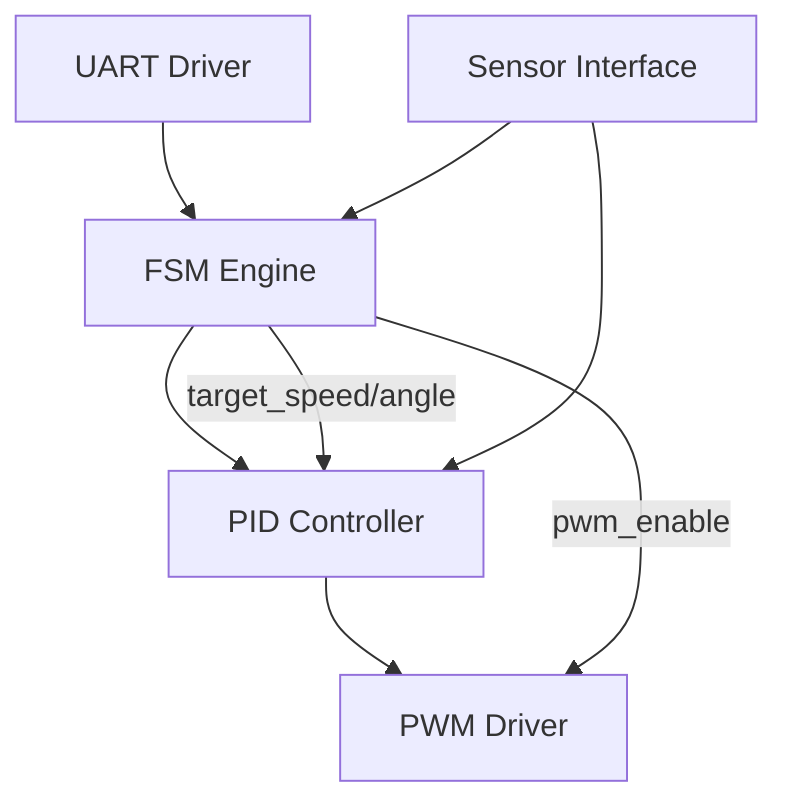

---

# 🤖 **AITL-H / PoC – 概要とリンク集**  
*🤖 AITL-H / PoC – Overview & Links*

このディレクトリは、AITL-H構想に基づく **各種Proof of Concept (PoC)** を格納しています。  
FSM（本能）＋ PID（理性）＋ LLM（知性）の三層アーキテクチャにより、**制御・推論・動作の統合検証**を行います。  

---

## 🔗 公式リンク / Official Links

| 言語 / Language | GitHub Pages 🌐 | GitHub 💻 |
|-----------------|----------------|-----------|
| 🇯🇵 Japanese | [](https://samizo-aitl.github.io/AITL-H/PoC/) | [](https://github.com/Samizo-AITL/AITL-H/tree/main/PoC) |

---

## 📁 ディレクトリ構成 / Directory Structure

```
PoC/
├── humanoid/              # フラグシップPoC（人型ロボット制御）
├── gimbal_control/        # 教育用ジンバル制御PoC
├── verilog_demo/          # FSM+PID Verilog自動生成デモ
├── auto_generator/        # FSM・PID自動生成ツール群
├── scenario/              # 対話・行動シナリオ定義
├── data/                  # 実験ログ・センサデータ
├── docs/                  # PoC設計マニュアル（章構成）
├── hw/                    # ハードウェア関連
├── run_main.py            # PoC統合実行エントリ
├── fsm_config.yaml        # FSM状態定義
└── README.md              # ← 本ドキュメント
```

---

## 📚 PoC 一覧 / PoC List

| タイトル | 概要 | リンク |
|---|---|---|
| 🚩 **Humanoid Robot PoC（集大成）** | FSM × PID × LLM × 状態空間 × 自己発電を統合したフラグシップPoC | [](./humanoid/) [](https://github.com/Samizo-AITL/AITL-H/tree/main/PoC/humanoid) |
| 🧭 **ジンバル制御（FSM + PID + LLM）** | 教育用PoC。ハイブリッド閉ループ制御の基本例 | [](./gimbal_control/) [](https://github.com/Samizo-AITL/AITL-H/tree/main/PoC/gimbal_control) |
| ⚙️ **Verilog自動生成（FSM + PID）** | YAML → C → Verilog 自動生成＋検証 | [](./verilog_demo/) [](https://github.com/Samizo-AITL/AITL-H/tree/main/PoC/verilog_demo) |
| 🛠 **Auto Generator** | FSM・PID構成の自動生成ツール群 | [](./auto_generator/) [](https://github.com/Samizo-AITL/AITL-H/tree/main/PoC/auto_generator) |

---

## 📑 PoCマニュアル / PoC Manual

PoC全体の設計思想・章構成は **docs/** 以下に整理しています。

| ドキュメント | 説明 | リンク |
|--------------|------|--------|
| 📘 **AITL-H PoC Manual** | PID・FSM・LLM三層構成を含むPoC全体の設計思想・仕様解説 | [](../docs/) [](https://github.com/Samizo-AITL/AITL-H/tree/main/docs) |

---

## ⚙️ 制御構成図 / Control Structure



- **UART Driver**：LLMからの命令をFSMに送信  
- **FSM Engine**：状態管理と制御目標出力（速度・角度）  
- **PID Controller**：誤差に基づくPWM制御量生成  
- **PWM Driver**：最終出力信号（duty制御）  
- **Sensor Interface**：FSMおよびPIDへ距離・角度センサ値を提供  

---

## 🚀 実行例 / Execution Example

```bash
# FSM定義・制御モジュールを統合してPoC制御を起動
python run_main.py --config fsm_config.yaml
```

---

## 👤 執筆者 / Author

| 項目 / Item | 内容 / Details |
|---|---|
| **著者 / Author** | 三溝 真一（Shinichi Samizo）<br/>*Shinichi Samizo* |
| **Email** | [](mailto:shin3t72@gmail.com) |
| **X** | [](https://x.com/shin3t72) |
| **GitHub** | [](https://github.com/Samizo-AITL) |

---

## 📄 ライセンス / License
[](#-ライセンス--license)

| 項目 / Item | ライセンス / License | 説明 / Description |
|-------------|----------------------|--------------------|
| **コード（Code）** | [MIT License](https://opensource.org/licenses/MIT) | 自由に使用・改変・再配布可<br/>*Free to use, modify, and redistribute* |
| **教材テキスト（Text）** | [CC BY 4.0](https://creativecommons.org/licenses/by/4.0/) | 著者表示必須<br/>*Attribution required* |
| **図表・イラスト（Figures）** | [CC BY-NC 4.0](https://creativecommons.org/licenses/by-nc/4.0/) | 非商用利用のみ可<br/>*Non-commercial use only* |
| **外部引用（External refs）** | 元ライセンスに従う | 引用元を明記<br/>*Follow original license & cite* |

---

## 🔝 トップに戻る / Back to Top
[](../../) [](https://github.com/Samizo-AITL/AITL-H)
