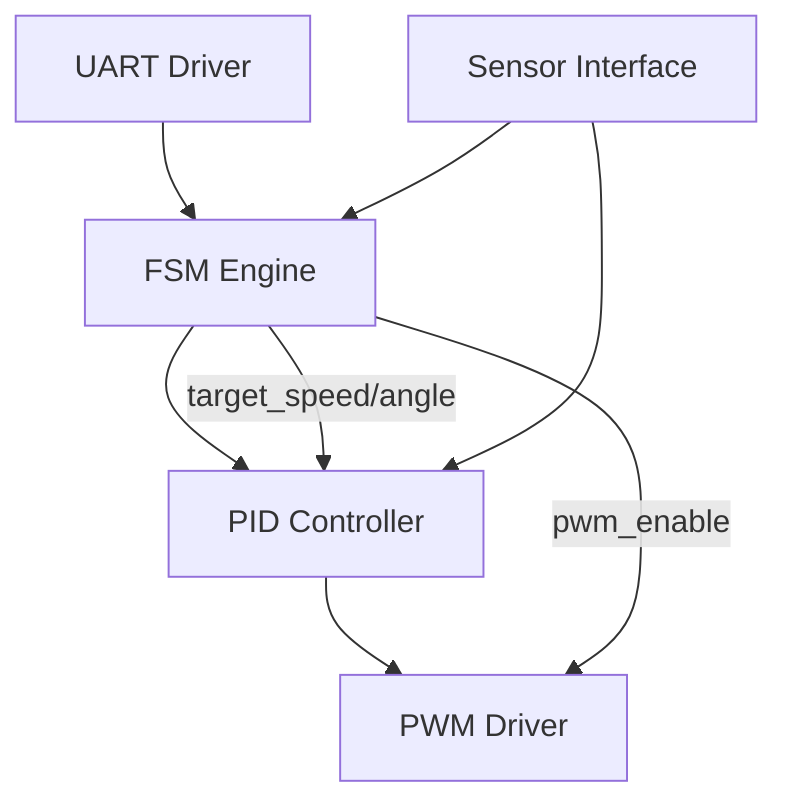

---

# 🤖 AITL-H / PoC – 人型ロボット制御の概念実証

本ディレクトリは、AITL-H構想に基づく**人型ロボットPoC（Proof of Concept）**の実験構成・実行環境を格納しています。  
FSM（本能）＋ PID（理性）＋ LLM（知性）の三層アーキテクチャにより、制御・推論・動作の統合実証を目的とした構成。

---

## 🔗 公式リンク / Official Links

| 言語 / Language | GitHub Pages 🌐 | GitHub 💻 |
|-----------------|----------------|-----------|
| 🇯🇵 Japanese | [](https://samizo-aitl.github.io/AITL-H/PoC/) | [](https://github.com/Samizo-AITL/AITL-H/tree/main/PoC) |

---

## 📁 ディレクトリ構成（PoC）

```
PoC/
├── run_main.py                # PoC制御起動スクリプト（統合実行エントリ）
├── fsm_config.yaml            # FSMの状態定義・遷移構成
├── scenario/                  # 対話・行動シナリオ定義群
│   └── interaction_scenario.md
├── data/                      # 実験ログ・センサデータ出力
├── docs/                      # 設計マニュアル（章構成ドキュメント）
│   └── README.md              # → PoC設計マニュアルのトップページ
└── README.md                  # ← 本ドキュメント（実行環境概要）
```

> 🚧 実装コード本体（FSM/PID/UART/LLM等）は `implementary/` に分離しています（詳細は下記参照）

---

## 🎯 このPoCディレクトリの役割

- AITL構造に基づく**実行構成・実験環境**の統合
- シナリオ駆動型のPoC制御とセンサデータの記録
- FSM状態定義・PoCパラメータの設定管理
- コード実装ではなく、**実験統合・動作構築の場**

---

## 🧩 実装コードとの関係：`implementary/` との分離

FSMやPIDなどの制御モジュールは、共通性と再利用性を高めるため、以下のように分離しています：

| 種別 | 配置先 | 内容 |
|------|--------|------|
| 制御モジュール本体 | [`implementary/`](../implementary/) | `fsm_engine.py`, `pid_controller.py`, `uart_driver.py` など |
| 実行設定・実験構成 | `PoC/` | `fsm_config.yaml`, `run_main.py`, `scenario/` など |

PoCディレクトリでは、これらを**呼び出して統合運用する**形で構成されます。

---

## 🔧 制御構成図（AITL-H PoC）

本PoCでは、UARTによる命令入力、FSMによる行動制御、PIDによる制御量生成、PWM出力までを統合しています。



- **UART Driver**：LLMからの命令をFSMに送信
- **FSM Engine**：状態管理と制御目標出力（速度・角度）
- **PID Controller**：目標と実測値の誤差に基づくPWM制御量生成
- **PWM Driver**：最終出力信号（duty制御）
- **Sensor Interface**：FSMおよびPIDへ距離・角度センサ値を提供

---

## 📑 PoCマニュアル / PoC Manual

設計思想・章構成・AITL三層モデルに関する解説は、`docs/` 以下に整理しています：

| ドキュメント | 説明 | リンク |
|---|---|---|
| 📘 **AITL-H PoC Manual** | PoC全体をカバーする実装マニュアル<br/>PID・FSM・LLM三層構造の設計と仕様 | [](../docs/) [](https://github.com/Samizo-AITL/AITL-H/tree/main/docs) |

内容一覧（一部）：

- 第0章：PoC設計全体像と目的
- 第1章：AITL視点での仕様策定
- 第2章：PID制御、FSM設計の実務ポイント
- 第8章：LLMによる自己修復設計のPoC展開
- 第11章以降：出口戦略とSystemDKへの接続

---

## 🚀 実行例

```bash
# FSM定義・制御モジュールを統合してPoC制御を起動
python run_main.py --config fsm_config.yaml
```

---

## 👤 執筆者 / Author

| 項目 / Item | 内容 / Details |
|---|---|
| **著者 / Author** | 三溝 真一（Shinichi Samizo）<br/>*Shinichi Samizo* |
| **Email** | [](mailto:shin3t72@gmail.com) |
| **X** | [](https://x.com/shin3t72) |
| **GitHub** | [](https://github.com/Samizo-AITL) |

---

## 📄 ライセンス / License
[](#-ライセンス--license)

| 項目 / Item | ライセンス / License | 説明 / Description |
|-------------|----------------------|--------------------|
| **コード（Code）** | [MIT License](https://opensource.org/licenses/MIT) | 自由に使用・改変・再配布可<br/>*Free to use, modify, and redistribute* |
| **教材テキスト（Text）** | [CC BY 4.0](https://creativecommons.org/licenses/by/4.0/) | 著者表示必須<br/>*Attribution required* |
| **図表・イラスト（Figures）** | [CC BY-NC 4.0](https://creativecommons.org/licenses/by-nc/4.0/) | 非商用利用のみ可<br/>*Non-commercial use only* |
| **外部引用（External refs）** | 元ライセンスに従う | 引用元を明記<br/>*Follow original license & cite* |

---

## 🔝 トップに戻る / Back to Top
[](../../) [](https://github.com/Samizo-AITL/AITL-H)
