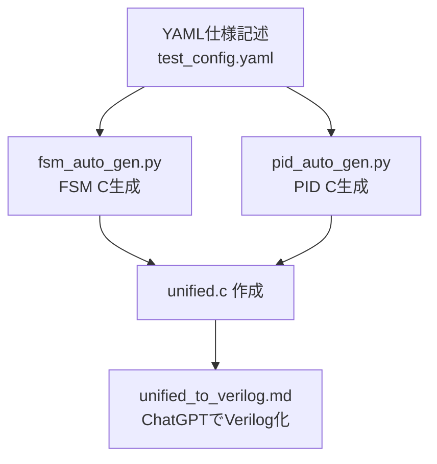

# ⚙️ auto_generator/README.md

このディレクトリは、AITL-Hアーキテクチャに基づくFSM・PIDの構成を  
**YAMLテンプレート → Cコード → 統合C → Verilog変換** へと導く自動生成支援ツール群を格納します。

---

## 🧠 全体フロー

---

## 📦 含まれるファイル

| ファイル名              | 内容 |
|------------------------|------|
| `test_config.yaml`     | FSM / PID / LLMの動作仕様（YAML形式） |
| `fsm_auto_gen.py`      | YAMLからFSM Cコードを生成 |
| `pid_auto_gen.py`      | YAMLからPID Cコードを生成 |
| `fsm_generated.c`      | FSMモジュールのC実装 |
| `pid_generated.c`      | PID制御のC実装 |
| `unified.c`            | FSM＋PIDの統合Cコード |
| `unified_to_verilog.md`| ChatGPT向けVerilog生成プロンプトテンプレート |

---

## 💡 活用方法

1. `test_config.yaml` を編集（状態遷移／PIDゲインなど記述）
2. `fsm_auto_gen.py` と `pid_auto_gen.py` を実行 → Cコードが生成される
3. `unified.c` に統合（または手動で結合）
4. `unified_to_verilog.md` を使い、ChatGPTでVerilog出力
5. `PoC/verilog_demo/` でテストベンチによる検証が可能

---

## 📜 ライセンス

MIT License  
教育・研究・開発目的での自由な利用と拡張を歓迎します。
