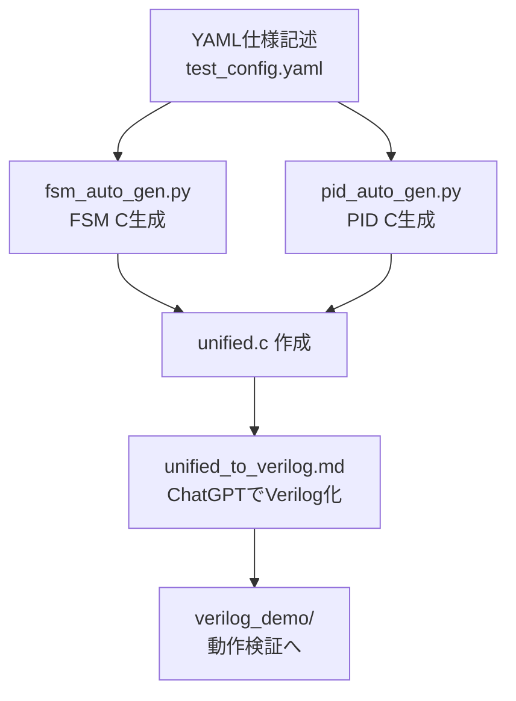

# ⚙️ auto_generator/README.md

このディレクトリは、AITL-Hアーキテクチャに基づくFSM・PIDの構成を  
**YAMLテンプレート → Cコード → 統合C → Verilog変換** へと導く自動生成支援ツール群を格納します。  
_This directory contains auto-generation tools that support converting FSM and PID structures in the AITL-H architecture from **YAML templates → C code → unified C → Verilog**._

---

## 🧠 全体フロー  
### Overall Flow

---

## 📦 含まれるファイル  
### Included Files

| ファイル名 / File Name           | 内容 / Description |
|----------------------------------|--------------------|
| `test_config.yaml`              | FSM / PID / LLMの動作仕様（YAML形式） _Operational specifications of FSM / PID / LLM (YAML format)_ |
| `fsm_auto_gen.py`               | YAMLからFSM Cコードを生成 _Generates FSM C code from YAML_ |
| `pid_auto_gen.py`               | YAMLからPID Cコードを生成 _Generates PID C code from YAML_ |
| `fsm_generated.c`               | FSMモジュールのC実装 _C implementation of FSM module_ |
| `pid_generated.c`               | PID制御のC実装 _C implementation of PID controller_ |
| `unified.c`                     | FSM＋PIDの統合Cコード _Unified C code for FSM and PID_ |
| `unified_to_verilog.md`         | ChatGPT向けVerilog生成プロンプトテンプレート _Prompt template for Verilog generation using ChatGPT_ |
| `streamlit_gui.py`              | YAML → CコードGUIツール（Streamlit） _GUI tool for YAML → C code (Streamlit)_ |
| `streamlit_gui_manual.md`       | GUI操作マニュアル _Manual for the GUI tool_ |

---

## 💡 活用方法  
### How to Use

1. `test_config.yaml` を編集（状態遷移／PIDゲインなど記述）  
   _Edit `test_config.yaml` (define state transitions, PID gains, etc.)_

2. `fsm_auto_gen.py` と `pid_auto_gen.py` を実行 → Cコードが生成される  
   _Run `fsm_auto_gen.py` and `pid_auto_gen.py` to generate C code_

3. `unified.c` に統合（または手動で結合）  
   _Merge into `unified.c` (manually or automatically)_

4. `unified_to_verilog.md` を使い、ChatGPTでVerilog出力  
   _Use `unified_to_verilog.md` with ChatGPT to generate Verilog code_

5. [`PoC/verilog_demo/`](../verilog_demo/) にてテストベンチで検証可能  
   _Test the output using the testbench in [`PoC/verilog_demo/`](../verilog_demo/)_

---

## 🔗 関連ディレクトリ  
### Related Directories

- [`PoC/verilog_demo/`](../verilog_demo/)：ChatGPT生成Verilogの動作検証  
  _Functional verification of Verilog generated via ChatGPT_

- [`logic_templates/`](../logic_templates/)：Verilog雛形と入力テンプレート集  
  _Verilog templates and input prompt collections_

---

## 📜 ライセンス  
### License

MIT License  
教育・研究・開発目的での自由な利用と拡張を歓迎します。  
_Freely usable and extensible for educational, research, and development purposes._
