# ⚙️ auto_generator/README.md

このディレクトリは、AITL-Hアーキテクチャに基づくFSM・PIDの構成を  
**YAMLテンプレート → Cコード → 統合C → Verilog変換** へと導く自動生成支援ツール群を格納します。

---

## 🧠 全体フロー

```mermaid
flowchart TD
    A[YAML仕様記述<br>test_config.yaml] --> B[fsm_auto_gen.py<br>FSM C生成]
    A --> C[pid_auto_gen.py<br>PID C生成]
    B & C --> D[unified.c 作成]
    D --> E[unified_to_verilog.md<br>ChatGPTでVerilog化]
    E --> F[verilog_demo/<br>動作検証へ]
```

---

## 📦 含まれるファイル

| ファイル名                  | 内容 |
|----------------------------|------|
| `test_config.yaml`         | FSM / PID / LLMの動作仕様（YAML形式） |
| `fsm_auto_gen.py`          | YAMLからFSM Cコードを生成 |
| `pid_auto_gen.py`          | YAMLからPID Cコードを生成 |
| `fsm_generated.c`          | FSMモジュールのC実装 |
| `pid_generated.c`          | PID制御のC実装 |
| `unified.c`                | FSM＋PIDの統合Cコード |
| `unified_to_verilog.md`    | ChatGPT向けVerilog生成プロンプトテンプレート |
| `streamlit_gui.py`         | YAML → CコードGUIツール（Streamlit） |
| `streamlit_gui_manual.md`  | GUI操作マニュアル |

---

## 💡 活用方法

1. `test_config.yaml` を編集（状態遷移／PIDゲインなど記述）
2. `fsm_auto_gen.py` と `pid_auto_gen.py` を実行 → Cコードが生成される
3. `unified.c` に統合（または手動で結合）
4. `unified_to_verilog.md` を使い、ChatGPTでVerilog出力
5. [`PoC/verilog_demo/`](../verilog_demo/) にてテストベンチで検証可能

---

## 🔗 関連ディレクトリ

- [`PoC/verilog_demo/`](../verilog_demo/)：ChatGPT生成Verilogの動作検証
- [`logic_templates/`](../logic_templates/)：Verilog雛形と入力テンプレート集

---

## 📜 ライセンス

MIT License  
教育・研究・開発目的での自由な利用と拡張を歓迎します。
