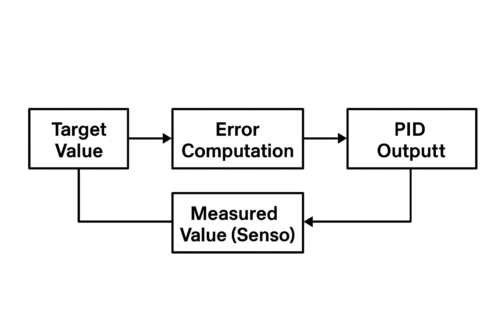

# ⚙️ 第02章：PID制御器の設計と応答チューニング

本章では、AITL-Hにおける**理性層（Reason Layer）**としてのPID制御の設計方針を解説します。  
PoC内では、FSMが出力した目標値（速度・角度など）に対し、PIDが誤差を補正しながら実機制御信号（PWM等）を生成します。

---

## 1. 📐 PID制御とは

PID制御は以下の制御式に基づいて、目標と現在値の差（誤差）を調整します：

$$
u(t) = K_p e(t) + K_i \int e(t) dt + K_d \frac{de(t)}{dt}
$$

- $e(t) = r(t) - y(t) $：目標値 $r$ と測定値 $y$ の誤差
- $K_p$：比例ゲイン（反応の速さ）
- $K_i$：積分ゲイン（定常偏差の解消）
- $K_d$：微分ゲイン（予測的補正）

---

## 2. 🧮 ゲイン設計の基本戦略

| ゲイン | 役割 | 高くすると | 低くすると |
|--------|------|-------------|-------------|
| $K_p$| 誤差への即時反応 | 応答が速くなるが不安定に | 鈍くなるが安定 |
| $K_i$ | 誤差の累積解消 | 定常誤差が減るが振動しやすく | 定常誤差が残る |
| $K_d$ | 変化の抑制 | オーバーシュート抑制 | 遅れが大きくなる |

---

## 3. 📊 ステップ応答と安定性評価

- ステップ入力（例：目標速度を 0 → 5 に）に対する応答を観察
- **オーバーシュート・立ち上がり時間・定常誤差**などを指標とする
- 例：

```
target_speed = 5.0
measured_speed = sensor.get_distance()
pwm = pid.compute(target_speed, measured_speed)
```

---

## 4. 🧩 AITL-H PoCにおけるPID制御器

PoC内の `pid_controller.py` は以下の形式を持ちます：

```python
class PIDController:
    def __init__(self, kp, ki, kd):
        ...

    def compute(self, target, measured):
        error = target - measured
        # 比例・積分・微分項を加算してPWM値を返す
        return pwm
```

FSMからの `target_speed`、センサからの `measured_speed` を用いてPWM出力を生成します。

---

## 5. 🔄 将来的展開：自己最適化へ

- FSM状態によってPIDゲインを**動的に切り替える**
- LLMがステップ応答を観察し、**ゲインを最適化**する補正戦略
- 自動同定や強化学習との連携による知的制御層への拡張

---

## 🔚 まとめ

PID制御は、FSMで定義された目標行動を物理レベルに落とし込む**理性の実装**です。  
本章では、PoCにおけるPID構成と調整の基本を明示しました。次章では、FSM設計に焦点を当てます。

---

## 図2-1：PID制御ループ構成図



---

