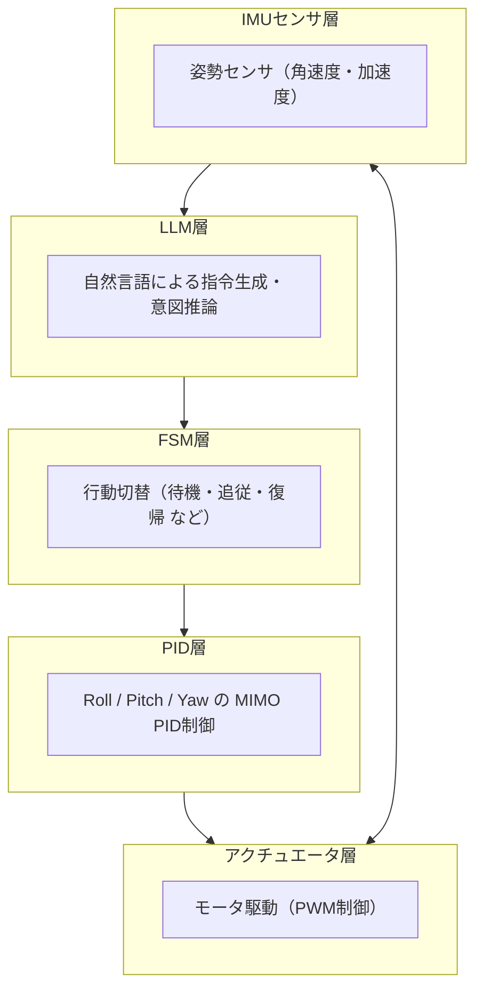

# 🤖 ジンバル制御 PoC：FSM + MIMO PID + LLM（AITL-HX構成）

本ディレクトリは、3軸ジンバルの安定化制御を対象とした  
**FSM（状態遷移）＋ MIMO PID制御 ＋ LLM（大規模言語モデル）**による  
**ハイブリッド知能制御アーキテクチャ（AITL-HX）**のPoC実装を提供します。

---

## 🧭 システム構成図



> LLM → FSM → PID → アクチュエータ → センサ → LLM  
> このように**知能的な意図推論と物理制御が循環する閉ループ制御**を構成します。

---

## 🔩 モジュール構成

| 層               | モジュール                 | 機能概要                             |
|------------------|----------------------------|--------------------------------------|
| **LLM層**        | `llm_goal_agent.py`        | 自然言語からの目的推論・対話指令生成 |
| **FSM層**        | `control_fsm_pid_llm.py`   | 状態遷移制御（追従・復帰・待機など） |
| **PID層**        | 同上                       | Roll・Pitch・YawへのMIMO PID制御     |
| **センサ層**     | `imu_sensor_model.py`      | 3軸IMUセンサモデル（角速度・加速度） |
| **アクチュエータ層** | `motor_pwm_driver.py`  | モータ駆動（PWM出力による模擬制御） |

---

## 📂 ファイル一覧

| ファイル名               | 説明                                  |
|--------------------------|---------------------------------------|
| `control_fsm_pid_llm.py` | FSM＋PID統合制御本体                   |
| `imu_sensor_model.py`    | IMUセンサの簡易シミュレーションモデル |
| `motor_pwm_driver.py`    | PWMベースのモータ駆動制御             |
| `llm_goal_agent.py`      | ChatGPT/LLMによる目標生成インターフェース |
| `config_gimbal.json`     | PIDゲインなどの設定ファイル           |
| `gimbal_sim_demo.ipynb`  | Notebookベースの統合制御デモ可視化    |

---

## 🗂️ ディレクトリ構成

```
gimbal_control/
├── README.md                   # プロジェクト概要と構成図
├── control_fsm_pid_llm.py     # FSM + PID + LLM統合制御
├── imu_sensor_model.py        # 3軸IMUセンサモデル
├── motor_pwm_driver.py        # モータ駆動PWMシミュレータ
├── llm_goal_agent.py          # LLMによる目標生成
├── config_gimbal.json         # PID設定などのシステムパラメータ
└── gimbal_sim_demo.ipynb      # 統合制御の可視化・Notebook実行用
```

---

## 🎯 学習目標

- 状態遷移（FSM）とPID制御の統合による**動作切替＋安定制御**の設計を学ぶ  
- **LLMによる自然言語からの目標設定**とフィードバック制御の融合を体験する  
- **3軸ジンバル系のMIMO PID制御**に関するシミュレーション実装を理解する  
- **ロボティクス × LLM統合制御**のPoC設計・検証手法を学ぶ  

---

## 🧪 実行方法（ローカル環境）

1. Python仮想環境の作成と依存ライブラリのインストール

```bash
python3 -m venv venv
source venv/bin/activate
pip install jupyter matplotlib numpy
```

2. Jupyter Notebook の起動とデモ実行

```bash
jupyter notebook gimbal_sim_demo.ipynb
```

---

## ⚙️ 設定ファイル概要

- `P`：比例ゲイン  
- `I`：積分ゲイン（未使用時は 0）  
- `D`：微分ゲイン（未使用時は 0）  
- `imu_noise_level`：センサノイズ強度（標準偏差）  
- `max_pwm`：PWM出力の最大値（飽和制限）  

---

## 🚀 今後の拡張予定

- 実機接続：IMUモジュール＋ESC＋Jetson/Raspberry Pi 連携  
- ChatGPT API を介したリアルタイム制御指令の実験  
- 画像認識＋サーボによる視覚フィードバック制御の追加  
- ドローン、カメラジンバル、視線制御ロボットなどへの応用展開  

---

## 📎 参考リンク・教材連携

- 🔗 AITL-H フレームワーク本体：[](https://github.com/Samizo-AITL/AITL-H)  
- 📘 教材連携先：[](https://github.com/Samizo-AITL/EduController/tree/main/part09_llm_hybrid)
