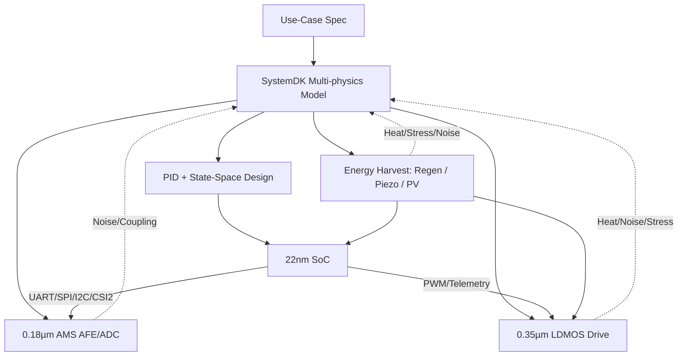

---

# 🚩 フラグシップPoC：人型ロボット（Samizo-AITL集大成）
*🚩 Flagship PoC: Humanoid Robot (Culmination of Samizo-AITL)*

[](#-ライセンス--license)  

> **本PoCは Samizo-AITL プロジェクトの「集大成」**。  
> *This PoC is positioned as the "culmination" of the Samizo-AITL project.*  
> AITL-Hの三層アーキテクチャ（FSM × PID × LLM）を基盤に、  
> *Based on the three-layer architecture of AITL-H (FSM × PID × LLM),*  
> **頭脳（22 nm SoC）／感覚（0.18 µm AMS）／筋肉（0.35 µm LDMOS）／自己発電ブロック**を跨いだクロスノード設計を、SystemDKで統合検証します。  
> *Cross-node design spanning Brain (22 nm SoC), Sensing (0.18 µm AMS), Muscles (0.35 µm LDMOS), and Energy Harvesting is integrated and verified with SystemDK.*  

---

## 🧩 クロスノード・チップセット  
*Cross-Node Chipset*  

| ブロック | ノード | 役割 / 主要IF |
|----------|--------|----------------|
| **Brain SoC** | **22 nm** | LLM推論・FSM管理・状態空間制御（LQR/LQG IP）<br>*LLM inference, FSM management, state-space control (LQR/LQG IP)*<br>**UART / SPI / I²C / MIPI-CSI2** |
| **Sensor Hub** | **0.18 µm AMS** | CMOSカメラ, IMU, エンコーダ, 力覚/圧力, MEMSマイク<br>*CMOS camera, IMU, encoders, force/pressure, MEMS microphone*<br>**I²C / SPI / DVP / CSI2** |
| **Power Drive** | **0.35 µm LDMOS** | サーボ・BLDC駆動, PWM/Hブリッジ, ゲートドライバ, 温度/電流モニタ<br>*Servo/BLDC drive, PWM/H-bridge, gate drivers, temperature/current monitoring* |
| **Energy Harvest** | **圧電MEMS / 薄膜PV / 回生ブレーキ** | DC-DC変換を介して蓄電池／SoCへ給電<br>*Piezo MEMS / thin-film PV / regenerative braking, powering battery/SoC via DC-DC conversion* |

---

## ⚙️ 制御アーキテクチャ  
*Control Architecture*  

| 層 | 実装 | 役割 |
|----|------|------|
| **LLM層** | SoC上アプリ/RTOS<br>*Applications/RTOS on SoC* | 目標生成・異常解釈・学習<br>*Goal generation, anomaly interpretation, learning* |
| **FSM層** | `fsm_engine.py` / YAML→C→Verilog | 行動モード切替（立位／歩行／旋回／転倒回避／省エネ）<br>*Behavior mode switching (standing, walking, turning, fall avoidance, energy saving)* |
| **物理制御層** | PID＋状態空間（LQR/LQG） | 関節のSISO安定化＋全身のMIMO協調制御<br>*Joint SISO stabilization + whole-body MIMO cooperative control* |
| **駆動層** | LDMOS PWM/Hブリッジ | トルク出力・安全監視<br>*Torque output, safety monitoring* |
| **エネルギー層** | 圧電／PV／回生制御 | 発電・蓄電・電力マネジメント<br>*Energy harvesting, storage, and power management* |

---

## 📷 代表センサ構成  
*Representative Sensor Configuration*  

- **CMOSイメージセンサ**（MIPI-CSI2 / DVP）<br>*CMOS image sensor (MIPI-CSI2 / DVP)*  
- **IMU（6/9軸）＋エンコーダ**<br>*IMU (6/9-axis) + encoders*  
- **力覚／圧力センサ**（グリップ・足裏）<br>*Force/pressure sensors (grip, foot sole)*  
- **MEMSマイク**（音声入力）<br>*MEMS microphone (audio input)*  
- **温度センサ**（駆動系／SoCサーマル管理）<br>*Temperature sensors (drive system / SoC thermal)*  
- **圧電素子アレイ**（歩行衝撃からのエネルギー回収）<br>*Piezo array (energy harvesting from walking impact)*  
- **薄膜PVセル**（外装からの光発電）<br>*Thin-film PV cells (light harvesting from exterior)*  

---

## 🧭 SystemDK統合設計フロー  
*SystemDK Integrated Design Flow*  



---

## 🎯 成功指標（KPI）  
*Key Performance Indicators (KPI)*  

- **姿勢回復時間** ≤ 200 ms<br>*Posture recovery time ≤ 200 ms*  
- **歩容安定度**（CoM偏差RMS）30%改善（PID単独比）<br>*Gait stability (CoM RMS deviation) improved by 30% compared to PID alone*  
- **エネルギー効率** 15%改善（協調制御導入＋ハーベスト連携）<br>*Energy efficiency improved by 15% (hybrid control + harvesting)*  
- **異常検知誤差率**（LLM+FSM） < 2%<br>*Anomaly detection error rate (LLM+FSM) < 2%*  
- **自己発電寄与率**：消費電力量の最大 **20%補填**<br>*Self-powering contribution: up to 20% of energy consumption supplemented*  

---

## 📂 ディレクトリ構成（予定）  
*Planned Directory Structure*  

```
humanoid/
 ├─ README.md
 ├─ hw/            # SoC, AMS, LDMOS 設計 / SoC, AMS, LDMOS design
 ├─ control/       # FSM, PID, 状態空間, LLM / FSM, PID, state-space, LLM
 ├─ systemdk/      # モデル & シミュレーション / Models & simulation
 ├─ energy/        # 自己発電・電力回生モデル / Energy harvesting & regen models
 ├─ docs/          # マニュアル・テスト仕様 / Manuals & test specs
 └─ logs/          # 実験ログ / Experiment logs
```

---

## 📚 関連プロジェクト・教材 / Related Projects & Materials  

| プロジェクト・教材 | 説明 | リンク |
|--------------------|------|--------|
| **EduController Part09** | FSM × PID × LLM統合制御教材<br>*Integrated control education (FSM × PID × LLM)* | [](https://samizo-aitl.github.io/EduController/part09_llm_hybrid/) [](https://github.com/Samizo-AITL/EduController/tree/main/part09_llm_hybrid) |
| **Edusemi-v4x 特別編 Chapter3** | FSM × PID × LLMによるSoC設計教材<br>*SoC design with FSM × PID × LLM* | [](https://samizo-aitl.github.io/Edusemi-v4x/f_chapter3_socsystem/) [](https://github.com/Samizo-AITL/Edusemi-v4x/tree/main/f_chapter3_socsystem) |
| **AITL-Strategy-Proposal** | AITL戦略提言・政策提案<br>*AITL strategy proposals and policy recommendations* | [](https://samizo-aitl.github.io/AITL-Strategy-Proposal/) [](https://github.com/Samizo-AITL/AITL-Strategy-Proposal) |

---

## 👤 執筆者 / Author  
**執筆者情報**  
*Author Information*  

| 項目 / Item | 内容 / Details |
|-------------|----------------|
| **著者 / Author** | 三溝 真一（Shinichi Samizo）<br>*Shinichi Samizo* |
| **Email** | [](mailto:shin3t72@gmail.com) |
| **X** | [](https://x.com/shin3t72) |
| **GitHub** | [](https://github.com/Samizo-AITL) |

---

## 📄 ライセンス / License  
**本PoCはハイブリッドライセンスを採用しています。**  
*This PoC adopts a hybrid license.*  

| 項目 / Item | ライセンス / License | 説明 / Description |
|-------------|----------------------|--------------------|
| **コード（Code）** | [MIT License](https://opensource.org/licenses/MIT) | 自由に使用・改変・再配布可<br>*Free to use, modify, and redistribute* |
| **教材テキスト（Text materials）** | [CC BY 4.0](https://creativecommons.org/licenses/by/4.0/) | 著者表示必須<br>*Attribution required* |
| **図表・イラスト（Figures & diagrams）** | [CC BY-NC 4.0](https://creativecommons.org/licenses/by-nc/4.0/) | 非商用利用のみ可<br>*Non-commercial use only* |
| **外部引用（External references）** | 元ライセンスに従う<br>*Follow the original license* | 引用元を明記<br>*Cite the original source* |

---

## 🔝 トップに戻る / Back to Top  
**サイト／リポジトリのトップページに戻ります。**  
*Return to the top page of the site and repository.*  

[](../../)  
[](https://github.com/Samizo-AITL/AITL-H)  
