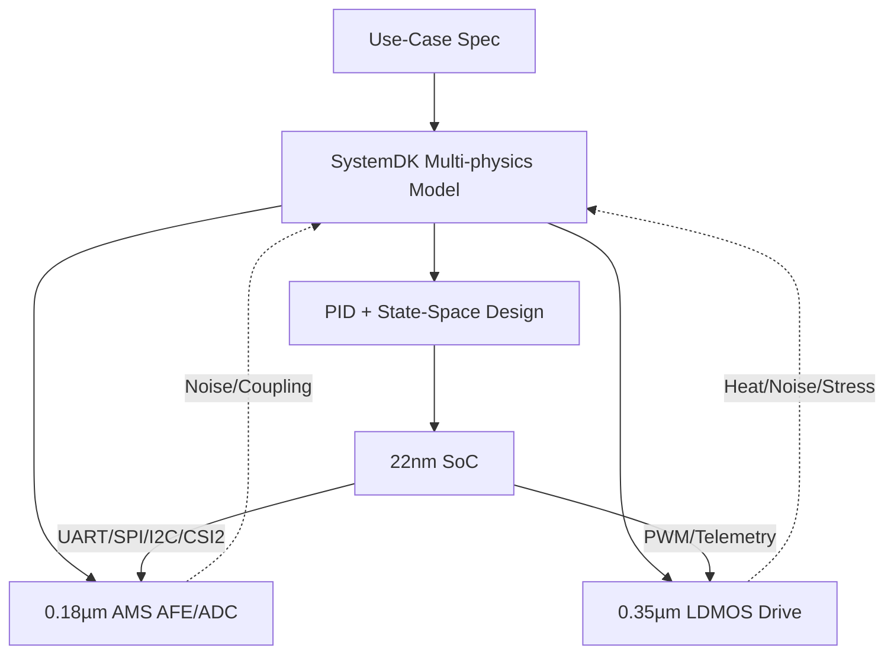

---

# 🚩 フラグシップPoC：人型ロボット（Samizo-AITL集大成）
*🚩 Flagship PoC: Humanoid Robot (Culmination of Samizo-AITL)*

> **本PoCは Samizo-AITL プロジェクトの「集大成」として位置づけられます。**  
> AITL-Hの三層アーキテクチャ（FSM × PID × LLM）を基盤に、**頭脳（22nm SoC）／感覚（0.18µm AMS）／筋肉（0.35µm LDMOS）**を跨いだクロスノード設計をSystemDKで統合検証します。  

---

## 🧩 クロスノード・チップセット
| ブロック | ノード | 役割 / 主要IF |
|---|---|---|
| **Brain SoC** | **22 nm** | LLM推論・FSM管理・状態空間制御（LQR/LQG）IP / **UART・SPI・I²C・MIPI-CSI2** |
| **Sensor Hub** | **0.18 µm AMS** | CMOSカメラ, IMU, エンコーダ, 力覚/圧力, MEMSマイク / **I²C・SPI・DVP・CSI2** |
| **Power Drive** | **0.35 µm LDMOS** | サーボ・BLDC駆動, PWM/Hブリッジ, ゲートドライバ, 温度/電流モニタ |

---

## ⚙️ 制御アーキテクチャ
| 層 | 実装 | 役割 |
|---|---|---|
| **LLM層** | SoC上アプリ/RTOS | 目標生成・異常解釈・学習 |
| **FSM層** | `fsm_engine.py` / YAML→C→Verilog | 行動モード切替（立位・歩行・旋回・転倒回避） |
| **物理制御層** | PID＋状態空間（LQR/LQG） | 局所SISO安定化＋全身MIMO協調制御 |
| **駆動層** | LDMOS PWM/Hブリッジ | トルク出力・安全監視 |

---

## 📷 代表センサ構成
- **CMOSイメージセンサ**（MIPI-CSI2 / DVP）  
- **IMU（6/9軸）＋エンコーダ**  
- **力覚/圧力センサ**（グリップ・足裏）  
- **MEMSマイク**（音声）  
- **温度センサ**（駆動系/SoCサーマル）  

---

## 🧭 SystemDK統合設計フロー


---

## 🎯 成功指標（KPI）
- **姿勢回復時間** ≤ 200 ms  
- **歩容安定度**（CoM偏差RMS）**30%改善**（PID単独比）  
- **エネルギー効率** 15%改善（協調制御導入）  
- **異常検知誤差率**（LLM+FSM） < 2%  

---

## 📂 ディレクトリ構成（予定）
```
humanoid/
 ├─ README.md
 ├─ hw/            # SoC, AMS, LDMOS 設計
 ├─ control/       # FSM, PID, 状態空間, LLM
 ├─ systemdk/      # モデル & シミュレーション
 ├─ docs/          # マニュアル・テスト仕様
 └─ logs/          # 実験ログ
```

---

## 🔗 関連リンク
- [EduController Part09](https://samizo-aitl.github.io/EduController/part09_llm_hybrid/)  
- [Edusemi-v4x 特別編](https://samizo-aitl.github.io/Edusemi-v4x/f_chapter3_socsystem/)  
- [AITL-Strategy-Proposal](https://samizo-aitl.github.io/AITL-Strategy-Proposal/)

---

## 👤 **執筆者 / Author**

| **項目 / Item** | **内容 / Details** |
|-----------------|--------------------|
| **著者 / Author** | 三溝 真一（Shinichi Samizo） |
| **Email** | [](mailto:shin3t72@gmail.com) |
| **X** | [](https://x.com/shin3t72) |
| **GitHub** | [](https://github.com/Samizo-AITL) |

---

## 📄 **ライセンス / License**
[](#-ライセンス--license)  

> 教材・コード・図表の性質に応じたハイブリッドライセンスを採用。  
> *Hybrid licensing based on the nature of the materials, code, and diagrams.*

| 📌 項目 / Item | ライセンス / License | 説明 / Description |
|------|------|------|
| **コード（Code）** | [MIT License](https://opensource.org/licenses/MIT) | 自由に使用・改変・再配布が可能<br>*Free to use, modify, and redistribute* |
| **教材テキスト（Text materials）** | [CC BY 4.0](https://creativecommons.org/licenses/by/4.0/) | 著者表示必須<br>*Attribution required* |
| **図表・イラスト（Figures & diagrams）** | [CC BY-NC 4.0](https://creativecommons.org/licenses/by-nc/4.0/) | 非商用利用のみ許可<br>*Non-commercial use only* |
| **外部引用（External references）** | 元ライセンスに従う<br>*Follow the original license* | 引用元を明記<br>*Cite the original source* |

