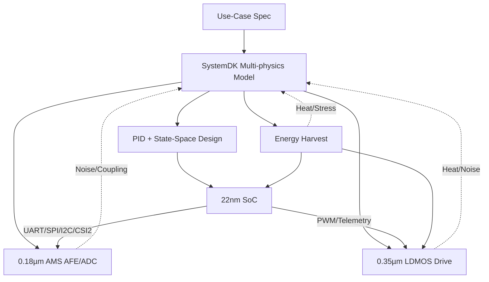

---

# 🚩 フラグシップPoC：人型ロボット（Samizo-AITL集大成）
*🚩 Flagship PoC: Humanoid Robot (Culmination of Samizo-AITL)*

[](#-ライセンス--license)  

> **本PoCは Samizo-AITL プロジェクトの「集大成」**  
> *This PoC is positioned as the culmination of the Samizo-AITL project.*  
> AITL-H三層アーキテクチャ（FSM × PID × LLM）を基盤に、  
> **頭脳（22 nm SoC）／感覚（0.18 µm AMS）／筋肉（0.35 µm LDMOS）／自己発電ブロック**を跨いだクロスノード設計を、SystemDKで統合検証します。  
> *Cross-node design spanning Brain (22nm SoC), Sensing (0.18µm AMS), Muscles (0.35µm LDMOS), and Energy Harvesting integrated with SystemDK.*  

---

## 📌 戦略的意義 / Strategic Significance
- **教育 × PoC × 政策提言**を一体化した「勝てるテーマ」  
- **クロスノード統合** (22nm SoC / 0.18µm AMS / 0.35µm LDMOS / Energy Harvest) を SystemDKで一貫設計  
- **FSM × PID × 状態空間 × LLM** の三層ハイブリッド制御  
- **自己発電統合**で持続可能なロボット設計  

> **結論：教育・産業・政策の三領域で優位性を発揮できるテーマ**  
> *Conclusion: A winning theme across education, industry, and policy*  

---

## 🧩 クロスノード・チップセット / Cross-Node Chipset
| ブロック | ノード | 役割 / Interface |
|----------|--------|------------------|
| **Brain SoC** | **22 nm** | FSM+PID+LLM制御、LQR/LQG制御IP<br>*Control + AI inference*<br>**UART / SPI / I²C / MIPI-CSI2** |
| **Sensor Hub** | **0.18 µm AMS** | CMOSカメラ / IMU / 力覚センサ / MEMSマイク<br>*Imaging, motion, force, audio*<br>**I²C / SPI / DVP / CSI2** |
| **Power Drive** | **0.35 µm LDMOS** | PWM/Hブリッジ、サーボ・BLDC駆動<br>*Motor drive & torque control* |
| **Energy Harvest** | **Piezo / PV / Regen** | 発電・蓄電・電力供給<br>*Energy harvesting & DC-DC power* |

---

## ⚙️ 制御アーキテクチャ / Control Architecture
| 層 | 実装 | 役割 |
|----|------|------|
| **LLM層** | SoCアプリ/RTOS | 目標生成・異常解釈・学習<br>*Goal generation, anomaly handling, learning* |
| **FSM層** | `fsm_engine.py` / YAML→C→Verilog | 行動モード切替（歩行・旋回・転倒回避・省エネ）<br>*Behavior switching* |
| **物理制御層** | PID + 状態空間 (LQR/LQG) | 関節SISO安定化 + 全身MIMO協調<br>*Joint + whole-body control* |
| **駆動層** | LDMOS PWM/Hブリッジ | トルク出力・安全監視<br>*Torque & safety* |
| **エネルギー層** | 圧電 / PV / 回生制御 | 発電・蓄電・管理<br>*Harvesting & power mgmt* |

---

## 📷 センサ構成 / Sensors
- CMOSイメージセンサ（MIPI-CSI2 / DVP）  
- IMU（6/9軸）＋エンコーダ  
- 力覚／圧力センサ（グリップ・足裏）  
- MEMSマイク  
- 温度センサ（駆動・SoCサーマル）  
- 圧電素子アレイ（歩行衝撃回収）  
- 薄膜PVセル（外装発電）  

---

## 🧭 SystemDK統合設計フロー / SystemDK Flow


---

## 🎯 成功指標 / KPI
- 姿勢回復 ≤ 200 ms  
- 歩容安定度 +30%（PID比）  
- エネルギー効率 +15%（協調制御＋発電）  
- 異常検知誤差率 < 2%  
- 自己発電寄与率 最大20%  

---

## 📂 ディレクトリ構成（予定） / Directory
```
humanoid/
 ├─ README.md
 ├─ hw/         # SoC, AMS, LDMOS
 ├─ control/    # FSM, PID, 状態空間, LLM
 ├─ systemdk/   # モデル & シミュレーション
 ├─ energy/     # 自己発電・回生
 ├─ docs/       # マニュアル・テスト仕様
 └─ logs/       # 実験ログ
```

---

## 📚 関連プロジェクト・教材 / Related Projects
| プロジェクト | 説明 | リンク |
|--------------|------|--------|
| **EduController Part09** | FSM × PID × LLM制御教材 | [](https://samizo-aitl.github.io/EduController/part09_llm_hybrid/) [](https://github.com/Samizo-AITL/EduController/tree/main/part09_llm_hybrid) |
| **Edusemi-v4x 特別編** | FSM × PID × LLM SoC設計教材 | [](https://samizo-aitl.github.io/Edusemi-v4x/f_chapter3_socsystem/) [](https://github.com/Samizo-AITL/Edusemi-v4x/tree/main/f_chapter3_socsystem) |
| **AITL-Strategy-Proposal** | 戦略提言・政策提案 | [](https://samizo-aitl.github.io/AITL-Strategy-Proposal/) [](https://github.com/Samizo-AITL/AITL-Strategy-Proposal) |

---

## 👤 執筆者 / Author
| 項目 | 内容 |
|------|------|
| **著者 / Author** | 三溝 真一（Shinichi Samizo）<br>*Shinichi Samizo* |
| **Email** | [](mailto:shin3t72@gmail.com) |
| **X** | [](https://x.com/shin3t72) |
| **GitHub** | [](https://github.com/Samizo-AITL) |

---

## 📄 ライセンス / License
| 項目 | ライセンス | 説明 |
|------|------------|------|
| **コード** | [MIT](https://opensource.org/licenses/MIT) | 自由に使用・改変・再配布可 |
| **教材テキスト** | [CC BY 4.0](https://creativecommons.org/licenses/by/4.0/) | 著者表示必須 |
| **図表** | [CC BY-NC 4.0](https://creativecommons.org/licenses/by-nc/4.0/) | 非商用利用のみ |
| **外部引用** | 元ライセンスに従う | 引用元を明記 |

---

## 🔝 トップに戻る / Back to Top
[](../../)  
[](https://github.com/Samizo-AITL/AITL-H)  

📑 **詳細レポート** → [PoC/humanoid/docs/index.md](../docs/index.md)  

