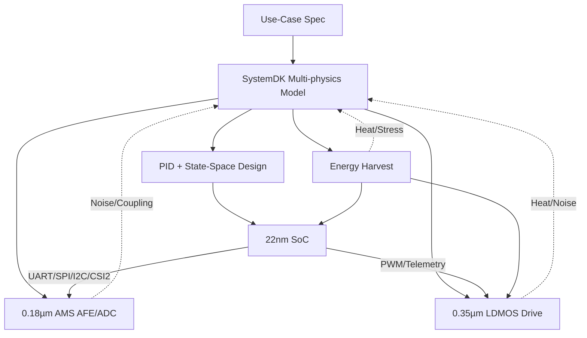

---

# 🚩 フラグシップPoC：人型ロボット（Samizo-AITL集大成）
*🚩 Flagship PoC: Humanoid Robot (Culmination of Samizo-AITL)*

[](#-ライセンス--license)

> **本PoCは Samizo-AITL プロジェクトの「集大成」** — AITL-H三層アーキテクチャ（FSM × PID × LLM）を基盤に、**頭脳（22 nm SoC）／感覚（0.18 µm AMS）／筋肉（0.35 µm LDMOS）／自己発電**を跨いだクロスノード設計を SystemDK で統合検証します。

---

## 🆕 最新情報 / Update Log
- **2025-08-25**：🚩 Humanoid Robot PoC（集大成）をトップに追加 → [PoC ページ][humanoid-site]
- **2025-08-25**：📑 PoC レポート（PWM Ripple / Thermal / Mission Energy）公開 → [Docs Index][docs-index]
- **2025-08-25**：🎤 発表用スライド雛形を追加 → [Slides][slides]

[humanoid-site]: ./
[docs-index]: ./docs/
[slides]: ./docs/flagship_poc_slides.md

---

## 🧩 クロスノード・チップセット / Cross-Node Chipset
| ブロック | ノード | 役割・IF |
|---|---|---|
| Brain SoC | 22 nm | LLM推論 / FSM管理 / LQR・LQG / **UART・SPI・I2C・MIPI-CSI2** |
| Sensor Hub | 0.18 µm AMS | CMOS / IMU / エンコーダ / 力覚 / マイク / **I2C・SPI・DVP・CSI2** |
| Power Drive | 0.35 µm LDMOS | PWM / Hブリッジ / サーボ・BLDC |
| Energy Harvest | Piezo / PV / Regen | 発電・蓄電・DC-DC |

> *EN: Brain SoC (22nm), Sensor Hub (0.18µm AMS), Power Drive (0.35µm LDMOS), Energy Harvest (Piezo/PV/Regen).*

---

## ⚙️ 制御アーキテクチャ / Control Architecture
| 層 | 実装 | 役割 |
|---|---|---|
| LLM層 | SoCアプリ / RTOS | 目標生成・異常解釈・学習 |
| FSM層 | fsm_engine.py / YAML→C→Verilog | 行動モード切替（歩行・旋回・回避・省エネ） |
| 物理制御層 | PID + 状態空間（LQR/LQG） | 関節SISO安定化 + 全身MIMO協調 |
| 駆動層 | LDMOS PWM/Hブリッジ | トルク出力・安全監視 |
| エネルギー層 | 圧電 / PV / 回生 | 発電・蓄電・電力管理 |

---

## 📷 センサ構成 / Sensors
- CMOS（MIPI-CSI2 / DVP）、IMU（6/9軸）、エンコーダ
- 力覚・圧力（グリップ・足裏）、MEMSマイク、温度（駆動・SoC）
- 圧電アレイ（歩行衝撃回収）、薄膜PV（外装発電）

---

## 🧭 SystemDK統合設計フロー / SystemDK Flow


---

## 🎯 成功指標 / KPI
- 姿勢回復 ≤ 200 ms / 歩容安定度 +30%（PID比）
- エネルギー効率 +15%（協調制御＋発電）
- 異常検知誤差率 < 2% / 自己発電寄与 最大20%

---

## 📂 ディレクトリ構成（予定） / Directory
```
humanoid/
 ├─ README.md
 ├─ hw/
 ├─ control/
 ├─ systemdk/
 ├─ energy/
 ├─ docs/
 └─ logs/
```

---

## 📚 関連プロジェクト・教材 / Related Projects
| プロジェクト | 説明 | Site / Repo |
|---|---|---|
| EduController Part09 | FSM × PID × LLM 制御教材 | [Site][ec-site] ・ [Repo][ec-repo] |
| Edusemi-v4x 特別編 | FSM × PID × LLM SoC 設計教材 | [Site][esv-site] ・ [Repo][esv-repo] |
| AITL-Strategy-Proposal | 戦略提言・政策提案 | [Site][asp-site] ・ [Repo][asp-repo] |

[ec-site]: https://samizo-aitl.github.io/EduController/part09_llm_hybrid/
[ec-repo]: https://github.com/Samizo-AITL/EduController/tree/main/part09_llm_hybrid
[esv-site]: https://samizo-aitl.github.io/Edusemi-v4x/f_chapter3_socsystem/
[esv-repo]: https://github.com/Samizo-AITL/Edusemi-v4x/tree/main/f_chapter3_socsystem
[asp-site]: https://samizo-aitl.github.io/AITL-Strategy-Proposal/
[asp-repo]: https://github.com/Samizo-AITL/AITL-Strategy-Proposal

> バッジは表外にまとめて表示：  
> [][ec-site]
> [][ec-repo]
> [][esv-site]
> [][esv-repo]
> [][asp-site]
> [][asp-repo]

---

## 👤 執筆者 / Author
- **三溝 真一（Shinichi Samizo）** / [GitHub](https://github.com/Samizo-AITL) / [X](https://x.com/shin3t72) / [Email](mailto:shin3t72@gmail.com)

---

## 📄 ライセンス / License
- **Code**: [MIT](https://opensource.org/licenses/MIT) / **Text**: [CC BY 4.0](https://creativecommons.org/licenses/by/4.0/) / **Figures**: [CC BY-NC 4.0](https://creativecommons.org/licenses/by-nc/4.0/)
- 外部引用は原ライセンスに従う。

---

## 🔝 トップに戻る / Back to Top
[Back to Site](../../) ・ [Back to Repo](https://github.com/Samizo-AITL/AITL-H)
