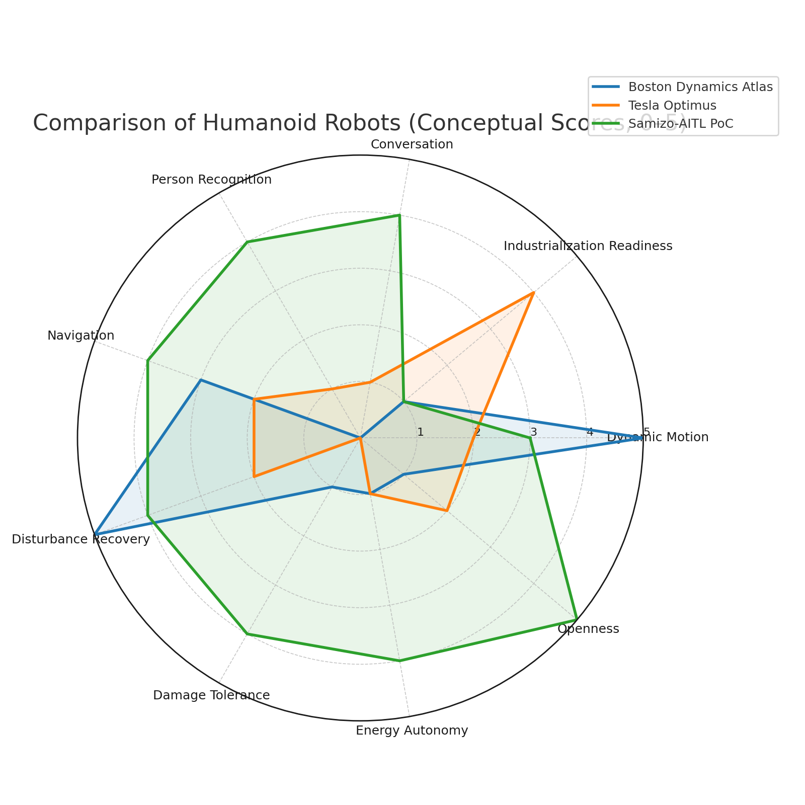
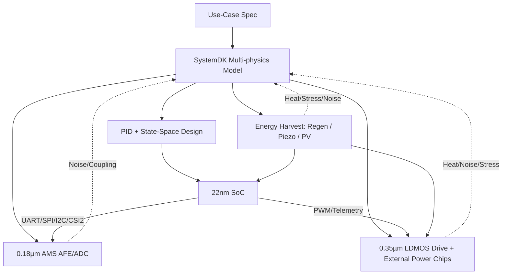

---

# 🚩 フラグシップPoC：人型ロボット（Samizo-AITL集大成）
*🚩 Flagship PoC: Humanoid Robot (Culmination of Samizo-AITL)*

[](#-ライセンス--license)

---

## ⚡ TL;DR / エグゼクティブサマリー
- **Samizo-AITL PoC = フラグシップ人型ロボットプロジェクト**  
  FSM × PID × 状態空間制御 × LLM を統合したクロスノード設計。  
  *Samizo-AITL PoC = Flagship humanoid robot project integrating FSM × PID × State-space × LLM in a cross-node design.*

- **Atlas & Optimus を超える領域**  
  会話・個人認識・損傷対応・自己発電による自律行動を実現。  
  *Goes beyond Atlas & Optimus by enabling conversation, person recognition, damage tolerance, and self-powering autonomy.*

- **目標 / Goal**  
  持続可能で冗長性を備えた知能的人型制御システムを実証し、Samizo-AITLの「集大成」とする。  
  *Demonstrate a sustainable, fault-tolerant, and intelligent humanoid control system as the culmination of Samizo-AITL.*
  
---

> **本PoCは Samizo-AITL プロジェクトの「集大成」**。<br/>
> *This PoC is positioned as the "culmination" of the Samizo-AITL project.*<br/>
> AITL-Hの三層アーキテクチャ（FSM × PID × LLM）を基盤に、**頭脳（22 nm SoC）／感覚（0.18 µm AMS）／筋肉（0.35 µm LDMOS＋外付けパワーチップ）／自己発電ブロック**を跨いだクロスノード設計を、SystemDKで統合検証します。<br/>
> *Based on AITL-H (FSM × PID × LLM), cross-node design spanning Brain (22 nm SoC), Sensing (0.18 µm AMS), Muscles (0.35 µm LDMOS + external power chips), and Energy Harvesting is integrated and verified with SystemDK.*

---

## 🔗 公式リンク / Official Links

| 言語 / Language | GitHub Pages 🌐 | GitHub 💻 |
|-----------------|----------------|-----------|
| 🇯🇵 Japanese | [](https://samizo-aitl.github.io/AITL-H/PoC/humanoid/) | [](https://github.com/Samizo-AITL/AITL-H/tree/main/PoC/humanoid) |

---

## 🧩 クロスノード・チップセット / Cross-Node Chipset

| ブロック / Block | ノード / Node | 役割・IF / Role & Interface |
|---|---|---|
| **Brain SoC (※1)** | **22 nm** | **LLM推論・FSM管理・状態空間制御（LQR/LQG IP）**<br/>*LLM inference, FSM management, state-space control (LQR/LQG IP)*<br/>UART / SPI / I²C / MIPI-CSI2 |
| **Sensor Hub (※2)** | **0.18 µm AMS** | **CMOSカメラ・IMU・エンコーダ・力覚/圧力・MEMSマイク**<br/>*CMOS camera, IMU, encoders, force/pressure, MEMS microphone*<br/>I²C / SPI / DVP / CSI2 |
| **Power Drive** | **0.35 µm LDMOS + 外付けパワーチップ** | **PWM/Hブリッジ・サーボ/BLDC駆動・温度/電流モニタ・大電流駆動**<br/>*PWM/H-bridge, servo/BLDC drive, temp/current monitor, high-current drive (MOSFET/GaN)* |
| **Energy Harvest** | **Piezo / PV / Regen** | **発電・蓄電・DC-DC電源供給**<br/>*Energy harvesting, storage, DC-DC power* |
| **Memory Subsystem** | **HBM (DRAM) + FeRAM Chiplet** | **高帯域ワーキングセット＋不揮発層（チェックポイント/メタデータ/低頻度更新）**<br/>*High-bandwidth working set + persistent tier (ckpt/metadata/low-update)*<br/>HBM3/E on interposer, NVM bus to FeRAM |

(※1) 極限環境用途では **22nm FD-SOI** 実装に切替可能（放射線耐性・広温度動作・低ノイズ対応）。  
*For extreme environments, Brain SoC can be implemented on **22nm FD-SOI** (radiation tolerance, wide-temp operation, low-noise).*  

(※2) 必要に応じ **0.18 µm SOI AMS** 実装も可能（低ノイズ・サブストレート干渉抑制・放射線耐性強化）。  
*Optionally, **0.18 µm SOI AMS** implementation is available (low-noise, reduced substrate coupling, enhanced radiation tolerance).*

---

## ⚙️ 制御アーキテクチャ / Control Architecture

| 層 / Layer | 実装 / Implementation | 役割 / Role |
|---|---|---|
| **LLM層** | SoCアプリ / RTOS | **目標生成・異常解釈・会話応答・学習**<br/>*Goal generation, anomaly interpretation, conversational response, learning* |
| **FSM層** | `fsm_engine.py` ・ YAML→C→Verilog | **行動モード切替（立位/歩行/旋回/転倒回避/目的地移動/省エネ/損傷対応）**<br/>*Behavior mode switching (standing, walking, turning, fall recovery, destination navigation, energy-saving, damage response)* |
| **物理制御層** | PID＋状態空間（LQR/LQG） | **関節SISO安定化＋全身MIMO協調制御＋外乱補償**<br/>*Joint SISO stabilization, whole-body MIMO control, disturbance compensation* |
| **駆動層** | LDMOS PWM/Hブリッジ＋外付けパワーチップ | **大トルク出力・安全監視**<br/>*High-torque output, safety monitoring* |
| **エネルギー層** | 圧電 / PV / 回生制御 | **発電・蓄電・電力マネジメント**<br/>*Energy harvesting, storage, power management* |

---

## 🔋 メモリサブシステム（HBM+FeRAM） / Memory Subsystem (HBM+FeRAM)

- **ねらい / Rationale**  
  HBMで制御・知覚スタックの**高帯域**を満たしつつ、FeRAMで**不揮発・低待機**・**インスタントレジューム**を実現。  
  *Meet high bandwidth with HBM while FeRAM provides non-volatility, low standby, and instant resume.*

- **役割分担 / Role Split**  
  - **HBM**: 学習済み特徴・マップ・バッファ等の**Hot/Warm**作業領域  
    *HBM for hot/warm working sets (features, maps, buffers)*  
  - **FeRAM**: **チェックポイント／ポリシー／ミッション状態**などの**Persistent/Cold**層  
    *FeRAM for persistent/cold data such as checkpoints, policies, mission state*

- **ポリシー / Policies**  
  **Tiering（Hot/Warm/Cold）**, **差分チェックポイント**, **HBMリフレッシュ抑制（FeRAM保護領域）**, **ECC/ウェア管理**  
  *Tiering, delta checkpointing, DRAM-refresh suppression for FeRAM-backed regions, ECC & wear management.*

```mermaid
flowchart LR
  Brain["🧠 Brain SoC (22 nm)"] -->|requests| HBM["⚡ HBM (DRAM): Working Set"]
  HBM <-.-->|ckpt/meta| FeRAM["💾 FeRAM: Persistent Tier"]
  PE["Policy Engine\n(tiering/ckpt/ECC)"] -.-> HBM
  PE -.-> FeRAM
```

---

## 📷 代表センサ構成 / Representative Sensors
- **CMOSイメージセンサ**（顔・場所認識）<br/>*CMOS image sensor (face & location recognition)*
- **IMU（6/9軸）＋エンコーダ**（外乱検知・姿勢推定）<br/>*IMU (6/9-axis) + encoders (disturbance detection, posture estimation)*
- **力覚／圧力センサ**（グリップ・足裏・損傷検知）<br/>*Force/pressure sensors (grip, foot sole, damage detection)*
- **MEMSマイク**（音声入力・声紋認識）<br/>*MEMS microphone (audio input, speaker recognition)*
- **温度センサ**（駆動系／SoCサーマル管理）<br/>*Temperature sensors (drive/SoC thermal)*
- **圧電素子アレイ**（歩行衝撃からのエネルギー回収）<br/>*Piezo array (harvesting walking impact)*
- **薄膜PVセル**（外装からの光発電）<br/>*Thin-film PV cells (exterior light harvesting)*

---

## 🤖 高度機能 / Advanced Capabilities

- **会話機能 / Conversational Ability**  
  MEMSマイクとLLM層を用い、自然言語での双方向対話が可能。音声認識と音声合成を通じて、人と自然に会話します。  
  *Using MEMS microphones and the LLM layer, the robot can engage in natural conversations with humans via speech recognition and synthesis.*

- **個人認識 / Person Recognition**  
  顔認識＋声紋認識で「誰が話しかけているか」を識別し、個別に応答可能。  
  *With facial and voiceprint recognition, the robot identifies individuals and responds personally.*

- **目的地移動 / Destination Navigation**  
  「リビングに行って」などの音声指示を理解し、SLAMと経路計画で指定場所へ移動可能。  
  *Understands spoken commands like “Go to the living room” and navigates there using SLAM and path planning.*

- **体勢回復 / Posture Recovery**  
  外部から押されてもIMU＋FSMで転倒を検知し、200 ms以内に姿勢を持ち直す。  
  *Detects external pushes via IMU and FSM, recovering posture within 200 ms.*

- **損傷対応 / Damage Tolerance**  
  腕や脚が一部損傷しても、残存アクチュエータを使って行動継続可能。  
  *Even with damaged limbs, the robot adapts and continues acting with remaining actuators.*

- **強力な駆動力 / Powerful Actuation**  
  0.35 µm LDMOSと外付けパワーチップ（MOSFET/GaN）を組み合わせ、大関節での高トルク出力に対応。  
  *Combining 0.35 µm LDMOS with external power chips (MOSFET/GaN) enables high-torque output for large joints.*

- **持続行動（自己発電） / Sustainable Operation (Self-Powering)**  
  圧電素子・薄膜PVセル・回生ブレーキを組み合わせ、外部電源がない山中やフィールド環境でも活動を継続可能。  
  *By combining piezoelectric elements, thin-film PV cells, and regenerative braking, the robot can sustain operation even in mountains or field environments without external power.*

---

## 🌍 世界主要人型ロボットとの比較 / Comparison with World-Leading Humanoid Robots

| 項目 / Feature | Boston Dynamics **Atlas** | Tesla **Optimus** | **Samizo-AITL PoC** |
|----------------|----------------------------|-------------------|---------------------|
| **開発目的 / Goal** | 研究用プラットフォーム（動的モーションデモ）<br/>*Research platform for dynamic motion demos* | 工場・物流向けの量産型<br/>*Mass production for factory & logistics* | 教育＋研究の集大成 / 自律・冗長性重視<br/>*Educational + research culmination, with autonomy & fault tolerance* |
| **制御 / Control** | 高速動的制御（跳躍・宙返り）<br/>*Dynamic control for jumps/flips* | シンプルな歩行・物体操作<br/>*Simple walking & manipulation* | FSM × PID × 状態空間 × LLM<br/>*FSM × PID × State-space × LLM* |
| **外乱耐性 / Disturbance Recovery** | 強力（押しても転ばない）<br/>*Robust (resists pushes)* | 限定的（動画では慎重な動き）<br/>*Limited (careful movements in demos)* | **200ms以内に姿勢回復**<br/>*Posture recovery ≤200 ms* |
| **会話 / Conversation** | なし<br/>*None* | 基本AI応答（将来予定）<br/>*Basic AI response planned* | **LLMによる自然会話対応**<br/>*Conversational via LLM* |
| **個人認識 / Person Recognition** | なし<br/>*None* | 顔/声認識は未実装<br/>*Not yet implemented* | **顔＋声紋で個別応答**<br/>*Face + voiceprint recognition* |
| **目的地移動 / Navigation** | 実験的（障害物回避あり）<br/>*Experimental, with obstacle avoidance* | 工場内ナビゲーションを計画<br/>*Planned factory navigation* | **SLAM＋音声指示で目的地移動**<br/>*SLAM + voice command navigation* |
| **損傷対応 / Damage Tolerance** | 転倒時は動作停止<br/>*Stops after falls* | 未実装<br/>*Not implemented* | **残存関節で行動継続**<br/>*Continues acting with remaining actuators* |
| **パワー / Power Output** | 外部バッテリ＋高出力油圧<br/>*External battery + hydraulics* | 内蔵バッテリ駆動<br/>*Internal battery powered* | **0.35 µm LDMOS＋外付けパワーチップ**で大関節高トルク<br/>*0.35 µm LDMOS + external power chips for high-torque joints* |
| **エネルギー自立 / Energy Autonomy** | バッテリ依存<br/>*Battery only* | バッテリ依存<br/>*Battery only* | **圧電＋PV＋回生で持続行動**<br/>*Piezo + PV + regen for sustained operation* |
| **公開性 / Openness** | 非公開（デモ動画のみ）<br/>*Closed, demo videos only* | 限定公開（動画・一部発表）<br/>*Partially open, demos* | **GitHub Pagesで日英公開**<br/>*Published bilingual on GitHub Pages* |

<p align="center">
  
</p>

📌 **総評**  
- **Atlas** → 「運動性能」で突出（跳躍・宙返りなどアクロバット重視）。  
- **Optimus** → 「量産・産業応用」に焦点（工場導入前提）。  
- **Samizo-AITL PoC** → 「教育＋研究集大成＋エネルギー自立＋損傷対応」で差別化。  

👉 世界トップを目指すなら、「**Atlas級の運動性能**」＋「**Optimus級の産業実装性**」に加え、**Samizo-AITL独自の“自立性・冗長性”** を強調することがカギになります。

---

## 🧭 SystemDK統合設計フロー / SystemDK Integrated Design Flow


---

## 🎯 成功指標（KPI） / Key Performance Indicators
- **姿勢回復時間** ≤ 200 ms<br/>*Posture recovery time ≤ 200 ms*
- **歩容安定度**（CoM偏差RMS）**+30%**（PID単独比）<br/>*Gait stability +30% vs. PID-only*
- **エネルギー効率** **+15%**（協調制御＋ハーベスト）<br/>*Energy efficiency +15% (hybrid + harvesting)*
- **異常検知誤差率**（LLM+FSM） < 2%<br/>*Anomaly detection error < 2%*
- **自己発電寄与率**：消費電力量の最大 **20%補填**<br/>*Self-powering contribution up to 20%*
- **持続行動時間延長**：従来比 **+30%**（山岳フィールドにおける動作時間）<br/>*Sustained operation time +30% in mountain/field missions*
- **待機電力削減（HBM+FeRAM）**：従来比 **−20〜−35%**
- **インスタントレジューム**：**≤ 1–5 ms**（全系再初期化なし）
- **チェックポイント耐久**：FeRAM年間書込みが **10¹²** 回未満（設計上限内）

---

## 📂 ディレクトリ構成（予定） / Planned Directory Structure
```
humanoid/
 ├─ README.md
 ├─ hw/            # SoC, AMS, LDMOS, Power Chips 設計 / SoC, AMS, LDMOS, Power chips design
 ├─ control/       # FSM, PID, 状態空間, LLM / FSM, PID, state-space, LLM
 ├─ systemdk/      # モデル & シミュレーション / Models & simulation
 ├─ energy/        # 自己発電・電力回生モデル / Energy harvesting & regen models
 ├─ docs/          # マニュアル・テスト仕様 / Manuals & test specs
 └─ logs/          # 実験ログ / Experiment logs
```

---

## 📑 詳細資料リンク / Reference Links

| 資料 / Material | 内容 / Description | リンク / Links |
|-----------------|--------------------|----------------|
| **Humanoid PoC Reports** | PWM Ripple / Thermal Derating / Mission Energy | [](https://samizo-aitl.github.io/AITL-H/PoC/humanoid/docs/) [](https://github.com/Samizo-AITL/AITL-H/tree/main/PoC/humanoid/docs) |
| **Flagship PoC Slides** | 発表用スライド雛形 / *Presentation draft slides* | [](https://samizo-aitl.github.io/AITL-H/PoC/humanoid/docs/flagship_poc_slides/) [](https://github.com/Samizo-AITL/AITL-H/blob/main/PoC/humanoid/docs/flagship_poc_slides.md) |
| **HBM+FeRAM（Edusemi-v4x）** | モバイルエッジAI向けHBM+FeRAM統合の設計・評価 / *Design & evaluation of HBM+FeRAM for mobile edge AI* | [📄 View Detail](https://samizo-aitl.github.io/Edusemi-v4x/d_chapter1_memory_technologies/hbm_feram.md) |

---

## 🚀 今後の展望 / Roadmap

- **実証実験ステップ / Experimental Steps**  
  - シミュレーションでのKPI検証（姿勢回復200ms・省エネ効率+15%）  
    *Validate KPIs in simulation (200 ms recovery, +15% efficiency)*  
  - 小型プロトタイプでの歩行・転倒回復デモ  
    *Prototype demonstration of walking and fall recovery*  
  - 会話・個人認識の実装テスト  
    *Test implementation of conversation and person recognition*  

- **技術拡張 / Technical Extensions**  
  - 大トルク駆動に向けたGaN/MOSFETパワーチップ統合  
    *Integrate GaN/MOSFET power chips for high-torque actuation*  
  - エネルギーハーベスト効率の最適化（圧電＋PV＋回生制御）  
    *Optimize energy harvesting (piezo + PV + regenerative control)*  

- **応用展開 / Applications**  
  - 山岳・災害現場での持続的自律活動  
    *Sustainable autonomous activity in mountain/disaster sites*  
  - 工場・物流での省エネ人型アシストロボット  
    *Energy-efficient humanoid assist robots for factories/logistics*  

- **最終目標 / Final Goal**  
  Samizo-AITLの集大成として、**「自律・冗長性・持続性」を備えた世界トップ水準の人型ロボット** を確立する。  
  *Establish a world-class humanoid robot with autonomy, fault tolerance, and sustainability as the culmination of Samizo-AITL.*
  
---

## 📚 関連プロジェクト・教材 / Related Projects & Materials

| プロジェクト / Project | 説明 / Description | リンク / Links |
|---|---|---|
| **EduController Part09** | FSM × PID × LLM統合制御教材<br/>*Integrated control (FSM × PID × LLM)* | [](https://samizo-aitl.github.io/EduController/part09_llm_hybrid/) [](https://github.com/Samizo-AITL/EduController/tree/main/part09_llm_hybrid) |
| **Edusemi-v4x Chapter3** | FSM × PID × LLMによるSoC設計教材<br/>*SoC design with FSM × PID × LLM* | [](https://samizo-aitl.github.io/Edusemi-v4x/f_chapter3_socsystem/) [](https://github.com/Samizo-AITL/Edusemi-v4x/tree/main/f_chapter3_socsystem) |
| **AITL-Strategy-Proposal** | AITL戦略提言・政策提案<br/>*Strategy proposals & policy* | [](https://samizo-aitl.github.io/AITL-Strategy-Proposal/) [](https://github.com/Samizo-AITL/AITL-Strategy-Proposal) |

- **Hybrid Memory (HBM+FeRAM)**  
  HBMは高帯域・大容量を提供し、FeRAMは不揮発・低待機電力・瞬時復帰を補完。  
  *HBM provides high bandwidth and capacity, while FeRAM complements with non-volatility, low standby power, and instant resume.*  

  **SystemDK** によるトップダウン協調設計（チップレット／コントローラ／OS）で、  
  スタンバイ電力と再起動時間を削減するハイブリッド構成を検討・教材化。  
  *Using **SystemDK** top-down co-design (chiplets / controllers / OS), we document hybrid architectures that reduce standby power and reboot time.*  

  👉 [📄 HBM+FeRAM 詳細（Edusemi-v4x）](https://samizo-aitl.github.io/Edusemi-v4x/d_chapter1_memory_technologies/hbm_feram.md)
  
---

## 👤 執筆者 / Author

| 項目 / Item | 内容 / Details | 
|---|---|
| **著者 / Author** | **三溝 真一**（Shinichi Samizo）<br/>*Shinichi Samizo* |
| **Email** | [](mailto:shin3t72@gmail.com) |
| **X** | [](https://x.com/shin3t72) |
| **GitHub** | [](https://github.com/Samizo-AITL) |

---

## 📄 ライセンス / License
[](#-ライセンス--license)

| 項目 / Item | ライセンス / License | 説明 / Description |
|-------------|----------------------|--------------------|
| **コード（Code）** | [MIT License](https://opensource.org/licenses/MIT) | 自由に使用・改変・再配布可<br/>*Free to use, modify, and redistribute* |
| **教材テキスト（Text）** | [CC BY 4.0](https://creativecommons.org/licenses/by/4.0/) | 著者表示必須<br/>*Attribution required* |
| **図表・イラスト（Figures）** | [CC BY-NC 4.0](https://creativecommons.org/licenses/by-nc/4.0/) | 非商用利用のみ可<br/>*Non-commercial use only* |
| **外部引用（External refs）** | 元ライセンスに従う | 引用元を明記<br/>*Follow original license & cite* |

---

## 🔝 トップに戻る / Back to Top
[](../../) [](https://github.com/Samizo-AITL/AITL-H)
