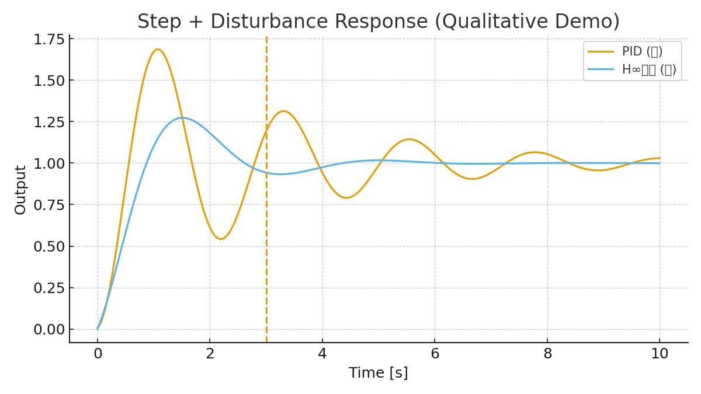

# SkyEdge: Secure High-Altitude Drone Platform Integrating H∞ Control, Domestic Devices, and Advanced Mechanical Design
### （SkyEdge：H∞制御・国産デバイス・メカ設計を統合した高高度セキュアドローンプラットフォーム）

## 1. 序論

- **背景**  
  ドローン技術は防衛、防災、環境モニタリングなど多様な分野で重要性を増している。しかし国内では依然として海外製、特に中国製ドローンへの依存が大きく、安全保障リスクや技術的自立性の欠如が指摘されている。また、GX（グリーントランスフォーメーション）の推進や社会インフラ監視においても、国産技術による信頼性の高い基盤が求められている。  

- **課題**  
  現行の民生ドローンは高度3,000 m程度が限界であり、強風・低温・低圧といった高高度環境での安定飛行は困難である。さらに、通信や制御系におけるセキュリティ機能は不十分であり、外乱耐性・耐ジャミング性の観点からも運用上のリスクが残る。  

- **既存研究の限界**  
  UAVの制御技術に関してはPID、適応制御、スライディングモード制御などが検討されてきたが、乱気流などの外乱に対して十分なロバスト性を確保するには限界がある。また、デバイスやメカ設計についても、従来は要素技術ごとの最適化にとどまり、全体としての統合設計が不足している。  

- **本研究の目的**  
  本研究は、**H∞制御による外乱抑圧と安定性確保、国産デバイスによるセキュアな制御実装、可変ピッチを含む高高度対応機体設計**を統合することで、10,000 m級の高高度環境に対応可能な国産セキュアドローンプラットフォーム「SkyEdge」の基盤設計を提示することを目的とする。
  
## 2. 関連研究
- UAV制御: PID, 適応制御, スライディングモード, H∞制御の比較。  
- デバイス統合: SoC化、モータドライバ技術、エナジーハーベスト応用。  
- 構造設計: マルチローター冗長性、軽量化構造、3Dプリント活用。  
- **追加**: 高高度UAV研究例（NASA Helios、JAXA UAV実証）を参照。

## 3. 社会的意義
- 防衛: 国境監視、電子妨害下での継続飛行、セキュア通信。  
- 防災: 広域災害監視、通信リレー。  
- GX: 温室効果ガス・環境モニタリング。  
- 教育: 制御・デバイス・メカ統合教材。  
- **補強**: GXと教育を接続し、「次世代エンジニア育成とグリーンエネルギー実証の場」と位置付け。

---

# Part I: 制御システム（理論）

## 4. 制御アーキテクチャ概要
- **H∞制御**: 強風・乱気流下（20–30 m/s相当）でも安定余裕を確保。  
- **FSM**: 通常 / 高高度 / 通信断 / 緊急帰還のモード遷移。  
- **LLM**: 未知状況下での制御則再設計支援（シミュレーション環境）。  

### 4.1 プラントモデル（簡易例）
$$
P(s) = \frac{1}{J s^2 + D s}
$$

- $J$: 機体慣性モーメント  
- $D$: 空気抵抗による減衰  

## 5. 外乱対応シミュレーション（定性的・数値デモ）
  
  
  

- ステップ追従中に外乱を加えた比較（PID vs H∞）。H∞の方が外乱後の回復が速く、オーバーシュートが小さい。  
- 周波数領域でも、H∞は低〜中周波外乱の伝達ゲインが低い。  

### 5.2 「制御→デバイス→メカ」の責務分担マップ
| 障害/外乱 | 制御系（H∞/FSM/LLM） | デバイス（SoC/Drivers/Sensors） | メカ（構造/外装） |
|---|---|---|---|
| 突風・乱気流 | H∞でロバスト安定化 | 高レートIMU、低遅延SoC、応答性ESC | 大径可変ピッチ、剛性フレーム |
| モータ1基故障 | FSMで推力再配分 | モニタリング、故障検知 | 6ローター冗長 |
| 通信断/ジャミング | FSMで自律航法へ遷移 | TPM鍵管理、耐妨害リンク | ラドーム、アンテナ視界確保 |
| 低温/電源劣化 | LLMで省電力最適化 | デュアルバッテリ、PTCヒータ | 断熱外装 |
| 着氷リスク | FSMで高度/速度再設定 | 温湿度センサ | 撥水・防氷コート |

## 6. H∞設計①: 重み関数と感度関数
  
  
  

$$
W_1(s) = \frac{0.5 s + 10}{s + 10^{-3}}, \quad
W_2(s) = \frac{s + 0.1}{s + 100}, \quad
W_3(s) = \frac{s + 10}{s + 10^3}
$$

- $W_1$: 外乱抑圧  
- $W_2$: 制御入力制約  
- $W_3$: 高周波ロールオフ  

## 7. H∞設計②: 閉ループ目標と実装ガイド
  

- $|S| \le 1/|W_1|$  
- $|T| \le 1/|W_3|$  
- $|KS| \le 1/|W_2|$  

---

# Part II: デバイス統合（実装基盤）

## 8. デバイス統合アーキテクチャ
- SoC (65 nm FDSOI)、LDMOSドライバ、CIS、エナジーハーベスト。  

## 9. デバイス実装要件
- 制御周期 $\leq 1.0$ ms  
- IMU $\geq 1$ kHz  
- ESC応答 $\leq 100 \ \mu$s  
- セキュリティ: TPM + PQC  

## 10. デバイス候補BOMと概算コスト
合計試算: 約 **596,700円/機体** （量産で30–50%低減可能）  

## 11. セキュリティ・国産化の可能性
- TPMによる鍵管理  
- 国産半導体ラインの活用  

---

# Part III: メカ設計（構造・環境耐性）

## 12. メカ設計概要
- 700–900 mm クラス  
- 可変ピッチ20インチ  
- CFRP構造・断熱外装  

## 13. 重量・推力設計
- TOW: 6.38 kg  
- ホバリング推力: 7.66 kgf  
- 最大推力: 12.76 kgf  
- $T/W \approx 2.82$  

## 14. 可変ピッチ推力レンジ
  

## 15. 可変ピッチと高度影響
  

- 海面高度: 約 8,339 rpm  
- 高度10,000 m: 約 14,353 rpm  

## 16. 可変ピッチ機構
  
  

- サーボ要求トルク: 約 0.62 N·m  
- 安全率 2–3 → 定格15–20 kgf·cm  

---

# Part IV: 統合・評価・PoC

## 17. 評価計画
- 風洞試験、低温チャンバ、冗長性試験、通信耐性評価  

## 18. PoCスケジュールと体制
  

## 19. 政策向け要点
- 防衛・防災・GX・教育  
- 国産半導体・CFRP連携  

---

# Part V: まとめ

## 20. 結論
本研究では、**H∞制御による外乱抑圧、国産デバイスによるセキュア実装、可変ピッチを含むメカ設計**を統合し、  
高高度 10,000 m 級の極限環境に対応可能な国産セキュアドローンプラットフォーム「SkyEdge」の基盤設計を提示した。  

提案した設計手法は、強風・低温・通信断といった空の課題に対して冗長性と信頼性を確保できることを示した。  
さらに、本研究のアーキテクチャ（制御・デバイス・メカの統合思想）は汎用性を持ち、海底探査ドローン（AUV/ROV）等への応用、すなわち「SeaEdge」への展開も可能である。  
これにより、空と海を両輪とした自律型ドローン基盤技術として、防衛・防災・GX・教育・資源探査を横断する国家的な技術基盤へ発展し得る。  

## 21. 参考文献
- Zames, G. (1981). Feedback and Optimal Sensitivity: Model Reference Transformations, Multiplicative Seminorms, and Approximate Inverses.  
- Doyle, J. C. (1989). Guaranteed Margins for LQG Regulators.  
- Skogestad, S., & Postlethwaite, I. (2005). *Multivariable Feedback Control*.  
- Sugie, T. (1991). Robust Control for Uncertain Systems.  
- u-blox ZED-F9P, Bosch BMI088, Sony IMX296 – 各種デバイス仕様書.  
- 経済産業省 (2023). 「ラピダスに関する報告書」.  
- NASA Helios Program, JAXA HAPS (2019). 高高度実証機研究.  
- OpenAI (2023). *GPT-4 Technical Report*.  
