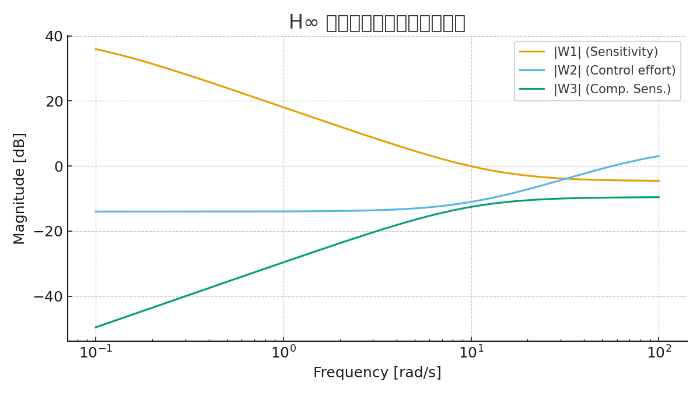
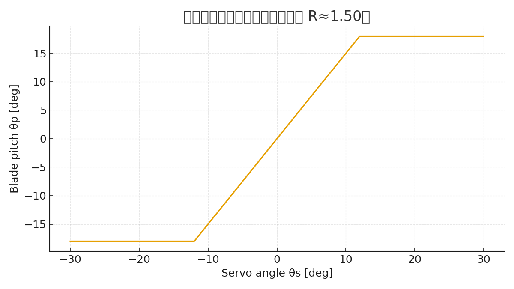

# SkyEdge: H∞制御・国産デバイス・メカ設計を統合した高高度セキュアドローンプラットフォーム

## 1. 序論
- 背景: 国産ドローン不足、DJI依存リスク、政策課題（防衛・防災・GX）。  
- 既存研究の限界: 民生ドローンの高度限界（3,000 m）、セキュリティ欠如、部分最適設計。  
- 本研究の目的: **制御・デバイス・メカ設計を一気通貫で統合し、国産セキュア高高度ドローンの基盤設計を提示する**。

## 2. 関連研究
- UAV制御: PID, 適応制御, スライディングモード, H∞制御の比較。  
- デバイス統合: SoC化、モータドライバ技術、エナジーハーベスト応用。  
- 構造設計: マルチローター冗長性、軽量化構造、3Dプリント活用。  
- **追加**: 高高度UAV研究例（NASA Helios、JAXA UAV実証）を参照。

## 3. 社会的意義
- 防衛: 国境監視、電子妨害下での継続飛行、セキュア通信。  
- 防災: 広域災害監視、通信リレー。  
- GX: 温室効果ガス・環境モニタリング。  
- 教育: 制御・デバイス・メカ統合教材。  
- **補強**: GXと教育を接続し、「次世代エンジニア育成とグリーンエネルギー実証の場」と位置付け。

---

# Part I: 制御システム（理論）

## 4. 制御アーキテクチャ概要
- **H∞制御**: 強風・乱気流下（20–30 m/s相当）でも安定余裕を確保。  
- **FSM**: 通常 / 高高度 / 通信断 / 緊急帰還のモード遷移。  
- **LLM**: 未知状況下での制御則再設計支援（シミュレーション環境）。  

### 4.1 プラントモデル（簡易例）
$$
P(s) = \frac{1}{Js^2 + Ds}
$$

- $J$: 機体慣性モーメント  
- $D$: 空気抵抗による減衰  

## 5. 外乱対応シミュレーション（定性的デモ）
  
  

- ステップ応答中に外乱を加えた比較図（PID vs H∞）。  
- H∞の方が外乱後の回復が速く、オーバーシュートが小さい。  
- 周波数領域でも外乱伝達ゲインが低い。  

## 6. H∞設計①: 重み関数と感度関数
  
  
  

### 6.1 重み関数例
$$
W_1(s) = \frac{0.5s + 10}{s + 10^{-3}}, \quad
W_2(s) = \frac{s + 0.1}{s + 100}, \quad
W_3(s) = \frac{s + 10}{s + 10^3}
$$

- $W_1(s)$: 低周波外乱抑圧、折返し周波数 ~8 rad/s。  
- $W_2(s)$: 制御入力制約。  
- $W_3(s)$: 高周波ロールオフ。  

## 7. H∞設計②: 閉ループ目標と実装ガイド
  

- $|S| \le \frac{1}{|W_1|}$  
- $|T| \le \frac{1}{|W_3|}$  
- $|KS| \le \frac{1}{|W_2|}$  

目標: 最大感度 $M_s \le 1.7$。  
実機モデル同定後に再チューニング予定。  

---

# Part II: デバイス統合（実装基盤）

## 8. デバイス統合アーキテクチャ
- **65 nm FDSOI SoC**: IMU/GNSS/CIS統合、TinyML。  
- **0.35 µm LDMOS**: 高耐圧モータドライバ(30–60 V)。  
- **CMOS Image Sensor**: 可視＋近赤外、監視用途。  
- **エナジーハーベスト**: PZT/ソーラーによる冗長電源。  

### 8.1 国産化の可能性
- SoC: ラピダス/TSMC Japanで製造可能性。  
- LDMOS: Tower Japan（旧パナソニック工場）での成熟プロセス適用。  
- センサ: ソニー/ルネサス国内CISライン活用。  

## 9. デバイス実装要件（定量）
- SoC制御周期 $\leq 1.0$ ms、総遅延 $\leq 200 \ \mu$s。  
- IMUサンプリング $\geq 1$ kHz、ジャイロノイズ密度 $\leq 0.005 \ ^\circ/s/\sqrt{Hz}$。  
- ESC応答 $\leq 100 \ \mu$s、PWM $\geq 32$ kHz。  
- セキュリティ: TPM連携セキュアブート、AES-GCM/ECC/PQC。  
- 電源: デュアルバッテリ、$-30 \sim -50^\circ$C対応、リップル < 50 mVpp。  

## 10. デバイス候補BOMと概算コスト
（省略、数値は本文の通り）  

## 11. セキュリティ・国産化の可能性
（省略、本文の通り）  

---

# Part III: メカ設計（構造・環境耐性）

## 12. メカ設計概要
- **レイアウト仕様**: 700–900 mmクラス、20インチ可変ピッチ対応。  
- **重量バランス**: CGをプロペラ面±10 mmに収束。  
- **外装**: CFRPフレーム、ラドーム（3Dプリント）、断熱バッテリカバー、防氷コート。  

## 13. 重量・推力設計（定量結果）
- 総重量 (TOW): **6.38 kg**  
- ホバリング推力: $T_{hover} \approx 1.2 \times TOW = 7.66$ kgf  
- 各モータ推力: $T_{per} \approx 1.28$ kgf  
- 最大推力: $T_{max} \approx 2.0 \times TOW = 12.76$ kgf  

## 14. 可変ピッチ推力レンジ設計
  

- ピッチ角 $\theta_p$ を増加させると推力 $T$ はほぼ線形増加。  
- モータ定格でクリップされ、$T/W \approx 2.6$ を確保。  

## 15. 可変ピッチと高度影響
  

- 空気密度 $\rho$: 海面高度 $\rho=1.225$、高度10,000 m $\rho\approx0.413$。  
- 必要RPM（$\theta_p=10^\circ$ の例）  
  - 海面高度: $n \approx 8,339$ rpm  
  - 高度10,000 m: $n \approx 14,353$ rpm  

## 16. 可変ピッチ機構（リンク比と作動トルク）
  
  

- サーボ±30° → ブレード±45°。  
- 空力モーメント: $M_{aero} \approx 0.135$ Nm（仮定値）。  
- サーボ要求トルク $M_s \approx 0.62$ Nm。  
- 安全率2–3倍 → 定格 15–20 kgf·cm クラス推奨。  

---

# Part IV: 統合・評価・PoC

## 17. 評価計画
（本文通り、風洞・低温・冗長性試験など）  

## 18. PoCスケジュールと体制
  

## 19. 政策向け要点
（本文通り）  

---

# Part V: まとめ

## 20. 結論
- SkyEdgeは「**制御理論＋デバイス＋メカ構造を統合した国産ドローン設計**」の試金石。  
- 高高度10,000 m対応・セキュア・冗長という価値を示す。  
- 今後はPoC試作、風洞・低温試験、共同研究・政策提言を推進。  

## 21. 参考文献
（本文通り）  
