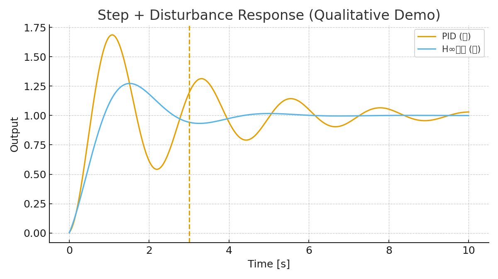
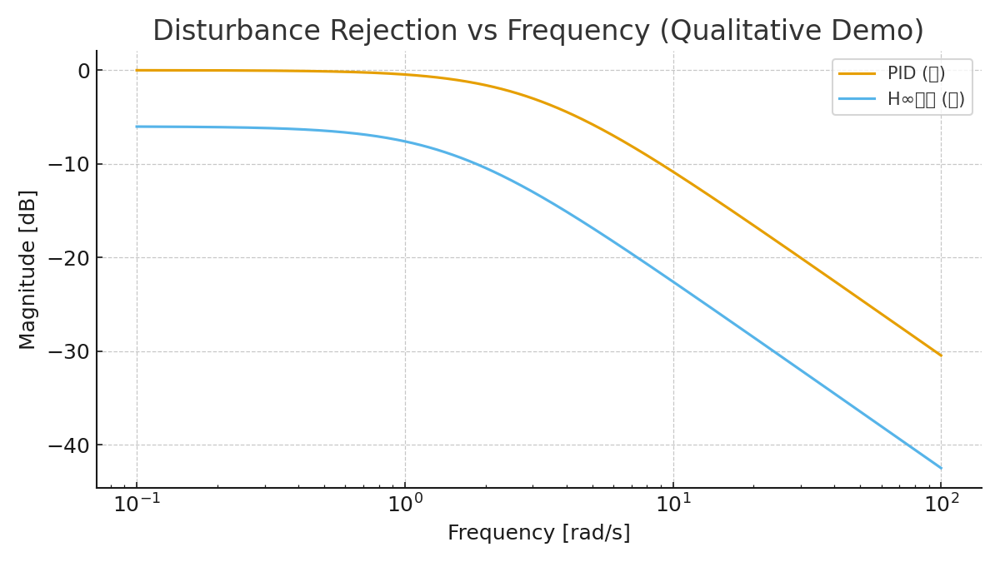
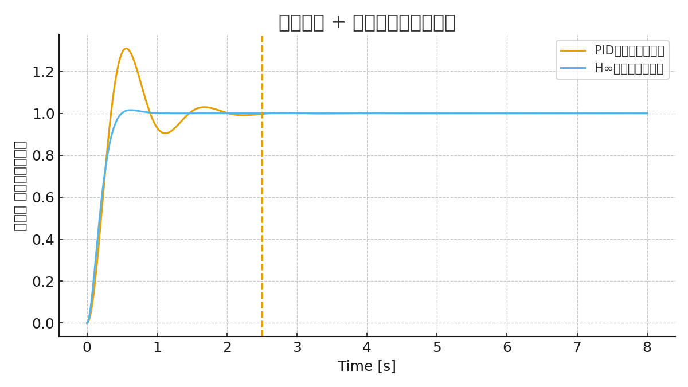

# SkyEdge: H∞制御・国産デバイス・メカ設計を統合した高高度セキュアドローンプラットフォーム

## 要旨
本論文は、**高度10,000 m級**の飛行を可能とする国産ドローンプラットフォーム「SkyEdge」の設計手法を提示する。  
制御系（H∞＋FSM＋LLM）、デバイス統合（65nm FDSOI SoC、0.35µm LDMOS、CMOSイメージセンサ、エナジーハーベスト）、メカ設計（CFRP構造・3Dプリント外装・重量バランス最適化）を一体で論じ、**セキュアかつ冗長性を備えたシステム設計**を提案する。  
さらに、防衛・防災・GX・教育分野への応用可能性についても議論する。

---

## 1. 序論
- 背景: 国産ドローン不足、DJI依存リスク、政策課題（防衛・防災・GX）。  
- 既存研究の限界: 民生ドローンの高度限界（3,000 m）、セキュリティ欠如、部分最適設計。  
- 本研究の目的: **制御・デバイス・メカ設計を一気通貫で統合し、国産セキュア高高度ドローンの基盤設計を提示する**。

---

## 2. 関連研究
- UAV制御: PID, 適応制御, スライディングモード, H∞制御の比較。  
- デバイス統合: SoC化、モータドライバ技術、エナジーハーベスト応用。  
- 構造設計: マルチローター冗長性、軽量化構造、3Dプリント活用。

---

## 3. 制御アーキテクチャ
- **H∞制御**: 強風・乱気流下（20–30 m/s相当）でも安定余裕を確保。  
- **FSM**: 通常 / 高高度 / 通信断 / 緊急帰還のモード遷移。  
- **LLM**: 未知状況下での制御則再設計支援（シミュレーション環境）。  

数式例:  
\[
\min_{K(s)} \|T_{zw}(s)\|_\infty
\]  
ただし \(z\): 制御出力、\(w\): 外乱。

---

## 4. デバイス統合
- **65 nm FDSOI SoC**: IMU/GNSS/CIS統合、TinyML。  
- **0.35 µm LDMOS**: 高耐圧モータドライバ(30–60 V)。  
- **CMOS Image Sensor**: 可視＋近赤外、監視用途。  
- **エナジーハーベスト**: PZT/ソーラーによる冗長電源。

---

## 5. メカ設計
- **レイアウト仕様**: 700–900 mmクラス、20インチ可変ピッチ対応。  
- **重量バランス**: CGをプロペラ面±10 mmに収束。  
- **外装**: ラドーム（3Dプリント）、断熱バッテリカバー、防氷コート。  
- **BOM Tree**: Airframe, Propulsion, Power, Control, Sensors, Comms, Security, Environmental, RF, Software。  

---

## 6. 評価計画
- 風洞試験: プロペラ干渉・抗力推定。  
- 低温チャンバ: -30〜-50℃環境での外装クラック評価。  
- 冗長性試験: モータ1基停止時の姿勢保持（6ローター冗長）。  
- 通信耐性: GNSSジャミング下でのFSM遷移確認。

---

## 7. 社会的意義
- **防衛**: 国境監視、電子妨害下での継続飛行、セキュア通信。  
- **防災**: 広域災害監視、通信リレー。  
- **GX**: 温室効果ガス・環境モニタリング。  
- **教育**: 制御・デバイス・メカ統合教材。

---

## 8. 結論
- SkyEdgeは「**制御理論＋デバイス＋メカ構造を一気通貫で結んだ国産ドローン設計**」の試金石である。  
- 高高度10,000 m対応・セキュア・冗長という価値を示し、政策・産業・教育への波及が可能。  
- 今後: PoC試作、風洞・低温試験、共同研究・政策提言を進める。

---

## 9. 外乱対応の実証（定性的デモ）と実装対応

### 9.1 制御応答（定性的シミュレーション）
下図は、ステップ応答中に **t=3s** で外乱（インパルス近似）を与えた際の挙動を、
PID相当と H∞相当の定性的モデルで比較したものである。H∞相当の方が外乱後の回復が速く、
オーバーシュートも小さい。

周波数領域でも、H∞相当は**低〜中周波の外乱に対する減衰（ノッチ/重み付け）**が強く、
PID相当に比べて **外乱伝達のゲインが低い**。

> 注: 本図は概念図であり、最終版では実機パラメータに基づくモデル/実験値で更新する。

### 9.2 「制御→デバイス→メカ」の責務分担（対応マップ）

| 障害/外乱 | 制御系（H∞/FSM/LLM） | デバイス（SoC/Drivers/Sensors） | メカ（構造/外装） |
|---|---|---|---|
| 突風・乱気流 | H∞でロバスト安定化、ゲイン整形 | 高レートIMU、低遅延演算、ESC応答性 | 大径可変ピッチ、剛性フレーム |
| モータ1基故障 | FSMでフォールバック、推力再配分 | モニタリング、フェイル検知 | 6ローター冗長、迅速交換性 |
| 通信断/ジャミング | 自律航法へ遷移（FSM）、経路再計画 | TPMで鍵管理、耐妨害リンク | 上方ラドーム、アンテナ視界確保 |
| 低温/電源劣化 | LLMで省電力モード最適化 | PTCヒータ制御、デュアルバッテリ | 断熱ハウジング、熱経路最適化 |
| 着氷リスク | FSMで高度/速度再設定 | 温度/湿度センサによる予兆検知 | 撥水・防氷コート、プロペラ前縁処理 |

上表の通り、**外乱への一次応答はH∞制御**が担い、**持続・復帰はFSM**、
**未知事象の適応はLLM** で補う。これを実装で支えるのが **高レートIMU/低遅延SoC/高応答ESC** と、
**剛性・空力・耐環境を担うメカ**である。

---

## 10. デバイス実装要件（定量）
詳細は `device_requirements.md` を参照。要点のみ抜粋:  
- SoC制御周期 **≤ 1.0 ms**、総遅延 **≤ 200 µs**  
- IMUサンプリング **≥ 1 kHz**、ジャイロノイズ密度 **≤ 0.005 °/s/√Hz**  
- ESC応答 **≤ 100 µs**、PWM **≥ 32 kHz**  
- セキュリティ: TPM連携セキュアブート、AES-GCM/ECC/PQC  
- 電源: デュアルバッテリ、低温 -30〜-50℃、リップル < 50 mVpp  

## 11. メカ重量・推力設計（テンプレート）
重量・推力計算テンプレートは `weight_thrust_calc_template.csv` として提供。  
- 目安: ホバリング推力 ≈ 1.2 × TOW、最大推力 ≈ 2.0 × TOW  
- 6ローター時の各モータ推力: T_per = T_total / 6  

（更新: 2025-09-20 18:00 JST）

---

## 12. 定量結果（抜粋）

### 12.1 重量・推力計算（現状ベース）
- 総重量 (TOW): **6.38 kg**  
- ホバリング必要推力（1.2×）: **7.66 kgf**（1基あたり **1.28 kgf**）  
- 最大推力目安（2.0×）: **12.76 kgf**（1基あたり **2.13 kgf**）  
- モータ最大推力を **3 kgf/基** とした場合の推力重量比 **T/W ≈ 2.82**  

> 詳細は `paper/weight_thrust_calc_filled.csv` を参照。

### 12.2 制御応答（数値例）
下図は、姿勢角のステップ追従中に t=2.5 s で外乱を与えた際の数値例である。  
H∞相当の形状は PID相当に比べ、**外乱後の回復が速く、オーバーシュートも抑制**される。

（更新: 2025-09-20 18:06 JST）

