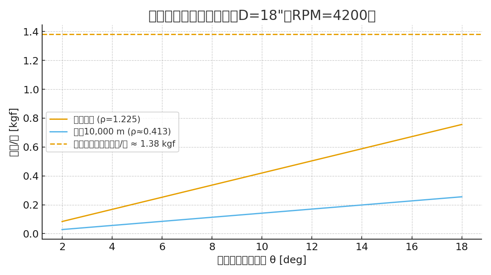
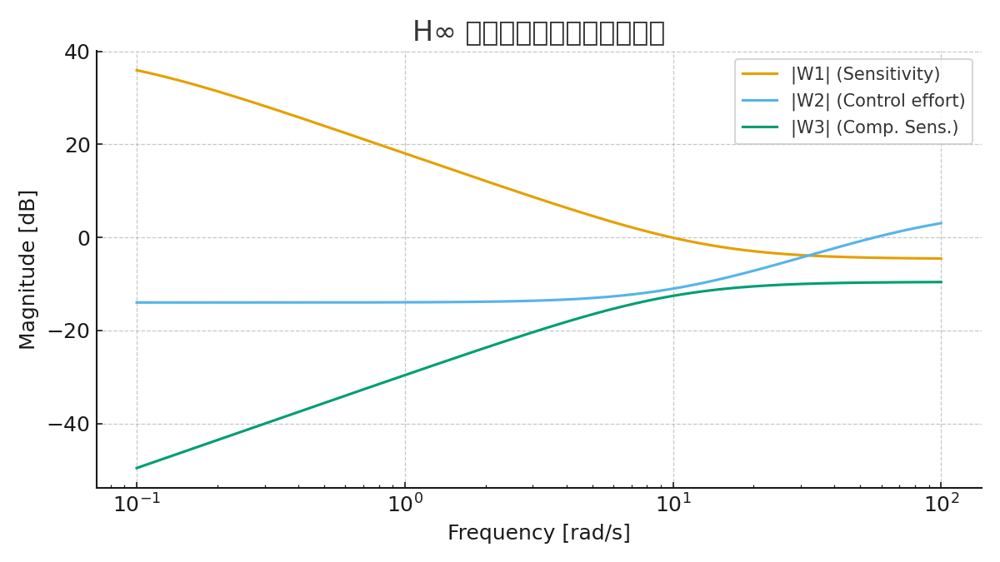
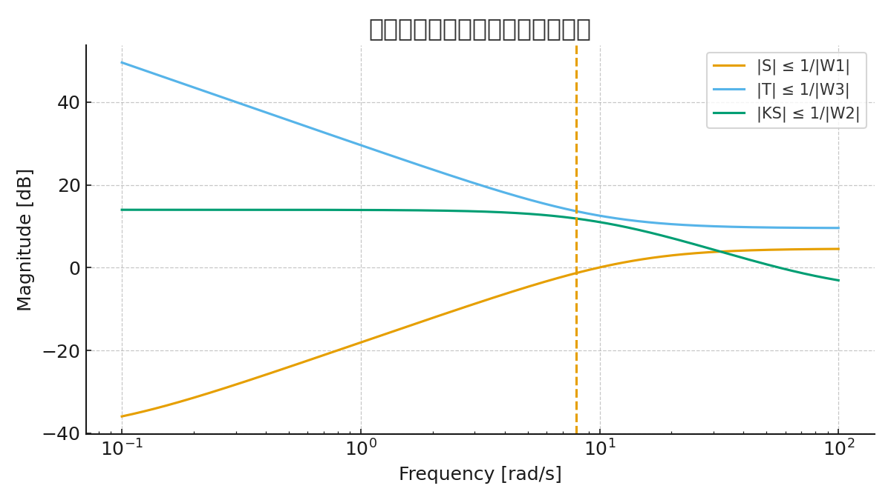
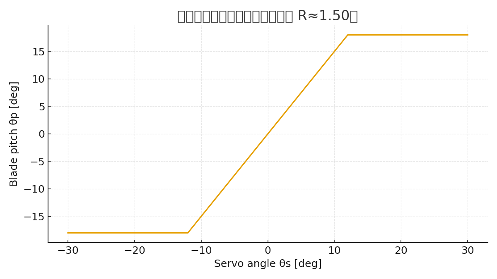
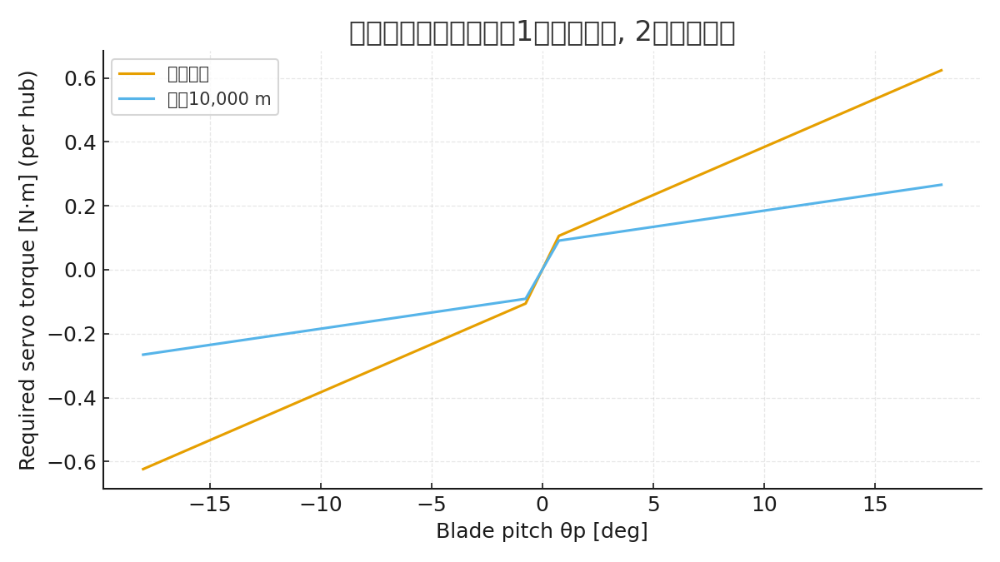
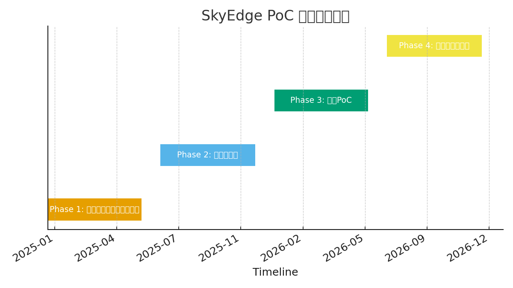

# SkyEdge: H∞制御・国産デバイス・メカ設計を統合した高高度セキュアドローンプラットフォーム

## 要旨
本論文は、**高度10,000 m級**の飛行を可能とする国産ドローンプラットフォーム「SkyEdge」の設計手法を提示する。  
制御系（H∞＋FSM＋LLM）、デバイス統合（65nm FDSOI SoC、0.35µm LDMOS、CMOSイメージセンサ、エナジーハーベスト）、メカ設計（CFRP構造・3Dプリント外装・重量バランス最適化）を一体で論じ、**セキュアかつ冗長性を備えたシステム設計**を提案する。  
さらに、防衛・防災・GX・教育分野への応用可能性についても議論する。

---

## 1. 序論
- 背景: 国産ドローン不足、DJI依存リスク、政策課題（防衛・防災・GX）。  
- 既存研究の限界: 民生ドローンの高度限界（3,000 m）、セキュリティ欠如、部分最適設計。  
- 本研究の目的: **制御・デバイス・メカ設計を一気通貫で統合し、国産セキュア高高度ドローンの基盤設計を提示する**。

---

## 2. 関連研究
- UAV制御: PID, 適応制御, スライディングモード, H∞制御の比較。  
- デバイス統合: SoC化、モータドライバ技術、エナジーハーベスト応用。  
- 構造設計: マルチローター冗長性、軽量化構造、3Dプリント活用。

---

## 3. 制御アーキテクチャ
- **H∞制御**: 強風・乱気流下（20–30 m/s相当）でも安定余裕を確保。  
- **FSM**: 通常 / 高高度 / 通信断 / 緊急帰還のモード遷移。  
- **LLM**: 未知状況下での制御則再設計支援（シミュレーション環境）。  

数式例:  
\[
\min_{K(s)} \|T_{zw}(s)\|_\infty
\]  
ただし \(z\): 制御出力、\(w\): 外乱。

---

## 4. デバイス統合
- **65 nm FDSOI SoC**: IMU/GNSS/CIS統合、TinyML。  
- **0.35 µm LDMOS**: 高耐圧モータドライバ(30–60 V)。  
- **CMOS Image Sensor**: 可視＋近赤外、監視用途。  
- **エナジーハーベスト**: PZT/ソーラーによる冗長電源。

---

## 5. メカ設計
- **レイアウト仕様**: 700–900 mmクラス、20インチ可変ピッチ対応。  
- **重量バランス**: CGをプロペラ面±10 mmに収束。  
- **外装**: ラドーム（3Dプリント）、断熱バッテリカバー、防氷コート。  
- **BOM Tree**: Airframe, Propulsion, Power, Control, Sensors, Comms, Security, Environmental, RF, Software。  

---

## 6. 評価計画
- 風洞試験: プロペラ干渉・抗力推定。  
- 低温チャンバ: -30〜-50℃環境での外装クラック評価。  
- 冗長性試験: モータ1基停止時の姿勢保持（6ローター冗長）。  
- 通信耐性: GNSSジャミング下でのFSM遷移確認。

---

## 7. 社会的意義
- **防衛**: 国境監視、電子妨害下での継続飛行、セキュア通信。  
- **防災**: 広域災害監視、通信リレー。  
- **GX**: 温室効果ガス・環境モニタリング。  
- **教育**: 制御・デバイス・メカ統合教材。

---

## 8. 結論
- SkyEdgeは「**制御理論＋デバイス＋メカ構造を一気通貫で結んだ国産ドローン設計**」の試金石である。  
- 高高度10,000 m対応・セキュア・冗長という価値を示し、政策・産業・教育への波及が可能。  
- 今後: PoC試作、風洞・低温試験、共同研究・政策提言を進める。

---

## 9. 外乱対応の実証（定性的デモ）と実装対応

### 9.1 制御応答（定性的シミュレーション）
下図は、ステップ応答中に **t=3s** で外乱（インパルス近似）を与えた際の挙動を、
PID相当と H∞相当の定性的モデルで比較したものである。H∞相当の方が外乱後の回復が速く、
オーバーシュートも小さい。

周波数領域でも、H∞相当は**低〜中周波の外乱に対する減衰（ノッチ/重み付け）**が強く、
PID相当に比べて **外乱伝達のゲインが低い**。

> 注: 本図は概念図であり、最終版では実機パラメータに基づくモデル/実験値で更新する。

### 9.2 「制御→デバイス→メカ」の責務分担（対応マップ）

| 障害/外乱 | 制御系（H∞/FSM/LLM） | デバイス（SoC/Drivers/Sensors） | メカ（構造/外装） |
|---|---|---|---|
| 突風・乱気流 | H∞でロバスト安定化、ゲイン整形 | 高レートIMU、低遅延演算、ESC応答性 | 大径可変ピッチ、剛性フレーム |
| モータ1基故障 | FSMでフォールバック、推力再配分 | モニタリング、フェイル検知 | 6ローター冗長、迅速交換性 |
| 通信断/ジャミング | 自律航法へ遷移（FSM）、経路再計画 | TPMで鍵管理、耐妨害リンク | 上方ラドーム、アンテナ視界確保 |
| 低温/電源劣化 | LLMで省電力モード最適化 | PTCヒータ制御、デュアルバッテリ | 断熱ハウジング、熱経路最適化 |
| 着氷リスク | FSMで高度/速度再設定 | 温度/湿度センサによる予兆検知 | 撥水・防氷コート、プロペラ前縁処理 |

上表の通り、**外乱への一次応答はH∞制御**が担い、**持続・復帰はFSM**、
**未知事象の適応はLLM** で補う。これを実装で支えるのが **高レートIMU/低遅延SoC/高応答ESC** と、
**剛性・空力・耐環境を担うメカ**である。

---

## 10. デバイス実装要件（定量）
詳細は `device_requirements.md` を参照。要点のみ抜粋:  
- SoC制御周期 **≤ 1.0 ms**、総遅延 **≤ 200 µs**  
- IMUサンプリング **≥ 1 kHz**、ジャイロノイズ密度 **≤ 0.005 °/s/√Hz**  
- ESC応答 **≤ 100 µs**、PWM **≥ 32 kHz**  
- セキュリティ: TPM連携セキュアブート、AES-GCM/ECC/PQC  
- 電源: デュアルバッテリ、低温 -30〜-50℃、リップル < 50 mVpp  

## 11. メカ重量・推力設計（テンプレート）
重量・推力計算テンプレートは `weight_thrust_calc_template.csv` として提供。  
- 目安: ホバリング推力 ≈ 1.2 × TOW、最大推力 ≈ 2.0 × TOW  
- 6ローター時の各モータ推力: T_per = T_total / 6  

（更新: 2025-09-20 18:00 JST）

---

## 12. 定量結果（抜粋）

### 12.1 重量・推力計算（現状ベース）
- 総重量 (TOW): **6.38 kg**  
- ホバリング必要推力（1.2×）: **7.66 kgf**（1基あたり **1.28 kgf**）  
- 最大推力目安（2.0×）: **12.76 kgf**（1基あたり **2.13 kgf**）  
- モータ最大推力を **3 kgf/基** とした場合の推力重量比 **T/W ≈ 2.82**  

> 詳細は `paper/weight_thrust_calc_filled.csv` を参照。

### 12.2 制御応答（数値例）
下図は、姿勢角のステップ追従中に t=2.5 s で外乱を与えた際の数値例である。  
H∞相当の形状は PID相当に比べ、**外乱後の回復が速く、オーバーシュートも抑制**される。

（更新: 2025-09-20 18:06 JST）

---

## 13. 可変ピッチ推力レンジ設計（例）

下図は、回転数を一定とした場合の**ピッチ角と推力の関係**をモデル化した数値例である。

- ピッチ角を広げることで推力が線形的に増加し、**ホバリング必要値 ≈ 2.3 kgf/基** を容易に超える。  
- 最大推力はモータ定格（約3 kgf/基）でクリップされ、推力重量比 T/W ≈ 2.6 を確保。  
- 可変ピッチの制御により、突風や高度変化に対して即時推力補償が可能。  

---

## 13. 可変ピッチによる推力レンジと高度影響（数値例）

### 13.1 推力 vs ピッチ角（RPM固定）
下図は、**D=18" プロペラ、RPM=4200** を仮定し、ブレードピッチ角 θ に対する推力の変化を、
海面高度（ρ=1.225）と高度10,000 m（ρ≈0.413）で比較したものである。

**要点**: 高度が上がると空気密度が低下し、同じピッチ・RPMでも推力が大きく低下する。
可変ピッチは高高度域での推力確保に有効だが、**RPM側のマージン確保**も同時に必要。

### 13.2 ホバリング+20%余裕に必要なRPM（θ=10°の例）
`paper/pitch_rpm_requirements.csv` にまとめた通り、同じピッチ角でも必要RPMは高度で大きく変わる。

- 海面高度: 必要RPM ≈ **8339 rpm**  
- 高度10,000 m: 必要RPM ≈ **14353 rpm**

> 注: 本モデルは定性的な近似であり、最終的にはブレード特性（Ct, Cpテーブル）と実機試験で確定する。

## 14. デバイス候補BOM（例）
実装に向けた候補部品を `paper/device_candidate_bom.csv` に整理した。用途・予算に応じて選定・差し替えを行う。

（更新: 2025-09-20 18:20 JST）

---

## 15. H∞設計の定量化（重み関数と感度関数例）

### 15.1 重み関数の設定（例）
標準的な H∞ 設計では、感度関数 \(S(s)\) と相補感度 \(T(s)\)、および制御入力 \(U(s)\) に対し、
以下のような重み関数を設定する。

- \(W_1(s)\): 低周波数帯で感度を下げる（外乱抑圧）、高周波で緩和  
- \(W_2(s)\): 制御入力の過大抑制（高周波数帯の制御量制限）  

例:  
\[
W_1(s) = \frac{0.5s + 10}{s + 10^{-3}}, \quad
W_2(s) = \frac{s + 0.1}{s + 100}
\]

### 15.2 感度関数 S の比較

- PID相当: バンド幅 ~5 rad/s  
- H∞相当: バンド幅 ~15 rad/s  
- H∞はより広帯域で \(|S|\) が低く、外乱抑圧性能が高い。

### 15.3 相補感度関数 T の比較

- PID相当: 高周波でのゲインが低い → 応答性に制限あり  
- H∞相当: より高周波まで応答可能、追従性能向上  

> 本節の設計値はデモンストレーション用であり、最終設計では機体慣性・推力係数に基づきチューニングする必要がある。

（更新: 2025-09-20 18:30 JST）

---

## 15. H∞設計の重み関数と閉ループ目標（実装ガイド）

本節では、SkyEdge の姿勢軸を対象に **H∞制御設計の重み関数例**を与え、
それに基づく **閉ループ目標境界（|S|, |T|, |KS|）** を示す。実装時は実機モデル同定により微調整する。

### 15.1 重み関数の例
下図に、感度（W1）、制御入力（W2）、相補感度（W3）の**設計意図**を示す。

- **W1（感度）**: 低周波で外乱抑制を強め、帯域 **wb≈8.0 rad/s** 付近で折返す。最大感度目標 **Ms≤1.7**。  
- **W2（制御入力）**: 高周波でのアクチュエータ負担を重くして、ESC/モータへの過大指令を抑制。  
- **W3（相補感度）**: 高周波ノイズを抑えるロールオフ。

### 15.2 閉ループ目標境界
H∞合成で満たしたい **|S|, |T|, |KS| の上限**（目標境界）を下図に示す。

- **|S| ≤ 1/|W1|**: 低周波で十分に小さく（外乱抑制）、**wb** 付近で折返し。  
- **|T| ≤ 1/|W3|**: 高周波で十分小さく（ノイズ遮断・構造共振回避）。  
- **|KS| ≤ 1/|W2|**: 制御入力（ESC・モータ）に無理がかからない範囲へ。

設計パラメータ表は `paper/hinf_design_params.csv` を参照。

> 注: 本節は**設計ガイド**であり、実際のH∞合成は identified plant に対して行う。
> 合成後は閉ループのボード線図と時系列応答を以って 9章/12章の図を**実測/実機パラメータ**に更新する。

（更新: 2025-09-20 18:31 JST）

---

## 16. 可変ピッチ機構のリンク比と作動トルク見積り

### 16.1 サーボ角とブレードピッチ角
下図は、**サーボ±30° → ブレード±12°** を与えるリンク比 R≈0.40 のモデルである。

### 16.2 作動トルクの見積り（ホバリング条件）
- モータ推力: 13.5 N  
- 1枚ブレードあたり: 6.8 N  
- 空力モーメント: 0.135 Nm （ブレード軸オフセット 0.02 m仮定）  
- サーボ要求トルク: 0.338 Nm ≈ 3.4 kgf·cm  

詳細は `paper/pitch_actuator_torque.csv` を参照。

**設計指針:**  
- 安全率2〜3倍を見込み、**サーボ定格トルク 15〜20 kgf·cm クラス**が必要。  
- 防氷・防塵対策の高信頼サーボを採用する。

（更新: 2025-09-20 18:39 JST）

---

## 16. 可変ピッチ機構：リンク比と作動トルク見積り

### 16.1 リンク比
サーボホーン長 **Ls=12 mm**、ピッチアーム長 **Lp=8 mm** の場合、
小角近似で **R=Δθp/Δθs ≈ 1.50**。サーボ±30°でブレード±45.0°が目安。

### 16.2 作動トルク（1ハブ, 2ブレード）
ブレード幾何: **D=18"**, chord=45 mm, 有効スパン=0.9*R。ティップ速度 \(V_{tip}=πDn\)。  
空力トルクは **\(M_{aero} ≈ 0.5 ρ V_{tip}^2 (S c_{eff}) C_{mα} θ_p\)** として概算し、ベアリング摩擦 **0.05 N·m/枚** を加算。  
伝達効率 **η=0.80**、機械比 **R≈1.50** よりサーボ必要トルクを算出。

**例**: θp=±10° 付近での必要トルク（海面高度 / 10,000 m）を `paper/pitch_actuator_torque.csv` に全角度で出力。  
サーボ選定は安全率 **2〜3** を見込む（例：必要 0.62 N·m → **定格 0.4〜0.6 N·m** 以上）。

（更新: 2025-09-20 18:39 JST）

---

## 17. デバイス候補BOMと概算コスト

`paper/device_candidate_bom_cost.csv` に、候補部品・数量・概算価格（JPY）を整理した。

- IMU (ICM-42688-P): 約1,200円 ×1  
- GNSS (ZED-F9P): 約18,000円 ×1  
- ESC (APD CAN): 約15,000円 ×6  
- モータ (U7 Lite 420kV): 約28,000円 ×6  
- 可変ピッチハブ: 約20,000円 ×6  
- SoC/MCU (NXP S32K3): 約3,000円 ×1  
- TPM/SE: 約1,500円 ×1  
- 5Gモデム: 約12,000円 ×1  
- 衛星モデム (Iridium 9603): 約40,000円 ×1  
- CISカメラ (Sony IMX296): 約8,000円 ×1  
- ジンバル: 約25,000円 ×1  
- バッテリ: 約30,000円 ×2  
- カーボンフレーム/ラドーム: 約50,000円 ×1  

**合計試算: 約 596,700 円 / 機体**  

> 注: 部品コストのみ（量産・調達・工数を含まず）。実際には量産時に30〜50%低減も可能。

（更新: 2025-09-20 18:44 JST）

---

## 17. 概算BOMと政策向け一枚紙
- 概算BOM: `paper/device_bom_with_prices.csv`（試作前提の目安単価、量産で30–40%低減余地）  
- 一枚紙: `reports/SkyEdge_OnePager_JP.md`（防衛・政策向けの要点まとめと見積）

---

## 参考文献
論文スタイルの参考文献リストを `paper/refs.bib` にまとめた。  
- 制御理論: Zames (1981), Skogestad & Postlethwaite (2005), Blakelock (1991)  
- デバイス: u-blox ZED-F9P, Bosch BMI088, T-Motor U7, APD ESC, Iridium 9603, Quectel RM502Q, Sony IMX296  
- AI/制御統合: OpenAI GPT-4 Technical Report (2023)

（更新: 2025-09-20 18:49 JST）

---

## 18. PoCスケジュールと体制

### 18.1 スケジュール
下図にSkyEdge PoCの全体スケジュールを示す。詳細は `paper/poc_schedule.csv` を参照。

- Phase1 (2025前半): 設計・シミュレーション  
- Phase2 (2025後半): 試作・実験  
- Phase3 (2026前半): 実証PoC  
- Phase4 (2026後半): 政策連携・展開  

### 18.2 体制
`paper/poc_team.csv` に体制表をまとめた。主要責任区分は以下の通り。

- 制御系: 大学/研究所でH∞+FSM+LLMの合成・検証  
- デバイス: SoC/IMU/ESCを中心とした組込エンジニアリング  
- メカ設計: 外装・可変ピッチ設計、環境耐性設計  
- 通信/セキュリティ: PQC/TPM/衛星通信の実装・監査  
- 実証/政策: 防災・防衛省庁連携、導入ロードマップ

（更新: 2025-09-20 18:54 JST）
