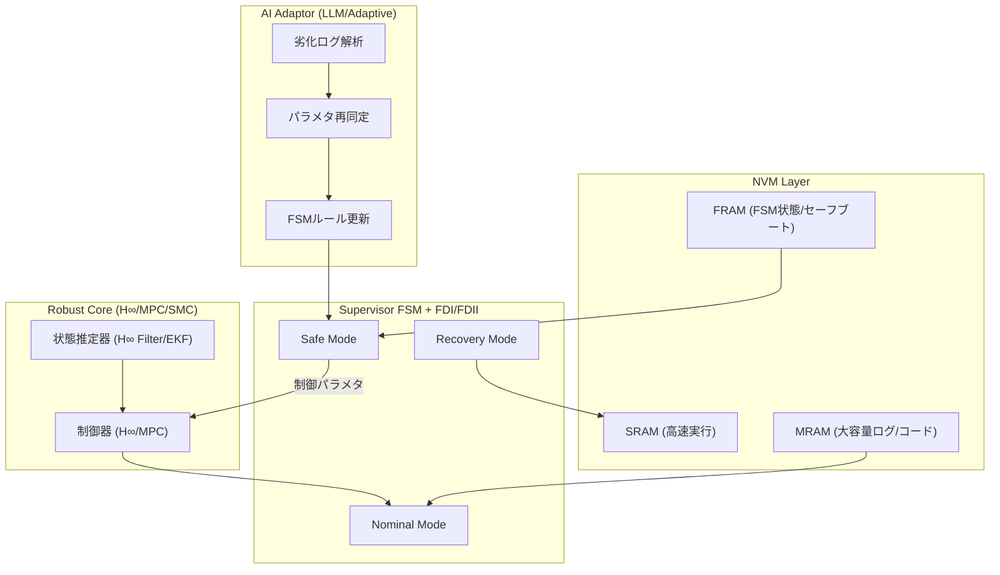

# AITL on Space — Execution Plan v0.2 (Spec-Driven)

## 🎯 目的 / Mission Objective
- **AITL三層アーキ (Robust Core × FSM × AI) ＋ NVM階層 (SRAM+MRAM+FRAM)** を  
  **22nm FDSOI SoC (AMS/GF 22FDX) 上に実装**し、  
  宇宙環境 (TID, SEU, 熱サイクル, 長期劣化) での **ウルトラロバスト制御** を実証する。  

---

## 1. 宇宙環境要求 / Environmental Requirements
| 項目 | 要求値 | 出典/想定 |
|------|--------|----------|
| TID耐性 | ≥ 100 krad(Si) | LEO 10年 / GEO 15年ミッション |
| SEE耐性 | LET_th ≥ 15 MeV·cm²/mg | Deep space (Europa, Mars) |
| 動作温度 | −120°C ⇔ +120°C | 月昼夜サイクル |
| サイクル数 | ≥ 10,000 cycles | 10年ミッション想定 |
| MTBF | > 1E6 hours | 航行制御系要求 |

---

## 2. 全体アーキ / System Architecture

---

## 3. 制御系設計フロー / Robust Core Flow
1. **EduController**  
   - H∞/MPC 設計 (混合感度設計, γ最小化)  
   - JSONエクスポート (`hinf_rw.json`)  
2. **AITL-H**  
   - JSON入力 → 固定小数点RTL化  
   - FSM・FDI統合  
3. **FPGA HIL**  
   - Rad-Tol FPGAでH∞制御実行  
   - 外乱シナリオ: SEUバースト, サンセンサ喪失, 熱ドリフト  
4. **RTL Freeze**  
   - STA収束 / DFT挿入済み RTL 固定  

---

## 4. NVM設計仕様 / NVM Layer Spec
- **SRAM**  
  - キャッシュ/制御コード展開用  
  - DICEセル＋ECC (SEC-DED)  
- **MRAM (eMRAM, 22FDX)**  
  - 16–64 MB, ログ＋コード保存  
  - ECC (BCH), スクラブ周期 ≤ 10 s  
  - A/Bスロットでフェイルセーフアップデート  
- **FRAM (Rad-Hard, 小容量)**  
  - 128 KB〜1 MB  
  - FSM状態, セーフブートコード  
  - 即時ライトゲート（FSM監督下でのみ書込可）  

---

## 5. SystemDK FEM条件 / Thermal-Mechanical Simulation
- **対象**: 22nm FDSOI SoC (die) + Chiplet (電力SiC/GaN) + SiP PKG  
- **条件**: ΔT = ±120 °C, サイクル数 ≥ 10k  
- **評価**:  
  - Tj,max ≤ 125 °C (margin ≥ 10 °C)  
  - CTEミスマッチ応力 < 200 MPa  
  - はんだ接合寿命 ≥ 10年  

---

## 6. FPGA検証 / HIL Verification
- **プラットフォーム**: Rad-Tol FPGA (e.g. Microsemi RTG4)  
- **構成**: Robust Core + FSM + 擬似NVM  
- **シナリオ**:  
  - SEU 10^4 events / 2h  
  - Sun sensor blackout 30 min  
  - TIDシフト 100 krad equivalent  
- **評価指標**:  
  - Safe mode到達 ≤ 1 s  
  - Recovery成功率 ≥ 99%  
  - ECC訂正率 100% (単一エラー)  

---

## 7. RTL → 物理設計
- **RTL**: SystemVerilog, UVM testbench, Assertion付  
- **DFT**: Scan ≥ 95%, MBIST全網羅, LBIST主要ブロック  
- **物理設計**:  
  - STA WNS ≥ 0 ps (OCV対応)  
  - IR drop < 5%, EM within spec  
  - LVS/DRC clean  

---

## 8. 製造〜SystemDK公開
- **Tape-out**: GDS提出, Mask製造  
- **Wafer Test**: eMRAM/FRAM 書込読出, ECC試験  
- **BRDK**: 評価ボード, SI/PI設計指針  
- **IPDK**: RobustCore/FSM/NVM IFドキュメント  
- **PKGDK**: PKGピン表, SI/PI/熱モデル  
- **SystemDK**: FEM条件, デジタルツイン, 自動検証スクリプト  

---

## ✅ 差別化ポイント
- 単なる「SoC設計」ではなく、  
  **AITL三層アーキ × NVM階層 × 宇宙環境条件**を数値で縛った**ロバスト設計戦略**。  
- NASA/ESA/JAXAがまだ整理できていない「自律アーキ基盤」に直撃。  
