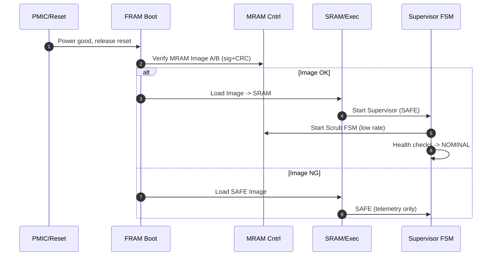

# AITL on Space — FSM × NVM シーケンス仕様（PoC）
Version: v0.1

---

## 1. 状態と役割
- **SAFE**：最小機能・通信維持・姿勢サバイバル制御（PID/SMC簡易）  
- **NOMINAL**：H∞/MPC 本運用、学習ログ記録  
- **RECOVERY**：不整合修復、A/B ロールバック、再同期

NVM 役割：  
- **FRAM**：Boot Vector, SAFE Image, FSM 状態, クリティカル設定（**二重化＋CRC**）  
- **MRAM**：OS/APP（A/B）, ログ, 学習パラメタ（**ECC + BCH + スクラブ**）

---

## 2. ブート時シーケンス


---

## 3. ランタイム書込み（ライトゲート）
- **原則**：MRAM/FRAM への書込みは **FSM がゲート**  
- **通常**：NOMINAL 中でも **WAL（Write‑Ahead Log）** 必須  
- **フレア/SEU 警報時**：`write_enable = 0`（MRAM ロック）、ログは **SRAM一時退避**

---

## 4. A/B スロット運用（学習・更新）
```mermaid
flowchart LR
  subgraph MRAM
    A[Slot A (Active)]:::good
    B[Slot B (Staging)]:::idle
  end
  classDef good fill:#3c6,stroke:#060,color:#fff;
  classDef idle fill:#ccc,stroke:#333;

  B-->|write & verify|B
  B-->|CRC & Sig OK|A<-->B
  A-->|commit|A
```
- ステップ：`Bに書込→Bを検証→FRAMに “B ready” → 再起動または動的切替→A/B入替`

---

## 5. スクラブ（Scrub FSM）
- 標準周期：**6 h/全域**、優先領域（コード/設定）は **30 min**  
- 警報時：**5–30 min/全域** に短縮  
- ログ：ECC 訂正統計、再配置、劣化マップを **FRAM概要 + MRAM詳細** に保存

---

## 6. FDI/FDII 連携（抜粋ルール）
- NVM ECC 失敗率 > θ1 → **NOMINAL→RECOVERY**  
- 重要領域の再試行失敗 → **RECOVERY→SAFE** + `write_enable=0`  
- 3回連続 FAIL → **SAFE維持**、地上介入待ち

---

## 7. 閾値例（調整可）
| 指標 | しきい値 | 動作 |
|------|---------:|------|
| ECC single‑bit rate | > 1e‑6 /word/h | スクラブ周期短縮 |
| ECC double‑bit | > 1e‑9 /word/h | RECOVERY へ遷移 |
| FRAM CRC mismatch | 1回でも | SAFE へ遷移 |
| Flare alert | NOAA S3+ | write_gate=0 |

---

## 8. テレメトリ項目（最小）
- ECC 訂正/失敗カウンタ（領域別）  
- スクラブ残時間／進捗／再配置数  
- A/B スロット世代・ハッシュ・署名者  
- write_gate 状態・禁止時間累計  
- SAFE/NOMINAL/RECOVERY 履歴（遷移理由コード）
