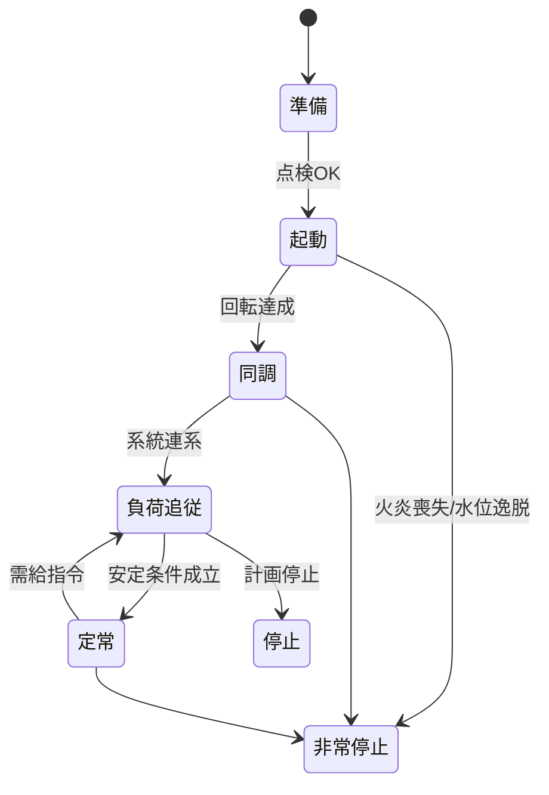

# 政策提言サマリー — Thermal Power AITL

---

## 🎯 一目でわかる効果
- **Heat Rate改善**：0.7%  
- **CO₂削減**：15,453 t/年（700MW・LNG想定、稼働率80%）  
- **燃料費削減**：6.7億円/年（$15/MMBtu, ¥150/$換算）

👉 既設火力に「外付けAI」を導入するだけで、経済・環境・安保に同時効果。

---

## 📊 CO₂削減イメージ

```
Before: ██████████████████████████  ~220,000 t/年  
After : ██████████████████████     ~205,000 t/年  
削減量 ≈ 15,000 t/年
```

---

## 🔑 提案の骨子
- **再エネ拡大を支える賢い火力**  
- **PIDで安定・FSMで安全・AIで効率化**  
- **既存DCS/PLCを改造せず導入可能**

---

## 🏛 GX政策との接続
- **環境省**：GXリーグ、CO₂クレジット化に直結  
- **経産省**：高効率火力推進、アンモニア/水素混焼の運転最適化  
- **内閣府**：燃料依存度低減によるエネルギー安全保障  

---

## ⚙️ FSMによる運転シナリオ（概要）



---

## 🚀 実証の流れ（90日PoC）
1. **基準線測定**（KPI: Heat Rate, CO₂排出）  
2. **外付けAI連携**（O₂トリム提案、水位制御改善）  
3. **A/B試験評価**（改善率の統計的検証）  

---

## ✅ 提言
- 「火力を止めるのではなく、**知能化してGXへ貢献**」  
- **2025年度内に国家PoCを採択・実証開始すべき**


---

## 💰 投資対効果（ROI試算）
- **初期投資**：5億円（PoC導入・システム費）  
- **維持運用費**：0.5億円/年  

### 単年度効果
- 燃料費削減：6.7億円/年  
- CO₂削減：15,453 t/年 → クレジット価値 0.3億円/年  
- **合計効果：7.0億円/年**  
- 👉 回収期間 ≈ **9か月**  

### 10年累積効果
- 燃料費削減：67億円  
- CO₂削減：15万t → クレジット価値 30億円  
- **合計効果：約97億円**  
- 👉 **投資対効果 ≈ 19倍**  

### 政策メッセージ
- 「即効性のあるGX投資」  
- 「1年以内に黒字化、10年で投資19倍のリターン」  
- 「CO₂削減15万tは中規模都市の年間排出に匹敵」  


---

## 🏠 物価高対策としての意義
- 世界的な燃料高・円安により、電気料金が家計・企業を圧迫  
- **AITL導入で燃料費を年間6.7億円削減（1プラントあたり）**  
- 10プラント規模で **67億円規模のコスト削減**  
- → 電気料金上昇を抑制し、国民生活・企業競争力を守る  

### 政策メッセージ
- 「GXは環境だけでなく、物価高から国民を守る経済対策でもある」  
- 「短期で成果を出せる外付けAIは、再エネ整備と並行して即効性のある一手」  
- 「家計負担を減らしつつCO₂削減、経済と環境を両立」  
