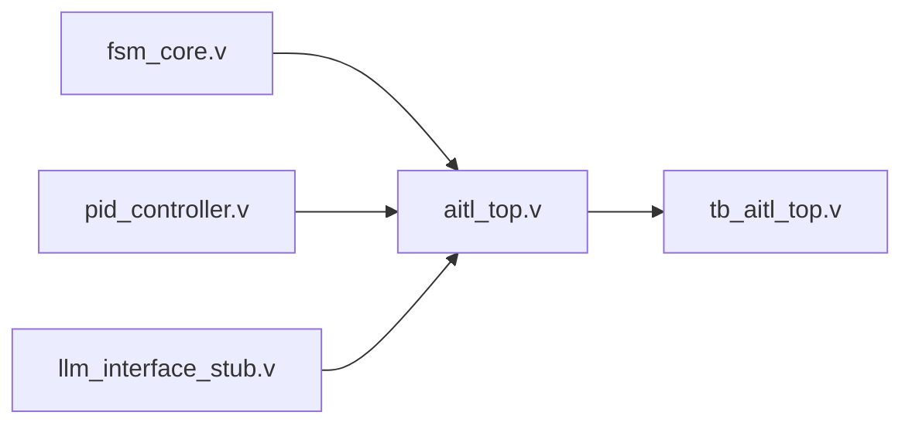

# 🧪 PoC: ChatGPT生成ロジック評価（FSM × PID × LLM）

このディレクトリは、AITL-H論理テンプレート（FSM / PID / LLM）のVerilog構造を  
テストベンチ `tb_aitl_top.v` により検証する PoC 評価構成です。

---

## 🔗 接続構成（verilog結線）


---

## 📦 含まれるファイル

- `fsm_core.v` / `pid_controller.v` / `llm_interface_stub.v`：論理テンプレート
- `aitl_top.v`：3層統合構造
- `tb_aitl_top.v`：PoC用トップレベルベンチ
- `waveform.vcd`：波形出力例
- `test_config.yaml`：テスト条件（任意拡張）

---

## 🛠️ 実行方法（例）

```bash
iverilog tb_aitl_top.v aitl_top.v fsm_core.v pid_controller.v llm_interface_stub.v -o aitl_test
vvp aitl_test
gtkwave waveform.vcd
```

---

## 📜 ライセンス

MIT License — 教育・PoC用途での使用・改変を歓迎します。

