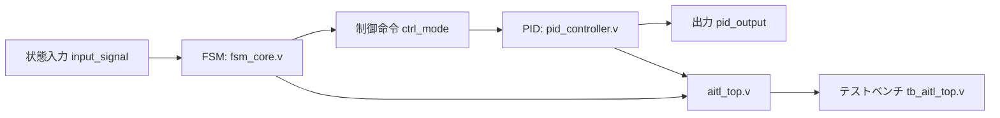

# 🧠 AITL-H Verilog Demo

このディレクトリは、FSM・PID・LLMを統合した  
**AITL-Hアーキテクチャのハードウェア検証用PoC構成**です。

---

## 🎯 構成目的

YAMLテンプレートから生成された Cコード → ChatGPTによって変換された Verilogコードを  
**テストベンチ上で検証し、統合制御アーキテクチャのPoC動作を確認**します。

---

## 📦 含まれるファイル

| ファイル名         | 内容                             |
|------------------|----------------------------------|
| `fsm_core.v`      | Moore型状態機械のVerilog実装     |
| `pid_controller.v`| 離散時間PID制御器のVerilog実装   |
| `aitl_top.v`      | FSM + PID + LLM接続の統合モジュール |
| `tb_aitl_top.v`   | テストベンチ：統合動作の検証     |

---

## 🧪 テストベンチ動作例（想定）

- `clk`, `reset` 信号の生成
- `input_signal` に条件を与えて状態遷移
- PID出力の応答変化を `$display` で観測
- LLMスタブの動作条件を模擬的に再現

---

## 📘 実行方法（例）

```bash
iverilog -o sim.out tb_aitl_top.v aitl_top.v fsm_core.v pid_controller.v
vvp sim.out
```

必要に応じて GTKWave で波形を確認：

```bash
gtkwave dump.vcd
```

---

## 🧩 全体構成図（Mermaid）



---

## 📜 ライセンス

MIT License  
教育・研究・開発における自由な活用・検証を歓迎します。
