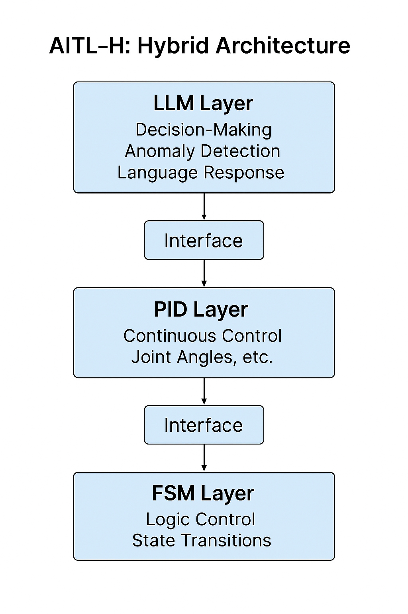

# 🤖 AITL-H: Hybrid Structured Control Framework

**AITL-H (All-in-Theory Logic - Hybrid)** is a hierarchical intelligent control architecture designed for humanoid robots and adaptive systems.  
It integrates three layers: **FSM (Instinct) × PID (Reason) × LLM (Intelligence)** to achieve control with **responsiveness, stability, and flexibility**.

---

- 🇯🇵 [日本語版 READMEはこちら](./README.md)  
　→ AITL-H：FSM × PID × LLM による階層型知能制御アーキテクチャの解説とPoC実装

---

## 🧭 Overview

| Item        | Description |
|-------------|-------------|
| **Name**    | AITL-H (Hybrid) |
| **Purpose** | Establish intelligent control methods for humanoid systems |
| **Core Logic** | - FSM: Instinctive behavior control via state transitions<br>- PID: Continuous control of physical quantities (angles, speed)<br>- LLM: Intelligent judgment, conversation, and adaptation |

---

## 🧘 Three-Layer Architecture

| Layer   | Function                         | Implementation Example                    |
|---------|----------------------------------|-------------------------------------------|
| FSM     | Logic control via state machines | `fsm_engine.py`, `fsm_state_def.yaml`     |
| PID     | Physical control (joints, motion) | `pid_controller.py`, `pid_module.py`     |
| LLM     | Judgment, anomaly detection, language interaction | `llm_interface.py`, `llm_logger.py` |

> Each layer is **loosely coupled yet coordinated**, allowing independent development and gradual integration.

<div align="center"></div>

---

## 📘 PoC Design Manual (16 Chapters)

A complete **PoC design manual for humanoid systems** using FSM × PID × LLM is available:  
▶︎ [📖 View Manual](docs/README.md)

---

## 🧪 List of PoC Projects

| Title | Summary | Path |
|-------|---------|------|
| 🧭 Gimbal Control (FSM + PID + LLM) | Hybrid closed-loop control | [`PoC/gimbal_control`](./PoC/gimbal_control) |
| 🔍 Additional PoCs | Coming soon | - |

---

## 🧪 Example: 3-Axis Gimbal Control with FSM × PID × LLM (AITL-HX)

> Proof-of-concept for gimbal control using the **AITL-HX architecture**.  
> Natural language command → FSM transition → PID stabilization → Actuator output.

📂 Directory: [`PoC/gimbal_control/`](./PoC/gimbal_control/)  
📘 Details: [`See README`](./PoC/gimbal_control/README.md)


| Component     | Description |
|---------------|-------------|
| LLM Layer     | Goal generation and intent recognition from natural language |
| FSM Layer     | State transitions (idle, follow, recovery) |
| PID Layer     | PID control of roll, pitch, yaw |
| Sensor Layer  | 3-axis IMU model for attitude estimation |
| Actuator Layer| Motor output control via PWM (simulated) |

🧭 Key Learning Points:
- Full-stack design of hybrid FSM + PID + LLM control
- Translating natural language into control objectives
- Implementing closed-loop intelligent control with MIMO and state coordination

---

## 🤖 ChatGPT Integration: Collaborative Design Tools

In the `accelerated_design/` directory, tools utilizing ChatGPT support the design process:

- Auto FSM generation (Prompt → FSM YAML)
- Test scenario creation & log visualization
- Auto documentation and review assistance

> 🧠 Experimental environment for **human-AI collaborative design**.

---

## 📂 Directory Structure
```
AITL-H/
├── theory/                # Architecture concepts and design principles
├── PoC/                   # PoC source codes, logs, and verification
├── implementary/          # Python implementations of FSM/PID/LLM modules
└── accelerated_design/    # ChatGPT-based design support tools
```
---

| Directory | Description |
|-----------|-------------|
| [`theory/`](theory/) | Theoretical background and design rationale |
| [`PoC/`](PoC/) | Control scenarios, logging, and evaluation |
| [`implementary/`](implementary/) | FSM, PID, communication, and LLM integration code |
| [`accelerated_design/`](accelerated_design/) | Design assistance tools and log processors |

---

## 🚀 Application Domains

- 🧓 **Elderly Care Robots**: Emotion-aware physical control
- 🛠 **Self-Evolving Control**: Anomaly detection and feedback optimization via LLM
- 🌏 **Disaster Response Robots**: Combining predefined behavior and inference
- 🎓 **Education & Research**: Ideal platform for AI × control learning

---

## 🎓 Educational Integration: Linked with EduController

AITL-H’s theoretical basis aligns with **Chapter 9 of EduController**, a control theory learning platform.

| Part | Content | Relevance to AITL-H |
|------|---------|----------------------|
| [Part 1–5](https://github.com/Samizo-AITL/EduController#制御理論系) | Classical to modern control | Foundation of PID layer |
| [Part 6–8](https://github.com/Samizo-AITL/EduController#ai制御系) | Neural nets, reinforcement learning | AI control integration |
| [Part 9](https://github.com/Samizo-AITL/EduController/tree/main/part09_llm_hybrid) | FSM × PID × LLM Hybrid Control | Directly implements AITL-H architecture |

> 🔗 [Visit EduController Repository](https://github.com/Samizo-AITL/EduController)

---

## 🧩 SoC-Level Expansion: Linked with Edusemi

To extend PoC into **SoC design, RTL implementation, and physical layout**, refer to the **Special Topics** in the [Edusemi v4.x](https://github.com/Samizo-AITL/Edusemi-v4x) project.

| Chapter | Content |
|---------|---------|
| [Ch.3](https://github.com/Samizo-AITL/Edusemi-v4x/tree/main/f_chapter3_socsystem) | SoC design of FSM × PID × LLM architecture |
| [Ch.4](https://github.com/Samizo-AITL/Edusemi-v4x/tree/main/f_chapter4_openlane) | RTL-to-GDSII with OpenLane |
| [Ch.5](https://github.com/Samizo-AITL/Edusemi-v4x/tree/main/f_chapter5_dfm) | Physical verification and DFM strategies |

---

## 📚 Related Projects

- [Edusemi v4.x](https://github.com/Samizo-AITL/Edusemi-v4x): Semiconductor / SoC design education
- [EduController](https://github.com/Samizo-AITL/EduController): Control theory to AI control learning platform
- [Rekiden](https://github.com/Samizo-AITL/Rekiden): History-based simulation using FSM (educational SLG)

---

## 👤 Author Profile

**Shinichi Samizo**  
- M.S. in Electrical and Electronic Engineering, Shinshu University  
- Former R&D Engineer at Seiko Epson Corporation (1997–)

📌 **Expertise**:  
- Semiconductor devices (logic, memory, high-voltage mixed process)  
- Thin-film piezoelectric actuators  
- PrecisionCore printhead commercialization, configuration management, and technical education

📬 **Contact**  
- ✉️ Email: [shin3t72@gmail.com](mailto:shin3t72@gmail.com)  
- 🐦 X (Twitter): [https://x.com/shin3t72](https://x.com/shin3t72)  
- 💻 GitHub: [https://samizo-aitl.github.io/](https://samizo-aitl.github.io/)

---

© 2025 Shinichi Samizo — MIT License  
All source code, documentation, and architecture diagrams are provided under the MIT License.

---

💬 Share feedback or join the discussion: [AITL-H Discussions](https://github.com/Samizo-AITL/AITL-H/discussions)
