---

# 🏗 **第01章：AITL三層アーキテクチャ設計**  
_**Chapter 01: AITL Three-Layer Architecture Design**_

> **要旨 / Abstract**  
> 本章では **AITL-H（All-in-Theory Logic for Humanoid）** の**三層制御アーキテクチャ**について、各層の役割・責任分担・相互接続方法を体系的に解説します。  
> This chapter explains the **three-layer control architecture** of **AITL-H**, clarifying the roles, responsibilities, and interconnections between each layer.

---

## 🧠 **1. AITL三層の再確認 / Revisiting the Three Layers**

| 層 / Layer | 役割 / Role | 実装例 / Implementation Example | 制御対象 / Control Target | 備考 / Notes |
|----|------|------------|--------------------------------|--------------|
| **知性（Intelligence）** | **状況判断・命令生成** / Situation assessment & command generation | **LLM** | FSM構成・補正 / FSM configuration & correction | 高次抽象処理 / High-level abstraction |
| **理性（Reason）** | **フィードバック制御** / Feedback control | **PID** | 速度・角度など / Speed, angle, etc. | アナログ量補正 / Regulates analog quantities |
| **本能（Instinct）** | **状態遷移・行動制御** / State transition & action control | **FSM** | 行動選択 / Action selection | 定義ルール準拠 / Rule-based |

> **設計思想 / Design Philosophy:** 責務分離により**検証容易性**・**移植性**・**拡張性**を確保。  
> _Clear separation of responsibilities ensures **testability**, **portability**, and **scalability**._

---

## 🧩 **2. 情報の流れと責任の明確化 / Information Flow & Responsibility**

```mermaid
flowchart TB
    LLM["LLM\n知性（命令解釈・目的設定）\nIntelligence (Command Interpretation, Goal Setting)"]
    FSM["FSM\n本能（状態遷移・行動生成）\nInstinct (State Transition, Action Generation)"]
    PID["PID\n理性（目標との差分補正）\nReason (Error Compensation)"]
    PWM["PWM信号\n→ モータ出力\nPWM Signals → Motor Output"]

    LLM -->|UART| FSM
    FSM -->|target_speed, target_angle| PID
    PID --> PWM
```

**流れの特徴 / Flow Characteristics**  
- **抽象 → 具体 / Abstract → Concrete**  
- LLMの曖昧な命令はFSMで確定 / Ambiguous high-level intent is concretized by FSM  
- FSMの行動目標をPIDが物理信号に変換 / PID converts goals to physical actuation

---

## 🧱 **3. モジュール独立性と再利用性 / Module Independence & Reusability**

- **PID** のゲイン・応答特性は **FSM/LLM** の変更と**非依存**  
- **FSM** の状態定義・遷移は **センサ/PID** と**疎結合**で独立設計  
- **LLM** の命令生成は **FSM構成**に依存せず**柔軟に拡張可能**

> **設計意図 / Design Intent:**  
> 独立性を高めるほど、**テスト分離**・**交換可能性**・**バージョン進化**が容易。

---

## 🔁 **4. 応用拡張の方向性 / Directions for Extension**

- **FSMの動的構築・再構成** by LLM → 自己修復・自己最適化  
- **PIDゲインの自動補正** using learning signals (LLM/FSM)  
- **LLMの記憶・文脈保持**による長期適応・セーフティガードの強化

---

## 🔚 **5. まとめ / Summary**

AITL三層モデルは、**多階層制御（Hierarchical Control）**のAI拡張です。  
**決定性（FSM） × 連続制御（PID） × 柔軟知性（LLM）** を分離しつつ連携させ、**適応的・堅牢**なシステムを実現します。

---

### 📝 **ライセンス / License**
- **Code:** MIT  
- **Text:** CC BY 4.0  
- **Figures:** CC BY-NC 4.0  
（詳細は [Docs Index のライセンス表 / License Table in Docs Index](https://samizo-aitl.github.io/AITL-H/docs/#-ライセンス--license) を参照）

---

### 🔗 **ナビゲーション / Navigation**
- ⏮ [第00章：PoC全体像と三層アーキテクチャの背景 / PoC Overview & Three-Layer Architecture Background](https://samizo-aitl.github.io/AITL-H/docs/chapter00_overview.html)  
- ▶️ [第02章：PID制御設計と応答チューニング / PID Design & Tuning](https://samizo-aitl.github.io/AITL-H/docs/chapter02_pid_design.html)  

  

