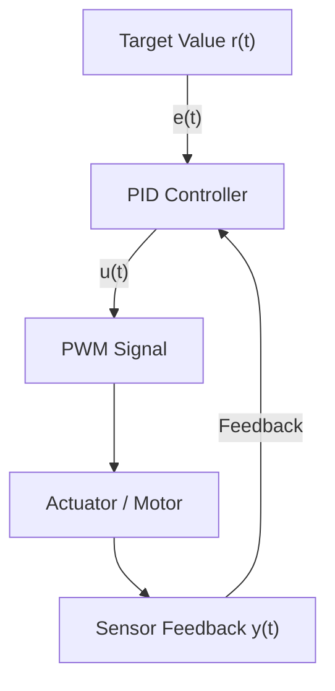

---

# ⚙️ **第02章：PID制御器の設計と応答チューニング**  
_**Chapter 02: PID Controller Design & Response Tuning**_

> **要旨 / Abstract**  
> 本章では、AITL-Hにおける**理性層（Reason Layer）**としての**PID制御設計**方針を解説します。  
> This chapter explains the **PID control design** policy for the **Reason Layer** in AITL-H.  
> Within the PoC, the FSM outputs target values (e.g., speed, angle), and the PID compensates for errors to produce actual control signals (PWM, etc.).

---

## 📐 **1. PID制御とは / What is PID Control?**

PID制御は、以下の制御式に基づき**目標値と現在値の差（誤差）**を補正します：  
_PID control adjusts the error between the target value and the current value according to the following formula:_

$$
u(t) = K_p \cdot e(t) + K_i \int e(t) \, dt + K_d \frac{de(t)}{dt}
$$

- **$e(t) = r(t) - y(t)$**：目標値 $r$ と測定値 $y$ の誤差  
  _Error between target $r$ and measured $y$._
- **$K_p$（比例 / Proportional）**：反応の速さ / Speed of reaction  
- **$K_i$（積分 / Integral）**：定常偏差の解消 / Eliminates steady-state error  
- **$K_d$（微分 / Derivative）**：予測的補正 / Predictive correction

---

## 🧮 **2. ゲイン設計の基本戦略 / Basic Gain Tuning Strategy**

| ゲイン / Gain | 役割 / Role | 高くすると / If Increased | 低くすると / If Decreased |
|--------|------|-------------|-------------|
| **$K_p$** | 即時反応 / Immediate response | 応答が速くなるが不安定に / Faster but less stable | 鈍くなるが安定 / Slower but stable |
| **$K_i$** | 累積誤差解消 / Cumulative error correction | 定常誤差が減るが振動しやすく / Less steady-state error but oscillation risk | 定常誤差が残る / Steady-state error remains |
| **$K_d$** | 変化抑制 / Change suppression | オーバーシュート抑制 / Suppresses overshoot | 遅れが増す / Slower reaction |

---

## 📊 **3. ステップ応答と安定性評価 / Step Response & Stability Evaluation**

- **ステップ入力**（例：目標速度を 0 → 5 に）で応答を観察  
- 指標 / Metrics: **オーバーシュート**, **立ち上がり時間**, **定常誤差**  
- 実装例 / Example:

```python
target_speed = 5.0
measured_speed = sensor.get_distance()
pwm = pid.compute(target_speed, measured_speed)
```

---

## 🧩 **4. AITL-H PoCにおけるPID制御器 / PID Controller in AITL-H PoC**

PoC内の `pid_controller.py` の骨格は以下の通りです：  
_The `pid_controller.py` in the PoC has the following structure:_

```python
class PIDController:
    def __init__(self, kp, ki, kd):
        ...

    def compute(self, target, measured):
        error = target - measured
        # 比例・積分・微分項を加算してPWM値を返す
        return pwm
```

**データフロー / Data Flow:**  
- FSM → `target_speed`  
- Sensor → `measured_speed`  
- PID → PWM出力

---

## 🔄 **5. 将来的展開：自己最適化へ / Toward Self-Optimization**

- FSM状態による**PIDゲイン動的切替**  
- LLMが応答を解析し**ゲイン自動調整**  
- 自動同定や強化学習との**ハイブリッド制御**

---

## 🔚 **6. まとめ / Summary**

PID制御は、FSMが定義した目標行動を物理的制御信号に変換する**理性の実装**です。  
It is the **Reason Layer** implementation that transforms FSM-defined goals into actionable control outputs.  
本章で示した設計方針と調整方法は、次章の**FSM設計**に接続されます。

---

## 🖼 **図2-1：PID制御ループ構成図 / Figure 2-1: PID Control Loop**



---

[← PoCマニュアルのREADMEに戻る / Back to AITL-H PoC Manual README](README.md)
