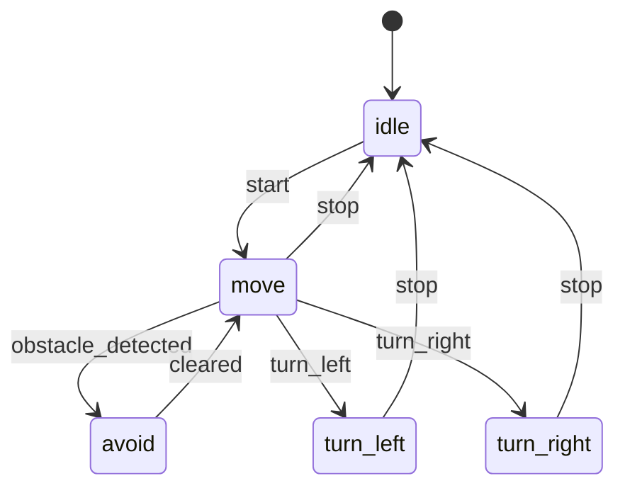

---

# 🔄 第03章：FSM状態設計と遷移戦略  
**Chapter 03: FSM State Design and Transition Strategy**

本章では、AITL-Hアーキテクチャにおける**本能層（Instinct Layer）**としてのFSM（有限状態機械）の設計戦略を解説します。  
FSMは、LLMからの命令やセンサ入力に応じて行動状態を管理し、PID制御の目標値を動的に切り替えます。  

---

## 1. 🧠 FSMの役割とは / **Role of FSM**
- 系の状態（`idle`, `move`, `avoid`, `turn_left`, `turn_right`）を明確に定義  
- 外部イベント（コマンドやセンサ値）に応じた状態遷移  
- 各状態で出力（目標速度・角度など）を制御層へ通知  

---

## 2. 🧩 状態とイベントの定義（例） / **States & Events Example**

| 状態 / State | 説明 / Description | 代表出力 / Example Output |
|--------------|-------------------|---------------------------|
| `idle`       | 停止状態 / Stopped | `speed=0`                  |
| `move`       | 直進中 / Moving Forward | `speed=5`             |
| `avoid`      | 障害物回避 / Obstacle Avoidance | `speed=2, angle=30` |
| `turn_left`  | 左旋回中 / Turning Left | `angle=+45`           |
| `turn_right` | 右旋回中 / Turning Right | `angle=-45`          |

| イベント（トリガ） / Event Trigger | 発生源 / Source | 説明 / Description |
|-----------------------------------|----------------|--------------------|
| `start`            | LLM / UART | 移動開始指令 / Start Command |
| `stop`             | LLM / UART | 停止指令 / Stop Command |
| `obstacle_detected`| センサ / Sensor | 障害物検出 / Obstacle Detected |
| `cleared`          | センサ / Sensor | 障害物解除 / Obstacle Cleared |
| `turn_left` / `turn_right` | LLM | 自律的旋回命令 / Autonomous Turn |

---

## 3. 🧾 遷移表と設定ファイル構造 / **Transition Table & Config Structure**

PoCでは、FSM構造を外部YAMLで定義し、柔軟に変更可能としています。  

```yaml
initial_state: idle
states:
  idle:
    on_event:
      start: move
  move:
    on_event:
      stop: idle
      obstacle_detected: avoid
  avoid:
    on_event:
      cleared: move
  turn_left:
    on_event:
      stop: idle
```

---

## 4. 🔧 実行構成との連携（PoC制御ループ） / **Integration with PoC Control Loop**

FSMは `fsm_engine.py` により制御され、PoCの `run_main.py` から制御ループ内で呼び出されます。  

```python
fsm = FSMEngine(config_path="fsm_config.yaml")

while True:
    command = uart.receive()
    fsm.handle_event(command)
    speed, angle = fsm.get_output()
    pwm = pid.compute(speed, sensor.read())
```

---

## 5. 🔄 今後の拡張と知能統合 / **Future Extensions**
- 状態・遷移構成をLLMが**自動生成・修復**（自己適応的FSM）  
- 状態ごとのPIDゲイン切り替えによる**状態依存制御**  
- 強化学習による**報酬最大化型遷移戦略**  

---

## 🔚 まとめ / **Summary**
FSMはPoCの「本能層」として、決定的かつ高速な状態制御を担います。  
`fsm_config.yaml`による構成記述を活用し、LLM・PIDとの分離設計により柔軟で拡張性の高い制御を実現します。  

---

## 図3-1：FSM状態遷移図 / **Figure 3-1: FSM State Transition Diagram**



---
