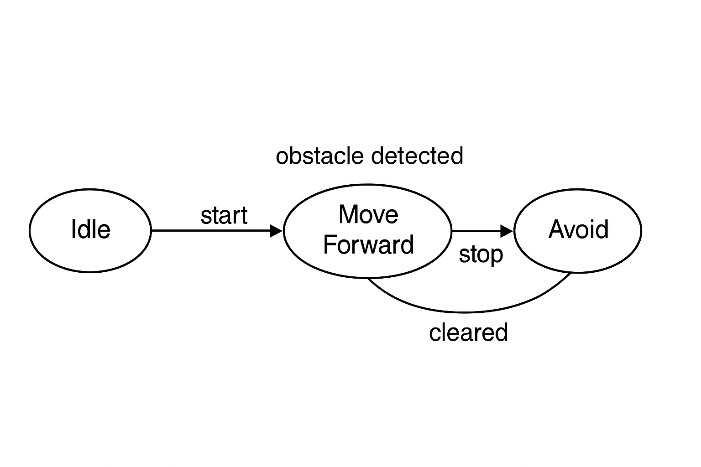

---

# 🔄 第03章：FSM状態設計と遷移戦略

本章では、AITL-Hアーキテクチャにおける**本能層（Instinct）**としてのFSM（有限状態機械）の設計戦略を解説します。  
FSMは、LLMからの命令やセンサ入力に応じて行動状態を管理し、PID制御の目標値を動的に切り替えます。

---

## 1. 🧠 FSMの役割とは

- 系の状態（idle, move, avoid, turn）を明確に定義
- 外部イベント（コマンドやセンサ値）に応じた状態遷移
- 各状態で出力（目標速度・角度など）を制御層へ通知

---

## 2. 🧩 状態とイベントの定義（例）

| 状態 | 説明 | 代表出力 |
|------|------|-----------|
| `idle` | 停止状態 | speed=0 |
| `move` | 直進中 | speed=5 |
| `avoid` | 障害物回避 | speed=2, angle=30 |
| `turn_left` | 左旋回中 | angle=+45 |
| `turn_right` | 右旋回中 | angle=-45 |

| イベント（トリガ） | 発生源 | 説明 |
|--------------------|--------|------|
| `start` | LLM/UART | 移動開始指令 |
| `stop` | LLM/UART | 停止指令 |
| `obstacle_detected` | センサ | 距離センサから障害物検出 |
| `cleared` | センサ | 障害物解除 |
| `turn_left` / `turn_right` | LLM | 自律的旋回命令 |

---

## 3. 🧾 遷移表と fsm_config.yaml の構造

PoCでは、FSMの構造を外部ファイルで柔軟に記述可能としています：

```yaml
initial_state: idle
states:
  idle:
    on_event:
      start: move
  move:
    on_event:
      stop: idle
      obstacle_detected: avoid
  avoid:
    on_event:
      cleared: move
  turn_left:
    on_event:
      stop: idle
```

このように状態とイベントのマッピングを記述し、柔軟な遷移構成が可能です。

---

## 4. 🔧 実行構成との連携（PoC制御ループ）

FSMは `fsm_engine.py` により制御され、PoCの `run_main.py` から制御ループ内で呼び出されます：

```python
fsm = FSMEngine(config_path="fsm_config.yaml")

while True:
    command = uart.receive()
    fsm.handle_event(command)
    speed, angle = fsm.get_output()
    pwm = pid.compute(speed, sensor.read())
```

---

## 5. 🔄 今後の拡張と知能統合

- 状態・遷移構成をLLMが**自動生成・修復**（自己適応的FSM）
- 状態ごとのPIDゲイン切り替えによる**状態依存制御**
- 状態遷移の**強化学習ベース切り替え**（報酬最大化）

---

## 🔚 まとめ

FSMはPoCの「本能層」として、決定的かつ高速な状態制御を担います。  
LLM・PIDとの役割分担を踏まえ、PoCでは`fsm_config.yaml`による構成記述を活用し、動作シナリオに柔軟に対応できる状態設計を目指します。

---

<h3>図3-1：FSM状態遷移図</h3>


---
