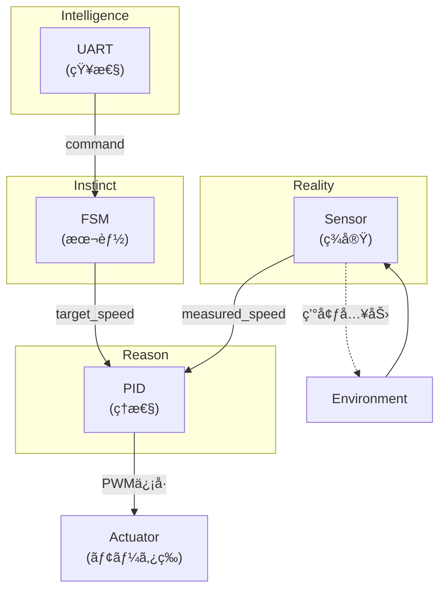

---

# 🧩 第06章：PoCçµ±åˆåˆ¶å¾¡æ§‹æˆã¨ run_main.py

本章ã§ã¯ã€AITL-H PoCã«ãŠã‘ã‚‹**çµ±åˆåˆ¶å¾¡ã‚¹ã‚¯ãƒªãƒ—ト `run_main.py` ã®æ§‹æˆã¨åˆ¶å¾¡ãƒ«ãƒ¼ãƒ—設計**を説æ˜ã—ã¾ã™ã€‚  
FSM・PID・UART・センサã®å„モジュールをæ¥ç¶šã—ã€PoCã¨ã—ã¦ã®ä¸€è²«ã—ãŸå‹•ä½œã‚’実ç¾ã—ã¾ã™ã€‚

---

## 1. âš™ï¸ çµ±åˆåˆ¶å¾¡ã®ç›®çš„

- å„制御モジュール（FSM/PID/UART/Sensor）を**çµ±åˆçš„ã«é€£æº**
- 外部命令（UART）をå—ä¿¡ã—ã€çŠ¶æ…‹åˆ¶å¾¡ãƒ»å‡ºåŠ›åˆ¶å¾¡ã‚’連動実行
- センサ値ã«å¿œã˜ã¦**å‹•çš„ã«å‡ºåŠ›åˆ¶å¾¡é‡ã‚’変化**

---

## 2. 🧾 run_main.py ã®åŸºæœ¬æ§‹æˆ

```python
from uart_driver import UARTDriver
from fsm_engine import FSMEngine
from pid_controller import PIDController
from sensor_interface import SensorInterface

# åˆæœŸåŒ–
uart = UARTDriver()
fsm = FSMEngine(config_path="fsm_config.yaml")
pid = PIDController(kp=1.2, ki=0.5, kd=0.1)
sensor = SensorInterface()

# 制御ループ
while True:
    # 1. 外部命令をå–得（UART）
    command = uart.receive()
    if command:
        fsm.handle_event(command)

    # 2. センサ更新
    sensor.update()

    # 3. FSMã®å‡ºåŠ›ç›®æ¨™å€¤ã‚’å–å¾—
    target_speed = fsm.get_output()

    # 4. 実測値をå–å¾—ã—ã¦åˆ¶å¾¡é‡ç”Ÿæˆï¼ˆPID）
    measured_speed = sensor.read_distance()
    pwm = pid.compute(target_speed, measured_speed)

    # 5. PWM制御é‡ã‚’出力（仮想）
    print(f"PWM output: {pwm}")
```

---

## 3. 📡 情報ã®æµã‚Œã¨å„層ã®å½¹å‰²

```
UART（知性）
   ↓ command
FSM（本能）---→ target_speed
                      ↓
Sensor（ç¾å®Ÿï¼‰       measured_speed
                      ↓
PID（ç†æ€§ï¼‰---→ PWMä¿¡å·å‡ºåŠ›
```

ã“ã®ã‚ˆã†ã«ã€FSMã¨PIDを軸ã«ã—ãŸ**データフロー制御**ãŒæˆç«‹ã—ã¦ã„ã¾ã™ã€‚

---

## 4. 🔄 テストã¨ãƒ‡ãƒãƒƒã‚°ã®è¦³ç‚¹

- UART命令を `inject_command()` ã§ãƒ†ã‚¹ãƒˆé€ä¿¡å¯èƒ½
- PIDã®å‡ºåŠ›ãƒ­ã‚°ã‚„FSM状態ログを print ã§ç¢ºèª
- センサ値㯠`sensor.update()` ã§å‹•çš„æ›´æ–°å¯èƒ½

---

## 🔚 ã¾ã¨ã‚

PoC制御ã®ä¸­å¿ƒã¯ `run_main.py` ã«ã‚ã‚Šã€FSM・PID・UART・センサを一体化ã—ã¦å‹•ä½œæ¤œè¨¼ã‚’å¯èƒ½ã«ã—ã¦ã„ã¾ã™ã€‚  
ã“ã®æ§‹é€ ã‚’ã‚‚ã¨ã«ã€å°†æ¥çš„ã«ã¯FSMã®å†æ§‹æˆã‚„PIDã®è‡ªå‹•èª¿æ•´ãªã©ã®æ‹¡å¼µãŒè¦‹è¾¼ã¾ã‚Œã¾ã™ã€‚

---

## 図6-1：PoCçµ±åˆåˆ¶å¾¡ãƒ–ロック図（Mermaid）


```mermaid
flowchart TD
    subgraph Intelligence
        UART["UART\n(知性)"]
    end

    subgraph Instinct
        FSM["FSM\n(本能)"]
    end

    subgraph Reality
        Sensor["Sensor\n(ç¾å®Ÿ)"]
    end

    subgraph Reason
        PID["PID\n(ç†æ€§)"]
    end

    UART -->|command| FSM
    FSM -->|target_speed| PID
    Sensor -->|measured_speed| PID
    PID -->|PWMä¿¡å·| Actuator["Actuator\n(モータ等)"]
    Sensor -.->|環境入力| Environment["Environment"]
    Environment --> Sensor
```

---

### 📠**ライセンス / License**

- **Code:** MIT  
- **Text:** CC BY 4.0  
- **Figures:** CC BY-NC 4.0  
（詳細㯠[Docs Index ã®ãƒ©ã‚¤ã‚»ãƒ³ã‚¹è¡¨](/AITL-H/docs/#-ライセンス--license) ã‚’å‚照）

### 🔗 **ナビゲーション / Navigation**
- 🠠**[AITL-H PoC ãƒãƒ‹ãƒ¥ã‚¢ãƒ« README](/AITL-H/docs/)**
- â® **[å‰ã®ç«  / Previous: 第05ç«  UART通信制御](/AITL-H/docs/chapter05_uart_control.html)**  
  _UART Communication_
- â–¶ï¸ **[次ã®ç«  / Next: 第07ç«  ログ出力ã¨ãƒ¢ãƒ‹ã‚¿ãƒªãƒ³ã‚°](/AITL-H/docs/chapter07_log_monitoring.html)**  
  _Logging & Monitoring_
  
