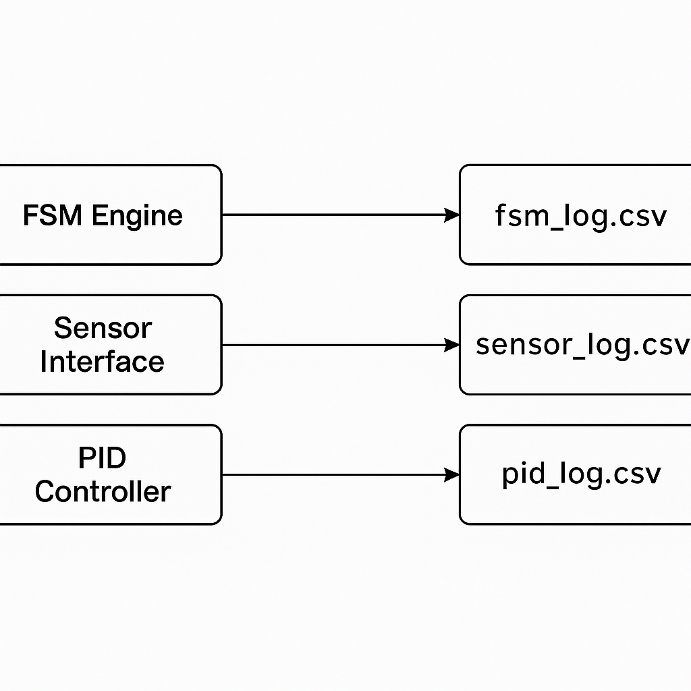

---

# 📊 第07章：PoCログ記録とモニタリング設計

本章では、AITL-H PoCにおける**センサ値・FSM状態・PID出力などのログ記録と可視化戦略**について解説します。  
動作中のデータを蓄積・解析・グラフ表示することで、制御挙動の評価と改善が可能になります。

---

## 1. 🗂 ログ記録の目的

- FSM状態の遷移履歴を記録し、**行動パターンを分析**
- センサデータ（距離・角度）を記録し、**外界変化との関係性を把握**
- PID出力（PWM）を記録し、**誤差推移や応答性を評価**

---

## 2. 🧩 ログ保存構造（例）

PoCでは `data/` ディレクトリにCSV形式で保存：

```bash
PoC/data/
├── fsm_log.csv         # 状態遷移ログ
├── sensor_log.csv      # 距離・角度のセンサ値履歴
└── pid_log.csv         # 目標値・実測値・出力PWM
```

---

## 3. 📝 ログ記録のコード例

```python
# ログファイル初期化
with open("data/pid_log.csv", "w") as f:
    f.write("time,target,measured,pwm\n")

# 制御ループ内で追記
timestamp = time.time()
with open("data/pid_log.csv", "a") as f:
    f.write(f"{timestamp},{target},{measured},{pwm}\n")
```

---

## 4. 📈 可視化例（Python + matplotlib）

```python
import pandas as pd
import matplotlib.pyplot as plt

df = pd.read_csv("data/pid_log.csv")
plt.plot(df["time"], df["target"], label="Target")
plt.plot(df["time"], df["measured"], label="Measured")
plt.plot(df["time"], df["pwm"], label="PWM")
plt.legend()
plt.show()
```

---

## 5. 📡 FSM状態の可視化アイデア

- 状態ごとに色分けされた時系列プロット
- 状態遷移を時間軸上でマッピングする**状態チャート**
- 自動レポート生成（PDF/HTML）での評価支援

---

## 🔚 まとめ

ログ記録と可視化は、PoC制御の**挙動検証・最適化・トラブルシュート**に不可欠な要素です。  
FSM・PID・センサの出力を統合記録し、**PoC設計の品質を客観的に評価**するための土台となります。

---

## 🖼 図7-1：ログ出力構成図

以下は、PoCにおける主要制御モジュールとログファイル出力の関係を示した図です。  
各モジュールは独立して `.csv` ファイルにログを記録し、後段で可視化や解析に利用されます。

<div align="center">
  
</div>

- **FSM Engine** → `fsm_log.csv`：状態遷移ログ
- **Sensor Interface** → `sensor_log.csv`：実測値（距離・角度など）
- **PID Controller** → `pid_log.csv`：制御応答ログ（目標 vs 実測 vs 出力）

> この構成により、制御挙動を時系列でトレースでき、システム全体の評価とデバッグが容易になります。

---

