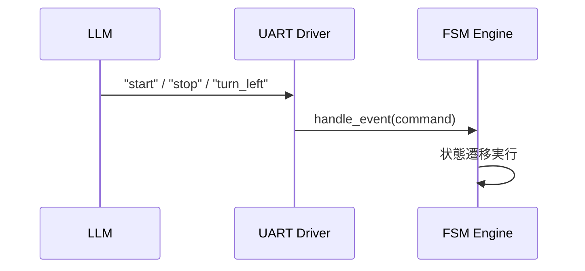

---

# 🤖 第08章：LLM統合と自己修復設計のPoC展開

本章では、AITL-Hにおける**知性層（Intelligence Layer）**としてのLLM（大規模言語モデル）の統合設計と、  
PoCにおける命令伝達、構成補正、状態再構築といった展開について述べます。

---

## 1. 🧠 LLMの役割とPoC内での立ち位置

LLMは主に以下のような**知的判断・命令生成**に関与します：

- ユーザ指令や外部状況を自然言語で解釈  
- UARTを通じて**FSMにイベント（コマンド）を送信**  
- 状態設計やPID設定の**構成ファイルを再生成・修正**  

LLMは「抽象的知性を実行系に落とし込む橋渡し」として機能します。

---

## 2. 🔄 UART経由の命令送信構造

PoCでは、LLMからFSMに命令を送るためにUART（仮想通信）を使用します。



FSM側の実装例：

```python
command = uart.receive()
fsm.handle_event(command)
```

---

## 3. 🛠 自己修復と構成補正の展開例

LLMは、PoC中で次のような**自己修復型制御**に応用可能です：

| 機能 | 内容 |
|------|------|
| FSM修復 | `fsm_config.yaml`を再生成（壊れた状態遷移の修復） |
| PID調整 | `pid_controller.py`内のゲイン再チューニング |
| 対話命令 | 状況を自然言語で受け取り、イベントに変換 |
| 状態説明 | 現在状態・履歴をLLMが自然言語で解説する機能 |

---

## 4. ⚠️ 実験上の課題と留意点

| 課題 | 解説 |
|------|------|
| 応答遅延 | LLMが外部にある場合、応答が数秒〜数十秒遅れる |
| 同期保証 | FSMループとLLM命令の同期が必要（タイミング問題） |
| 曖昧命令 | "ちょっと曲がって" 等の曖昧さはFSMに直接反映できない |
| 安全性 | 誤命令による状態遷移ミスの制御が必要（フェイルセーフ） |

---

## 🔚 まとめ

LLMはAITL-Hにおける「知性」を担い、FSMやPIDに対して構造的命令や自己修復補正を提供する役割を果たします。  
PoC段階ではUART連携により段階的に実験し、**構成ファイルの自動生成・再設計支援**などを通じて、AIと制御の橋渡しを試みます。

---

### 📝 **ライセンス / License**
- **Code:** MIT  
- **Text:** CC BY 4.0  
- **Figures:** CC BY-NC 4.0  
（詳細は [Docs Index のライセンス表 / License Table in Docs Index](https://samizo-aitl.github.io/AITL-H/docs/#-ライセンス--license) を参照）

---

### 🔗 **ナビゲーション / Navigation**
- ⏮ [第07章：ログ出力とモニタリング / Logging & Monitoring](https://samizo-aitl.github.io/AITL-H/docs/chapter07_log_monitoring.html)  
- ▶️ [第11章：出口戦略とSystemDK接続 / Exit Strategy](https://samizo-aitl.github.io/AITL-H/docs/chapter11_exit_strategy.html)  

[](https://samizo-aitl.github.io/AITL-H/docs/)  
[](https://samizo-aitl.github.io/AITL-H/)
