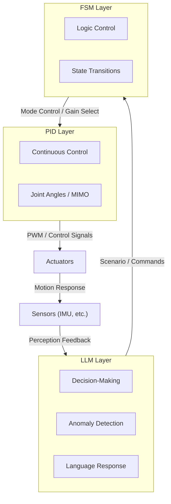
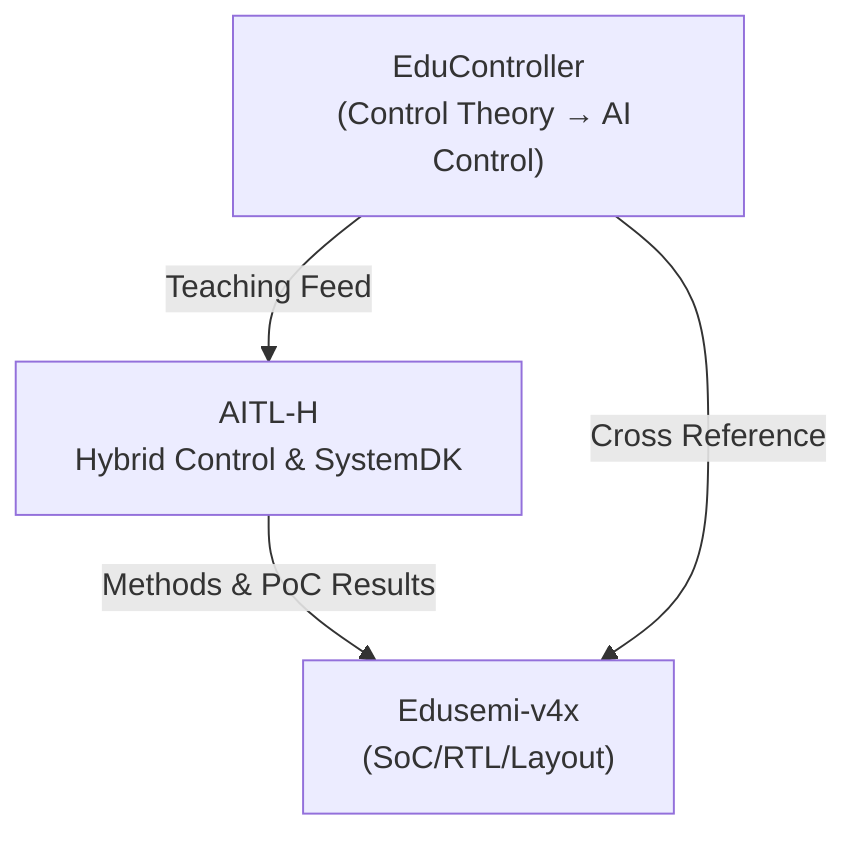

---

# 🤖 **AITL-H: Hybrid Structural Control Framework**

 

> ⚠️ **Under Development / Testing**  
> This project is still **in progress**, and its structure, specifications, and implementation are subject to change.  
> Please always check the latest repository contents when using or referencing it.

---

## 🆕 Update Log

| Date | Update | Reference |
|------|--------|-----------|
| 2025-08-25 | 🚩 Added **Humanoid Robot PoC (Flagship)** to top | [PoC Page](../PoC/humanoid/) |
| 2025-08-25 | 📑 Published 3 PoC reports (PWM Ripple / Thermal / Mission Energy) | [Docs Index](../PoC/humanoid/docs/) |
| 2025-08-25 | 🎤 Added template for presentation slides | [Slides](../PoC/humanoid/docs/flagship_poc_slides.md) |

---

## 🔗 Official Links

| Language | GitHub Pages 🌐 | GitHub 💻 |
|----------|----------------|-----------|
| 🇯🇵 Japanese |  |  |
| 🇺🇸 English |  |  |

---

## 🧭 Overview

| Item | Details |
|------|---------|
| **Name** | **AITL-H (Hybrid)** |
| **Objective** | Establishing humanoid robot control methods using **structural AI control** |
| **Core Principles** | - **FSM**: instinctive behavior control via state transitions - **PID**: continuous control of physical quantities (angle, velocity) - **LLM**: intelligence through advanced decision-making, dialogue, and learning |

---

## 🧘 Three-Layer Architecture

| Layer | Function | Implementation |
|-------|----------|----------------|
| **FSM Layer** | Logic control based on state transitions | `fsm_engine.py`, `fsm_state_def.yaml` |
| **PID Layer** | Physical control of joints and motion quantities | `pid_controller.py`, `pid_module.py` |
| **LLM Layer** | Situation assessment, anomaly detection, language response | `llm_interface.py`, `llm_logger.py` |

> Each layer is **loosely coupled yet cooperative**, allowing **independent development and step-by-step integration**.

---

## 🌏 Strategic Significance

AITL-H is not just a control architecture.  
By integrating **state feedback control** and **state transition control**, and combining with **LLMs** and **SystemDK**, it achieves **real-time optimal design under physical constraints**.

- **Industrial impact**  
  - 94% reduction in fault response time (PoC evaluation)  
  - 8× faster reconfiguration of production lines  
  - 40% reduction in design change costs  

- **National significance**  
  - Securing competitiveness in advanced-node semiconductors and industrial autonomous systems  
  - Gaining leadership in international standardization  

> **This technology must be integrated now.**  
> SystemDK is not unique to AITL-H but is an **essential foundational technology for all advanced-node semiconductor designs**.

---

## 🧪 PoC Related

| Title | Description | Path |
|-------|-------------|------|
| 🚩 **Humanoid Robot PoC (Flagship)** | Integrated flagship with FSM × PID × LLM × State-Space × Energy Harvesting |   |
| 🧭 **Gimbal Control (FSM + PID + LLM)** | Educational PoC for hybrid closed-loop control |   |
| ⚙️ **Verilog Auto-Generation (FSM + PID)** | YAML → C → Verilog conversion & verification |   |
| 🛠 **Auto Generator** | Tools for YAML → C → Verilog conversion of FSM/PID configs |   |

---

## 🗺️ Project Relationship Map

*A simple diagram showing the cross-reference among EduController ⇔ AITL-H ⇔ Edusemi-v4x.*

---

## 👤 Author

| Item | Details |
|------|---------|
| **Name** | **Shinichi Samizo** |
| **Education** | M.S. in Electrical and Electronic Engineering, Shinshu University |
| **Career** | Former Engineer at Seiko Epson Corporation (since 1997) |
| **Expertise** | Semiconductor devices (logic, memory, HV mixed-signal) Inkjet thin-film piezo actuators PrecisionCore printhead productization, BOM management, ISO training |
| **Email** |  |
| **X** |  |
| **GitHub** |  |

---

## 📄 License

This project adopts a **Hybrid License**. Different licenses apply depending on whether the content is code, text, or figures.

| Item | License | Description |
|------|---------|-------------|
| **Code** | [MIT License](https://opensource.org/licenses/MIT) | Free to use, modify, and redistribute |
| **Text materials** | [CC BY 4.0](https://creativecommons.org/licenses/by/4.0/) | Attribution required |
| **Figures & diagrams** | [CC BY-NC 4.0](https://creativecommons.org/licenses/by-nc/4.0/) | Non-commercial use only |
| **External references** | Follow the original license | Cite the source |

---

## 💬 Feedback

> Please propose improvements or start discussions via **GitHub Discussions**.

