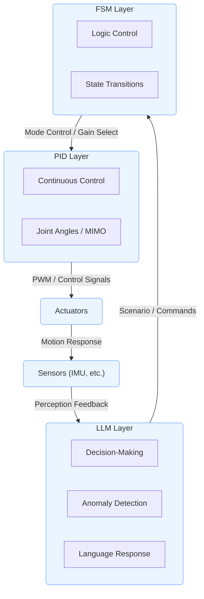
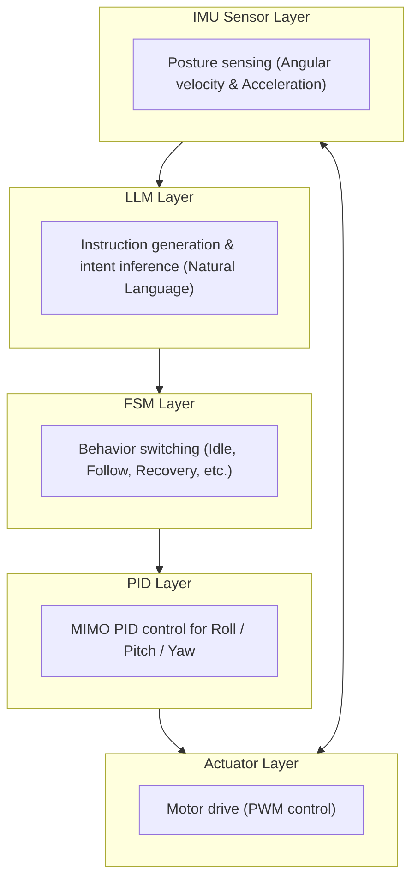

---

# 🤖 **AITL-H: Hybrid Structural Control Framework**

 

> ⚠️ **Under Development**  
> This project is currently **in progress**, and its structure, specifications, and implementation details are subject to change.  
> Please check the latest repository content before using or referencing it.

---

## 🔗 Official Links

| Language | GitHub Pages 🌐 | GitHub 💻 |
|----------|----------------|-----------|
| 🇺🇸 English |  |  |
| 🇯🇵 Japanese |  |  |

---

**AITL-H (All-in-Theory Logic - Hybrid)** is a **hierarchical intelligent control architecture** designed for humanoid robots and adaptive systems.  
With its three-layer structure of **FSM (instinct) × PID (reason) × LLM (intelligence)**, it combines **instant responsiveness, stability, and flexibility**.

---

## 🧭 Overview

| Item | Details |
|------|---------|
| **Name** | **AITL-H (Hybrid)** |
| **Purpose** | **Establishing a humanoid robot control methodology using structured AI control** |
| **Core Principles** | - **FSM**: instinctive behavioral control through state transitions - **PID**: continuous control of physical quantities (angle, velocity) - **LLM**: intelligent decision-making, dialogue, and learning |

---

## 🧘 Three-Layer Architecture

| Layer | Function | Example Implementation |
|-------|----------|------------------------|
| **FSM Layer** | Logic control based on state transitions | `fsm_engine.py`, `fsm_state_def.yaml` |
| **PID Layer** | Physical control of joints and movement | `pid_controller.py`, `pid_module.py` |
| **LLM Layer** | Situation judgment, anomaly detection, language response | `llm_interface.py`, `llm_logger.py` |

> Each layer is designed to be **loosely coupled yet collaborative**, enabling **independent development and phased integration**.

### AITL-H: Hybrid Architecture

> 📌 This diagram is **displayed on GitHub**. On the site, use the button below to view the GitHub version.  
> 

---

## 🌏 Strategic Significance

AITL-H is not just a control architecture —  
it integrates **state feedback control** and **state transition control**, combined with **LLM (Large Language Models)** and **SystemDK**,  
to enable **real-time, physically-constrained optimal design**.

- **Industrial Impact**  
  - Major reduction in fault recovery time (PoC evaluation: 94% reduction)  
  - 8× faster production line reconfiguration  
  - 40% reduction in design change costs  
- **National Importance**  
  - Securing competitiveness in advanced-node semiconductors and industrial autonomous systems  
  - Leadership in international standardization  

> **This technology must be integrated now.**  
> SystemDK is not unique to AITL-H — it is **a core technology required for all advanced-node semiconductor design**.

---

## 🧪 **PoC Projects**

| Title | Overview | Links |
|-------|----------|-------|
| 📘 **PoC Design Manual** | Humanoid robot PoC design manual (16 chapters) based on FSM × PID × LLM integration |   |
| 🤖 **Integrated PoC Execution Environment** | Experimental setup and runtime environment of AITL-H PoC (humanoid robot control) using a three-layer architecture: FSM + PID + LLM |   |
| 🧭 **Gimbal Control (FSM + PID + LLM)** | Hybrid closed-loop control system |   |
| ⚙️ **Verilog Auto-Generation (FSM + PID)** | YAML → C → Verilog conversion and validation |   |
| 🛠 **Auto Generator (FSM & PID Toolchain)** | Auto-generation toolset for FSM and PID structures in AITL-H architecture, converting YAML → C → Verilog |   |

---

### 🧭 **PoC Example: 3-Axis Gimbal Control with FSM × PID × LLM**

> **Natural language command → State transition (FSM) → PID stabilization → Actuator control** in a closed-loop architecture.  
> Serves as a fundamental implementation of the **AITL-HX architecture**, optimized for both education and applied research.

📂 Directory: [**`PoC/gimbal_control/`**]    
📘 Details: [**`See README`**](https://samizo-aitl.github.io/AITL-H/PoC/gimbal_control/)

---

## 🤖 ChatGPT Support Tools

Provided in `accelerated_design/`: **Design support tools using ChatGPT**

- State transition design support (prompt → FSM YAML automation)
- Test scenario / log visualization
- Automatic generation of design documents

> A **human-AI collaborative design framework**.

---

## 🎛️ Connection with EduController

**AITL-H** is **fully integrated** with **Chapter 9** (FSM × PID × LLM Hybrid Control) of the educational material **EduController**.

| Part | Content | Relation to AITL-H |
|------|---------|--------------------|
| **Part 01–05**  | Classical to modern control theory (PID, state-space, etc.) | **Theoretical basis of PID layer** |
| **Part 06–08**  | AI control (NN control, reinforcement learning, data-driven) | **Supplementary knowledge for AI application design** |
| **Part 09** &nbsp; | FSM × PID × LLM integrated control | **AITL-H architecture implemented as educational material** |

---

## 🎓 Integrated Design Deployment with Edusemi-v4x

To extend towards **SoC/RTL design**, see the “Special Edition” of **[Edusemi-v4x](https://github.com/Samizo-AITL/Edusemi-v4x)**, which covers:

| Chapter | Content | Link |
|---------|---------|------|
| Chapter 3 | SoC design with FSM × PID × LLM integrated control |   |
| Chapter 4 | RTL → GDSII layout automation with OpenLane |   |
| Chapter 5 | Physical verification and consistency check with DRC / LVS / DFM |   |

### 📌 If you want to study physical constraints in more depth
Once you understand the flow from SoC design to physical verification, proceed to **Special Edition Chapter 2a: Handling Thermal, Stress, and Noise Constraints in SystemDK**.

  

---

## 📚 Related Projects

| Project | Description | Link |
|---------|-------------|------|
| **Edusemi-v4x** | Semiconductor / SoC design educational material |   |
| **EduController** | Control theory × AI control educational material |   |
| **SamizoGPT** | Project Design Hub guide management |   |
| **AITL-Strategy-Proposal** | AITL strategic proposals and policy recommendations |   |

---

## 👤 Author

| 📌 Item | Details |
|---------|---------|
| **Name** | **Shinichi Samizo** *Shinichi Samizo* |
| **Education** | **M.S. in Electrical and Electronic Engineering, Shinshu University** |
| **Career** | **Former Engineer at Seiko Epson Corporation (since 1997)** |
| **Expertise** | **Semiconductor devices** (logic, memory, high-voltage mixed integration) **Inkjet thin-film piezo actuators** **Productization of PrecisionCore printheads, BOM management, ISO training** |
| **Contact** | ✉️ [Email](mailto:shin3t72@gmail.com) / 🐦 [X](https://x.com/shin3t72) / 💻 [GitHub](https://samizo-aitl.github.io/) |

---

## 📄 License

  

> **This project adopts a hybrid license**  
> Depending on the nature of the educational materials, code, and figures, the following licenses apply.

| 📌 Item | License | Description |
|---------|---------|-------------|
| **Code** | **[MIT License](https://opensource.org/licenses/MIT)** | Free to use, modify, redistribute |
| **Text materials** | **[CC BY 4.0](https://creativecommons.org/licenses/by/4.0/)** | Attribution required |
| **Figures & diagrams** | **[CC BY-NC 4.0](https://creativecommons.org/licenses/by-nc/4.0/)** | Non-commercial use only |
| **External references** | Follow original license | Clearly indicate source |

---

## 💬 Feedback

> Please submit improvement suggestions or start discussions via **GitHub Discussions**.

