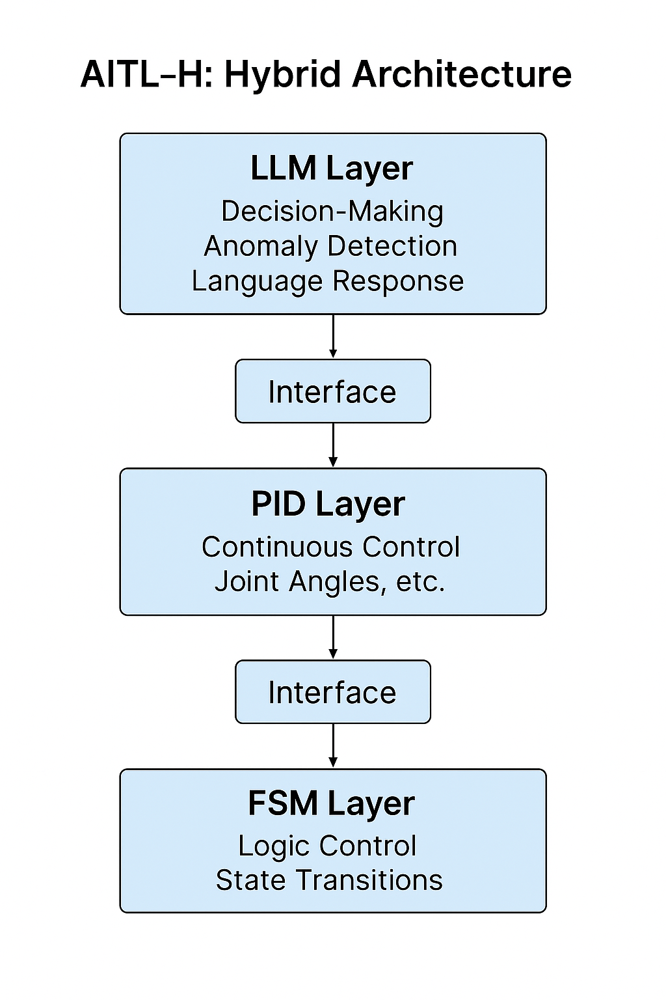
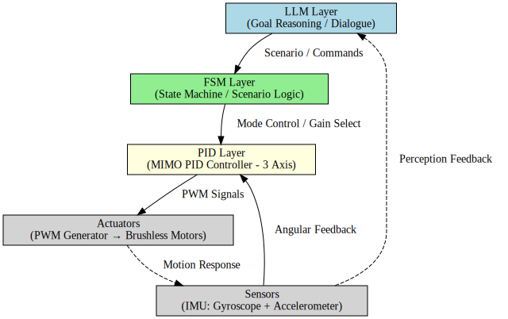

---

# 🤖 **AITL-H: Hybrid Intelligent Control Architecture**

[](https://samizo-aitl.github.io/) [](../LICENSE)

> ⚠️ **Under Development**  
> This project is currently **in progress**, and its structure, specifications, and implementation details are subject to change.  
> Please check the latest repository contents before use or reference.

---

## 🔗 **Official Links**

| Language | Type | Link |
|------|------|--------|
| 🇺🇸 English Version | 🌐 GitHub Pages | [https://samizo-aitl.github.io/AITL-H/en/](https://samizo-aitl.github.io/AITL-H/en/) |
| 🇺🇸 English Version | 💻 GitHub | [https://github.com/Samizo-AITL/AITL-H/tree/main/en](https://github.com/Samizo-AITL/AITL-H/tree/main/en) |
| 🇯🇵 Japanese Version | 🌐 GitHub Pages | [https://samizo-aitl.github.io/AITL-H/](https://samizo-aitl.github.io/AITL-H/) |
| 🇯🇵 Japanese Version | 💻 GitHub | [https://github.com/Samizo-AITL/AITL-H](https://github.com/Samizo-AITL/AITL-H) |

---

**AITL-H (All-in-Theory Logic - Hybrid)** is a **three-layered intelligent control framework** designed for **humanoid robots** and **adaptive systems**.  
By integrating **FSM (Instinct)** × **PID (Reason)** × **LLM (Intelligence)**, AITL-H enables real-time, stable, and flexible control.

---

## 🧭 **Overview**

| Item        | Description |
|-------------|-------------|
| **Name**    | **AITL-H (Hybrid)** |
| **Purpose** | Establish structured intelligent control for humanoid robotics |
| **Core Layers** | - **FSM**: State-based behavioral control<br>- **PID**: Physical control of angles and velocities<br>- **LLM**: High-level reasoning, dialogue, and learning |

---

## 🧘 **Three-Layer Architecture**

| Layer | Function                   | Example Modules              |
|-------|----------------------------|------------------------------|
| FSM   | State-based logic control  | `fsm_engine.py`, `fsm_state_def.yaml` |
| PID   | Continuous physical control | `pid_controller.py`, `pid_module.py` |
| LLM   | Language-driven reasoning  | `llm_interface.py`, `llm_logger.py` |

> Each layer is **loosely coupled but functionally integrated**, supporting **modular development** and **step-by-step fusion**.

<div align="center"></div>

---

## 📘 **PoC Design Manual (16 Chapters)**

A complete manual is available for **PoC development** using **FSM × PID × LLM**.  
▶︎ [📖 Read the Manual](./docs/index.md)

---

## 🧪 **PoC Projects**

| Title | Description | Path |
|-------|-------------|------|
| 🧭 Gimbal Control (FSM + PID + LLM) | Hybrid closed-loop control | [`PoC/gimbal_control`](../PoC/gimbal_control) |
| ⚙️ Verilog Auto-Generation (FSM + PID) | YAML → C → Verilog synthesis | [`PoC/verilog_demo`](../PoC/verilog_demo) |
| 🔍 Other PoCs | (Coming soon) | - |

---

## 🧪 **Featured PoC: Gimbal Control with AITL-HX**

> This PoC demonstrates a **3-axis gimbal controller** based on the **AITL-HX architecture**.  
> The flow: **Natural Language → FSM → PID → Actuator**, forming a hybrid intelligent control loop.

📂 [`PoC/gimbal_control/`](../PoC/gimbal_control/)  
📘 [`See README`](../PoC/gimbal_control/README.md)



| Layer | Role |
|-------|------|
| **LLM** | Generates goals and context from user input |
| **FSM** | Manages state transitions: idle / tracking / recovery |
| **PID** | Controls Roll, Pitch, Yaw |
| **Sensors** | Simulated 3-axis IMU |
| **Actuators** | PWM-based motor simulation |

> Key topics: **hybrid control architecture**, **natural language to motion**, **MIMO + logic state integration**

---

### ⚙️ **PoC: Verilog Auto-Generation (FSM × PID)**

> This PoC demonstrates **automatic generation of Verilog** from **FSM and PID YAML specs**, supported by ChatGPT.

📂 [`PoC/verilog_demo/`](../PoC/verilog_demo/)  
📘 [`See README`](../PoC/verilog_demo/README.md)

| Component | Description |
|----------|-------------|
| Input | `test_config.yaml` (FSM + PID specs) |
| Generation | `fsm_auto_gen.py`, `pid_auto_gen.py` → C code |
| Integration | `unified.c` → GPT-based Verilog generation |
| Verification | `tb_aitl_top.v` with iverilog |

> Tools used: **ChatGPT**, `auto_generator/`, `logic_templates/`

---

## 🤖 **AI-Assisted Design Tools**

The `accelerated_design/` directory includes **GPT-supported design modules**:

- FSM prompt-to-YAML generation
- Test scenario creation and log analysis
- Auto-documentation and review support

> 🧠 Built for a **human-AI co-design loop**

---

## 📂 **Directory Structure**

```
AITL-H/
├── theory/                # Architecture, principles, concepts
├── PoC/                   # Proof-of-concept projects (gimbal, Verilog)
├── implementary/          # Python modules for FSM, PID, LLM
└── accelerated_design/    # GPT-assisted co-design tools
```

| Folder | Description |
|--------|-------------|
| `theory/` | Layered control theory and architecture |
| `PoC/` | Demonstration projects and evaluation logs |
| `implementary/` | Core logic modules |
| `accelerated_design/` | GPT-integrated design support |

---

## 🚀 **Application Areas**

- 🧓 Elder care robots: **emotional sensing + physical response**
- 🛠 Self-adaptive systems: **LLM-driven feedback updates**
- 🌏 Disaster robotics: **rule-based + reasoned action**
- 🎓 Education & research: **AI × control** learning platform

---

## 🎓 **Educational Linkage: EduController**

**AITL-H** is structurally linked with **EduController**, an educational framework for classical and AI control:

| Part | Topics | Linkage |
|------|--------|---------|
| [Part 1–5](https://github.com/Samizo-AITL/EduController#制御理論系) | Classical & Modern Control | Basis for **PID layer** |
| [Part 6–8](https://github.com/Samizo-AITL/EduController#ai制御系) | NN & RL Control | AI-based expansion |
| **[Part 9](https://github.com/Samizo-AITL/EduController/tree/main/part09_llm_hybrid)** | FSM × PID × LLM | Implements **AITL-H structure** |

Also integrated with:

🔹 **[`matlab_tools`](https://github.com/Samizo-AITL/EduController/tree/main/matlab_tools)**  
- Simulink-based **PID/state-space simulation**  
- C-code generation with **Simulink Coder**  
- **HDL extension** via `c_to_hdl/`

🔹 **[`SoC_DesignKit_by_ChatGPT`](https://github.com/Samizo-AITL/EduController/tree/main/SoC_DesignKit_by_ChatGPT)**  
- FSM, PID, LLM design templates  
- **Verilog generation with GPT**  
- `testbench/` for waveform validation

> 🧠 A unified **Education × Implementation × AI** design pipeline

🔗 [Visit EduController](https://github.com/Samizo-AITL/EduController)

---

## 🧩 **SoC Integration via Edusemi**

For extending AITL-H into **RTL, GDSII, and physical chip design**, refer to **[Edusemi-v4x](https://github.com/Samizo-AITL/Edusemi-v4x)**:

| Chapter | Topic |
|---------|-------|
| [Chapter 3](https://github.com/Samizo-AITL/Edusemi-v4x/tree/main/f_chapter3_socsystem) | FSM × PID × LLM in SoC |
| [Chapter 4](https://github.com/Samizo-AITL/Edusemi-v4x/tree/main/f_chapter4_openlane) | OpenLane RTL to GDSII |
| [Chapter 5](https://github.com/Samizo-AITL/Edusemi-v4x/tree/main/f_chapter5_dfm) | DRC / LVS / DFM flow |

---

## 📚 **Related Projects**

- **[Edusemi-v4x](https://github.com/Samizo-AITL/Edusemi-v4x)**: Curriculum for SoC/semiconductor design  
- **[EduController](https://github.com/Samizo-AITL/EduController)**: Learning platform for classical and AI control

---

## 👤 **Author Information**

**Shinichi Samizo**  
- **M.S. in Electrical and Electronic Engineering, Shinshu University**  
- Former **Seiko Epson** Corporation Engineer (since 1997)

📌 **Areas of Expertise**:  
- **Semiconductor Devices (Logic, Memory, High-Voltage Integrated with Logic)**  
- **Inkjet Thin-Film Piezoelectric Actuators**  
- **PrecisionCore Printhead Development, BOM Management, ISO Education**

📬 **Contact**  
- ✉️ [shin3t72@gmail.com](mailto:shin3t72@gmail.com)  
- 🐦 [https://x.com/shin3t72](https://x.com/shin3t72)  
- 💻 [https://samizo-aitl.github.io/](https://samizo-aitl.github.io/)

---

© 2025 **Shinichi Samizo** — MIT License  
All source code, diagrams, and documents are freely available under the MIT License.

---

💬 Share ideas or questions at [AITL-H Discussions](https://github.com/Samizo-AITL/AITL-H/discussions)

---

