---

# 🤖 **AITL-H: Hybrid Structural Control Framework**

 

> ⚠️ **Under Development / Testing**  
> This project is still **in progress**, and its structure, specifications, and implementation are subject to change.  
> Please always check the latest repository contents when using or referencing it.

---

## 🆕 Update Log

| Date | Update | Reference |
|------|--------|-----------|
| 2025-08-25 | 🚩 Added **Humanoid Robot PoC (Flagship)** to top | [PoC Page](../PoC/humanoid/) |
| 2025-08-25 | 📑 Published 3 PoC reports (PWM Ripple / Thermal / Mission Energy) | [Docs Index](../PoC/humanoid/docs/) |
| 2025-08-25 | 🎤 Added template for presentation slides | [Slides](../PoC/humanoid/docs/flagship_poc_slides.md) |

---

## 🔗 Official Links

| Language | GitHub Pages 🌐 | GitHub 💻 |
|----------|----------------|-----------|
| 🇯🇵 Japanese |  |  |
| 🇺🇸 English |  |  |

---

## 🧭 Overview

| Item | Details |
|------|---------|
| **Name** | **AITL-H (Hybrid)** |
| **Objective** | Establishing humanoid robot control methods using **structural AI control** |
| **Core Principles** | - **FSM**: instinctive behavior control via state transitions - **PID**: continuous control of physical quantities (angle, velocity) - **LLM**: intelligence through advanced decision-making, dialogue, and learning |

---

## 🧘 Three-Layer Architecture

| Layer | Function | Implementation |
|-------|----------|----------------|
| **FSM Layer** | Logic control based on state transitions | `fsm_engine.py`, `fsm_state_def.yaml` |
| **PID Layer** | Physical control of joints and motion quantities | `pid_controller.py`, `pid_module.py` |
| **LLM Layer** | Situation assessment, anomaly detection, language response | `llm_interface.py`, `llm_logger.py` |

> Each layer is **loosely coupled yet cooperative**, allowing **independent development and step-by-step integration**.

---

## 🌏 Strategic Significance

AITL-H is not just a control architecture.  
By integrating **state feedback control** and **state transition control**, and combining with **LLMs** and **SystemDK**, it achieves **real-time optimal design under physical constraints**.

- **Industrial impact**  
  - 94% reduction in fault response time (PoC evaluation)  
  - 8× faster reconfiguration of production lines  
  - 40% reduction in design change costs  

- **National significance**  
  - Securing competitiveness in advanced-node semiconductors and industrial autonomous systems  
  - Gaining leadership in international standardization  

> **This technology must be integrated now.**  
> SystemDK is not unique to AITL-H but is an **essential foundational technology for all advanced-node semiconductor designs**.

---

## 🧪 PoC Related

| Title | Description | Path |
|-------|-------------|------|
| 🚩 **Humanoid Robot PoC (Flagship)** | Integrated flagship with FSM × PID × LLM × State-Space × Energy Harvesting |   |
| 🧭 **Gimbal Control (FSM + PID + LLM)** | Educational PoC for hybrid closed-loop control |   |
| ⚙️ **Verilog Auto-Generation (FSM + PID)** | YAML → C → Verilog conversion & verification |   |
| 🛠 **Auto Generator** | Tools for YAML → C → Verilog conversion of FSM/PID configs |   |

---

## 🗺️ Project Relationship Map

```mermaid
flowchart TB
  EC["EduController
(Control Theory → AI Control)"]
  AITLH["AITL-H
Hybrid Control & SystemDK"]
  ESV["Edusemi-v4x
(SoC/RTL/Layout)"]

  EC -- Teaching Feed --> AITLH
  AITLH -- Methods & PoC Results --> ESV
  EC -- Cross Reference --> ESV
```

*A simple diagram showing the cross-reference among EduController ⇔ AITL-H ⇔ Edusemi-v4x.*

---

## 🤖 ChatGPT Support Tools

Provided in `accelerated_design/`: **Design support tools using ChatGPT**

- State transition design support (prompt → FSM YAML automation)
- Test scenario / log visualization
- Automatic generation of design documents

> A **human-AI collaborative design framework**.

---

## 🎛️ Connection with EduController

**AITL-H** is **fully integrated** with **Chapter 9** (FSM × PID × LLM Hybrid Control) of the educational material **EduController**.

| Part | Content | Relation to AITL-H |
|------|---------|--------------------|
| **Part 01–05**  | Classical to modern control theory (PID, state-space, etc.) | **Theoretical basis of PID layer** |
| **Part 06–08**  | AI control (NN control, reinforcement learning, data-driven) | **Supplementary knowledge for AI application design** |
| **Part 09** &nbsp; | FSM × PID × LLM integrated control | **AITL-H architecture implemented as educational material** |

---

## 🎓 Integrated Design Deployment with Edusemi-v4x

To extend towards **SoC/RTL design**, see the “Special Edition” of **[Edusemi-v4x](https://github.com/Samizo-AITL/Edusemi-v4x)**, which covers:

| Chapter | Content | Link |
|---------|---------|------|
| Chapter 3 | SoC design with FSM × PID × LLM integrated control |   |
| Chapter 4 | RTL → GDSII layout automation with OpenLane |   |
| Chapter 5 | Physical verification and consistency check with DRC / LVS / DFM |   |

### 📌 If you want to study physical constraints in more depth
Once you understand the flow from SoC design to physical verification, proceed to **Special Edition Chapter 2a: Handling Thermal, Stress, and Noise Constraints in SystemDK**.

  

---

## 📚 Related Projects

| Project | Description | Link |
|---------|-------------|------|
| **Edusemi-v4x** | Semiconductor / SoC design educational material |   |
| **EduController** | Control theory × AI control educational material |   |
| **SamizoGPT** | Project Design Hub guide management |   |
| **AITL-Strategy-Proposal** | AITL strategic proposals and policy recommendations |   |

---

## 👤 Author

| 📌 Item | Details |
|---------|---------|
| **Name** | **Shinichi Samizo** *Shinichi Samizo* |
| **Education** | **M.S. in Electrical and Electronic Engineering, Shinshu University** |
| **Career** | **Former Engineer at Seiko Epson Corporation (since 1997)** |
| **Expertise** | **Semiconductor devices** (logic, memory, high-voltage mixed integration) **Inkjet thin-film piezo actuators** **Productization of PrecisionCore printheads, BOM management, ISO training** |
| **✉️ Email** |  |
| **🐦　X** |  |
| **💻 GitHub** |  |

---

## 📄 License

  

> **This project adopts a hybrid license**  
> Depending on the nature of the educational materials, code, and figures, the following licenses apply.

| 📌 Item | License | Description |
|---------|---------|-------------|
| **Code** | **[MIT License](https://opensource.org/licenses/MIT)** | Free to use, modify, redistribute |
| **Text materials** | **[CC BY 4.0](https://creativecommons.org/licenses/by/4.0/)** | Attribution required |
| **Figures & diagrams** | **[CC BY-NC 4.0](https://creativecommons.org/licenses/by-nc/4.0/)** | Non-commercial use only |
| **External references** | Follow original license | Clearly indicate source |

---

## 💬 Feedback

> Please submit improvement suggestions or start discussions via **GitHub Discussions**.

