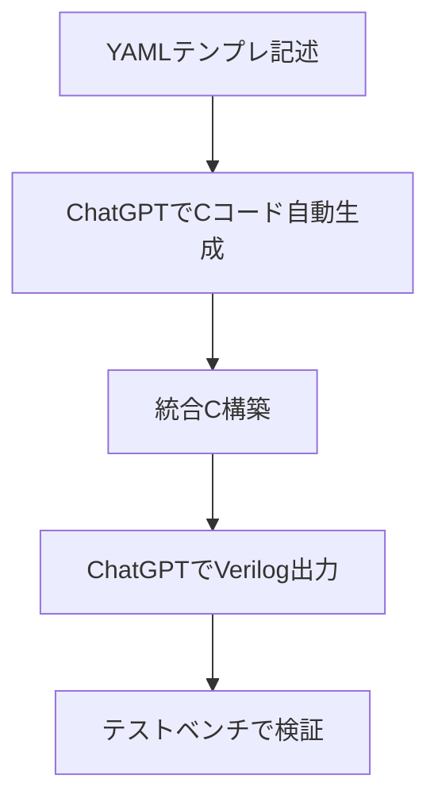

# 🧠 AITL-H Logic Templates

このディレクトリは、AITL-H（FSM × PID × LLM）知能制御アーキテクチャの  
ハードウェア実装に向けた **論理テンプレートとChatGPT支援プロンプト集** を格納しています。

---

## 📦 含まれるファイル

### ◼ Verilogモジュール
- `fsm_core.v`：Moore型状態機械の雛形
- `pid_controller.v`：離散時間PID制御器の雛形
- `llm_interface_stub.v`：外部命令スタブ（LLMの知性層を模擬）
- `aitl_top.v`：FSM/PID/LLM統合モジュール

### ◼ テストベンチ
- `tb_fsm.v`：FSMモジュールの検証
- `tb_pid.v`：PIDモジュールの検証（feedbackを模擬的に変化）

### ◼ 設計テンプレート（ChatGPT入力用）
- `fsm_template.yaml`：状態遷移仕様テンプレート
- `pid_template.yaml`：PIDゲイン・信号仕様テンプレート

### ◼ ChatGPTプロンプトテンプレート
- `fsm_to_c.md`：FSMテンプレート → Cコード生成
- `unified_to_verilog.md`：統合C → Verilog 3層構成出力指示

---

## 🧠 活用方法（推奨フロー）



- FSM設計やPIDゲイン定義をYAMLで記述
- ChatGPTを使って Cコード → Verilog を生成
- モジュール分割され、テストベンチで即検証可能

---

## 📁 ディレクトリ構成案（例）

```
logic_templates/
├── fsm_core.v
├── pid_controller.v
├── llm_interface_stub.v
├── aitl_top.v
├── tb_fsm.v
├── tb_pid.v
├── fsm_template.yaml
├── pid_template.yaml
├── fsm_to_c.md
├── unified_to_verilog.md
└── README.md  ← 本ファイル
```

---

## 📜 ライセンス

MIT License  
技術者・研究者・教育者による再利用・改変を歓迎します。
