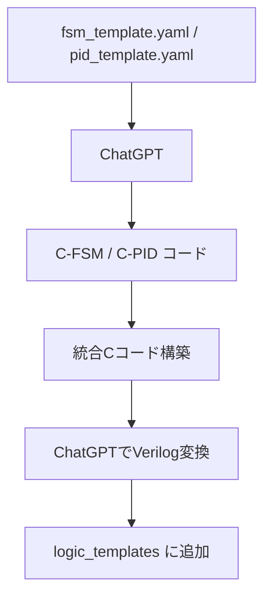

# 🚀 accelerated_design: ChatGPT設計支援ツール群

このディレクトリは、AITL-Hアーキテクチャの構築における  
**設計支援・生成支援ツール（テンプレート・プロンプト）**を格納します。

---

## 📌 主な目的

- FSM / PID / 統合制御の設計を ChatGPT により加速
- YAMLによる定義 → Cコード → Verilog生成 の自動化支援
- 将来的には Streamlit / API連携によるGUI生成も視野に

---

## 🧠 典型フロー（ChatGPT利用）

---

## 📁 対応ファイル例

| ファイル名 | 説明 |
|------------|------|
| `fsm_template.yaml` | 状態機械の定義テンプレート |
| `pid_template.yaml` | PIDゲイン・信号定義テンプレート |
| `fsm_to_c.md` | ChatGPTプロンプト：FSM → Cコード |
| `unified_to_verilog.md` | ChatGPTプロンプト：C → Verilog |

※これらのファイルは `implementary/logic_templates/` に格納されています。

---

## 🔮 今後の展開（予定）

- `fsm_auto_gen.py`：YAML → Cコード変換自動化（CLIまたはStreamlit）
- `verilog_pipeline.py`：統合C → Verilog変換の自動プロンプト送信
- ChatGPT API / Claude連携によるバックエンド自動化
- GUIツールによる教育用キット化

---

## 📜 ライセンス

MIT License  
生成支援のための活用・改変・統合利用を歓迎します。

