---

# 🤖 **AITL-H：Hybrid型構造制御フレームワーク**

 

> ⚠️ **開発・検証中 / Under Development**  
> 本プロジェクトは現在も **発展途上** にあり、構成・仕様・実装内容は今後変更される可能性があります。  
> 利用・参照の際は、最新のリポジトリ内容をご確認ください。

---

## 🔗 公式リンク | Official Links

| 言語 / Language | GitHub Pages 🌐 | GitHub 💻 |
|-----------------|----------------|-----------|
| 🇯🇵 Japanese |  |  |
| 🇺🇸 English |  |  |

---

**AITL-H（All-in-Theory Logic - Hybrid）** は、人型ロボットや適応型システムに向けて設計された **階層型知能制御アーキテクチャ** です。  
**FSM（本能） × PID（理性） × LLM（知性）** の三層構造により、**瞬時性・安定性・柔軟性** を兼ね備えた制御を実現します。

---

## 🧭 **概要**

| 項目 | 内容 |
|------|------|
| **名称** | **AITL-H（Hybrid）** |
| **目的** | **構造的AI制御による人型ロボット制御手法の確立** |
| **中核原理** | - **FSM**：状態遷移による本能的行動制御 - **PID**：物理量（角度・速度）の連続制御 - **LLM**：高度な判断・対話・学習による知能化 |

---

## 🧘 **三層アーキテクチャ構成**

| 層 | 機能 | 実装例 |
|----|------|--------|
| **FSM層** | 状態遷移に基づくロジック制御 | `fsm_engine.py`, `fsm_state_def.yaml` |
| **PID層** | 各関節・移動量の物理制御 | `pid_controller.py`, `pid_module.py` |
| **LLM層** | 状況判断、異常検出、言語応答 | `llm_interface.py`, `llm_logger.py` |

> 各層は **疎結合・協調的** に設計されており、**独立した開発・段階的統合が可能** です。

### AITL-H: Hybrid Architecture

> 📌 この図は **GitHub では表示**されます。サイトでは下のボタンから GitHub 版をご覧ください。  
> 

---

## 🌏 **戦略的重要性 / Strategic Significance**

AITL-Hは、単なる制御アーキテクチャではなく、  
**状態フィードバック制御**と**状態遷移制御**を統合し、さらに**LLM（大規模言語モデル）**と**SystemDK**を組み合わせることで、  
**リアルタイムかつ物理制約を考慮した最適設計**を実現します。

- **産業的効果**  
  - 故障対応時間の大幅短縮（PoC評価値：94%削減）  
  - 生産ライン再構成時間を8倍短縮  
  - 設計変更対応コストを40%削減  
- **国家的意義**  
  - 先端ノード半導体や産業用自律システムの競争力確保  
  - 国際標準化における主導権獲得  

> **この技術は「今」統合しなければならない。**  
> 特にSystemDKはAITL-H固有ではなく、**全ての先端ノード半導体設計に必須の基盤技術**です。

---

## 🧪 **PoC関連**

| タイトル | 概要 | パス |
|----------|------|------|
| 📘 **PoC設計マニュアル** | FSM×PID×LLM統合に基づいた人型ロボットPoC設計マニュアル（全16章） |   |
| 🧭 **ジンバル制御（FSM + PID + LLM）** | ハイブリッド閉ループ制御 | [`PoC/gimbal_control`](./PoC/gimbal_control) |
| ⚙️ **Verilog自動生成（FSM + PID）** | YAML → C → Verilog生成＋検証 | [`PoC/verilog_demo`](./PoC/verilog_demo) |

---

### 🧭 **PoC例：FSM × PID × LLMによる3軸ジンバル制御**

> **自然言語指令 → 状態遷移（FSM） → PID安定制御 → アクチュエータ** の閉ループ構成。  
> 教育・応用に最適な **AITL-HXアーキテクチャ** の基本実装。

📂 ディレクトリ：[**`PoC/gimbal_control/`**](./PoC/gimbal_control/)  
📘 詳細：[**`READMEはこちら`**](./PoC/gimbal_control/README.md)

  

---

## 🤖 **ChatGPT支援ツール群**

`accelerated_design/` にて **ChatGPTを用いた設計支援ツール** を提供：

- 状態遷移設計支援（プロンプト → FSM YAML自動化）
- テストシナリオ／ログ可視化
- 設計ドキュメントの自動生成

> 人とAIの **協調設計フレームワーク** を実現するツール群です。

---

## 🎛️ **EduControllerとの接続**

**AITL-H** は、教育教材 **EduController** の第9章（FSM × PID × LLMハイブリッド制御）と**完全に統合**されています。  

| 章 | 内容 | AITL-Hとの関係 |
|----|------|----------------|
| **Part 01〜05**  | 古典〜現代制御理論（PID、状態空間など） | **PID層の理論的基盤** |
| **Part 06〜08**  | AI制御（NN制御、強化学習、データ駆動） | **AI応用設計の補完知識** |
| **Part 09** &nbsp; | FSM × PID × LLM 統合制御 | **AITL-Hのアーキテクチャを教材として実装** |

---

## 🎓 **Edusemi-v4xとの統合設計展開**

**SoC/RTL設計まで発展**させたい場合は、**[Edusemi-v4x](https://github.com/Samizo-AITL/Edusemi-v4x)** の「特別編」にて、以下の内容が提供されています：

| 章 | 内容 | リンク |
|----|------|--------|
| 第3章 | FSM × PID × LLM 統合制御による SoC設計 |   |
| 第4章 | OpenLaneによるRTL 〜 GDSII レイアウト自動化 |   |
| 第5章 | DRC / LVS / DFM による物理検証と整合性確認 |   |

### 📌 さらに物理制約を深く学びたい場合
SoC設計〜物理検証の流れを理解したら、**特別編 第2a章：SystemDKにおける熱・応力・ノイズ制約の設計対応**へ進んでください。

 

---

## 📚 **関連プロジェクト一覧**

| プロジェクト | 説明 | リンク |
|--------------|------|--------|
| **Edusemi-v4x** | 半導体／SoC設計教材 |   |
| **EduController** | 制御理論×AI制御教材 |   |
| **SamizoGPT** | Project Design Hubガイド管理 |   |
| **AITL-Strategy-Proposal** | AITL戦略提言・政策提案 |   |

---

## 👤 **執筆者情報 / Author**

| **📌 項目 / Item** | **内容 / Details** |
|--------------------|--------------------|
| **氏名 / Name** | **三溝 真一（Shinichi Samizo）** *Shinichi Samizo* |
| **学歴 / Education** | **信州大学大学院 電気電子工学 修了** *M.S. in Electrical and Electronic Engineering, Shinshu University* |
| **経歴 / Career** | **元 セイコーエプソン株式会社 技術者（1997年〜）** *Former Engineer at Seiko Epson Corporation (since 1997)* |
| **経験領域 / Expertise** | **半導体デバイス**（ロジック・メモリ・高耐圧混載） *Semiconductor devices (logic, memory, high-voltage mixed integration)* **インクジェット薄膜ピエゾアクチュエータ** *Inkjet thin-film piezo actuators* **PrecisionCoreプリントヘッド製品化・BOM管理・ISO教育** *Productization of PrecisionCore printheads, BOM management, and ISO training* |
| **連絡先 / Contact** | ✉️ [Email](mailto:shin3t72@gmail.com) / 🐦 [X](https://x.com/shin3t72) / 💻 [GitHub](https://samizo-aitl.github.io/) |

---

## 📄 **ライセンス / License**

  

> **本プロジェクトはハイブリッドライセンスを採用**  
> 教材・コード・図表の性質に応じて以下のライセンスを適用します。

| **📌 項目 / Item** | **ライセンス / License** | **説明 / Description** |
|--------------------|--------------------------|------------------------|
| **コード（Code）** | **[MIT License](https://opensource.org/licenses/MIT)** | 自由に使用・改変・再配布可 |
| **教材テキスト（Text materials）** | **[CC BY 4.0](https://creativecommons.org/licenses/by/4.0/)** | 著者表示必須 |
| **図表・イラスト（Figures & diagrams）** | **[CC BY-NC 4.0](https://creativecommons.org/licenses/by-nc/4.0/)** | 非商用利用のみ可 |
| **外部引用（External references）** | 元ライセンスに従う | 引用元を明記 |

---

## 💬 **フィードバック | Feedback**

> 改善提案や議論は **GitHub Discussions** からお願いします。  
> *Propose improvements or start discussions via GitHub Discussions.*

