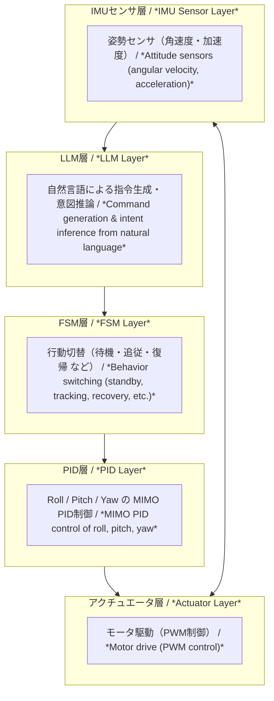

---

# 🤖 **AITL-H：Hybrid型構造制御フレームワーク**
*🤖 AITL-H: Hybrid Structural Control Framework*

 

> ⚠️ **開発・検証中 / Under Development**  
> 本プロジェクトは現在も **発展途上** にあり、構成・仕様・実装内容は今後変更される可能性があります。  
> 利用・参照の際は、最新のリポジトリ内容をご確認ください。  
> *⚠️ **Under development/testing.** This project is still evolving, and its structure, specifications, and implementation may change. Please check the latest repository contents when using or referencing it.*

---

## 🆕 最新情報 / Update Log
| 日付 | 更新内容 / Update | 参照 |
|-----|-------------------|------|
| 2025-08-25 | 🚩 **Humanoid Robot PoC（集大成）** をトップに追加 | [PoCページ](./PoC/humanoid/) |
| 2025-08-25 | 📑 PoCレポート3本（PWM Ripple / Thermal / Mission Energy）公開 | [Docs Index](./PoC/humanoid/docs/) |
| 2025-08-25 | 🎤 発表用スライド雛形を追加 | [Slides](./PoC/humanoid/docs/flagship_poc_slides.md) |

---

## 🔗 公式リンク / Official Links

| 言語 / Language | GitHub Pages 🌐 | GitHub 💻 |
|-----------------|----------------|-----------|
| 🇯🇵 Japanese |  |  |
| 🇺🇸 English |  |  |

---

## 🧭 概要　/　Overview

| 項目 | 内容 |
|------|------|
| **名称** | **AITL-H（Hybrid）** *AITL-H (Hybrid)* |
| **目的** | **構造的AI制御による人型ロボット制御手法の確立** *Establishing humanoid robot control methods using structural AI control* |
| **中核原理** | - **FSM**：状態遷移による本能的行動制御 - **PID**：物理量（角度・速度）の連続制御 - **LLM**：高度な判断・対話・学習による知能化 *- **FSM**: instinctive behavior control through state transitions - **PID**: continuous control of physical quantities (angle, velocity) - **LLM**: intelligence through advanced decision-making, dialogue, and learning* |

---

## 🧘 三層アーキテクチャ構成　/　Three-Layer Architecture

| 層 | 機能 | 実装例 |
|----|------|--------|
| **FSM層** | 状態遷移に基づくロジック制御 *Logic control based on state transitions* | `fsm_engine.py`, `fsm_state_def.yaml` |
| **PID層** | 各関節・移動量の物理制御 *Physical control of joints and motion quantities* | `pid_controller.py`, `pid_module.py` |
| **LLM層** | 状況判断、異常検出、言語応答 *Situation assessment, anomaly detection, and language response* | `llm_interface.py`, `llm_logger.py` |

> 各層は **疎結合・協調的** に設計されており、**独立した開発・段階的統合が可能** です。  
> *Each layer is designed to be **loosely coupled yet cooperative**, allowing **independent development and step-by-step integration**.*

### AITL-H: Hybrid Architecture

> 📌 This diagram is **displayed on GitHub**. On the site, use the button below to view the GitHub version.  
> 

---

## 🌏 戦略的重要性　/  Strategic Significance

AITL-Hは、単なる制御アーキテクチャではなく、  
**状態フィードバック制御**と**状態遷移制御**を統合し、さらに**LLM（大規模言語モデル）**と**SystemDK**を組み合わせることで、  
**リアルタイムかつ物理制約を考慮した最適設計**を実現します。  
*AITL-H is not just a control architecture. By integrating **state feedback control** and **state transition control**, and further combining **LLMs** with **SystemDK**, it achieves **real-time optimal design under physical constraints**.*

- **産業的効果**  
  - 故障対応時間の大幅短縮（PoC評価値：94%削減）  
  - 生産ライン再構成時間を8倍短縮  
  - 設計変更対応コストを40%削減  
- **Industrial effects**  
  - Significantly reduced fault response time (PoC evaluation: 94% reduction)  
  - 8× faster reconfiguration of production lines  
  - 40% reduction in design change costs*  

- **国家的意義**  
  - 先端ノード半導体や産業用自律システムの競争力確保  
  - 国際標準化における主導権獲得  
- **National significance**  
  - Securing competitiveness in advanced-node semiconductors and industrial autonomous systems  
  - Gaining leadership in international standardization*  

> **この技術は「今」統合しなければならない。**  
> 特にSystemDKはAITL-H固有ではなく、**全ての先端ノード半導体設計に必須の基盤技術**です。  
> *This technology must be integrated **now**. In particular, SystemDK is not unique to AITL-H but is an **essential foundational technology for all advanced-node semiconductor designs**.*

---

## 🧪 PoC関連　/  PoC Related

| タイトル | 概要 | パス |
|----------|------|------|
| 📘 **PoC設計マニュアル** | FSM×PID×LLM統合に基づいた人型ロボットPoC設計マニュアル（全16章） *Humanoid robot PoC design manual (16 chapters) based on FSM × PID × LLM integration.* |   |
| 🤖 **PoC統合実行環境** | FSM＋PID＋LLMの三層アーキテクチャを用いたAITL-H PoC（人型ロボット制御）の実験構成・実行環境 *Experimental setup and execution environment for AITL-H PoC (humanoid robot control) using the three-layer architecture of FSM + PID + LLM.* |   |
| 🧭 **ジンバル制御（FSM + PID + LLM）** | ハイブリッド閉ループ制御 *Hybrid closed-loop control.* |   |
| ⚙️ **Verilog自動生成（FSM + PID）** | YAML → C → Verilog生成＋検証 *Automatic conversion from YAML → C → Verilog with verification.* |   |
| 🛠 **Auto Generator（FSM・PID自動生成ツール）** | AITL-Hアーキテクチャに基づくFSM・PID構成をYAML→C→Verilog変換する自動生成支援ツール群 *Auto-generation support toolset for converting FSM/PID configurations based on the AITL-H architecture from YAML → C → Verilog.* |   |
| 🚩 **Humanoid Robot PoC（集大成）** | FSM × PID × LLM × 状態空間 × 自己発電を統合したフラグシップPoC *Flagship PoC integrating FSM × PID × LLM × State-Space × Energy Harvesting* |    |

---

> 🚩 **フラグシップPoC：人型ロボット**  
> *Flagship PoC: Humanoid Robot*  
> Samizo-AITLの集大成として、クロスノード設計（22nm SoC / 0.18µm AMS / 0.35µm LDMOS / 自己発電）をSystemDKで統合。  
> 教育・産業・政策の三領域で優位性を発揮できるテーマです。

---

### ​ PoC例：FSM × PID × LLMによる3軸ジンバル制御
*PoC Example: 3-Axis Gimbal Control with FSM × PID × LLM*

> **自然言語指令 → 状態遷移（FSM） → PID安定制御 → アクチュエータ** の閉ループ構成。  
> 教育・応用に最適な **AITL-HXアーキテクチャ** の基本実装。  
> *Closed-loop structure: **Natural language commands → State transitions (FSM) → PID stabilization → Actuators**.  
> A basic implementation of the **AITL-HX architecture**, ideal for education and applications.*

📂 ディレクトリ：[**`PoC/gimbal_control/`**]    
*📂 Directory: [**`PoC/gimbal_control/`**](https://github.com/Samizo-AITL/AITL-H/tree/main/PoC/gimbal_control)*  

📘 詳細：[**`READMEはこちら`**](https://samizo-aitl.github.io/AITL-H/PoC/gimbal_control/)  
*📘 Details: [**`README here`**](https://samizo-aitl.github.io/AITL-H/PoC/gimbal_control/)*  

---

## 🤖 ChatGPT支援ツール　/  ChatGPT-Assisted Toolset

`accelerated_design/` にて **ChatGPTを用いた設計支援ツール** を提供：  
*The directory `accelerated_design/` provides **design support tools using ChatGPT***:

- 状態遷移設計支援（プロンプト → FSM YAML自動化）  
  *State transition design support (prompt → automatic FSM YAML generation)*  
- テストシナリオ／ログ可視化  
  *Test scenario and log visualization*  
- 設計ドキュメントの自動生成  
  *Automatic generation of design documents*  

> 人とAIの **協調設計フレームワーク** を実現するツール群です。  
> *A toolset to realize a **collaborative design framework between humans and AI**.*

---

## 🎛️ EduControllerとの接続　　/  Connection with EduController

**AITL-H** は、教育教材 **EduController** の第9章（FSM × PID × LLMハイブリッド制御）と**完全に統合**されています。  
*AITL-H is **fully integrated** with Chapter 9 of the educational material **EduController** (FSM × PID × LLM hybrid control).*

| 章 | 内容 | AITL-Hとの関係 |
|----|------|----------------|
| **Part 01〜05**  | 古典〜現代制御理論（PID、状態空間など） *Classical to modern control theory (PID, state-space, etc.)* | **PID層の理論的基盤** *Theoretical foundation of the PID layer* |
| **Part 06〜08**  | AI制御（NN制御、強化学習、データ駆動） *AI control (neural networks, reinforcement learning, data-driven)* | **AI応用設計の補完知識** *Complementary knowledge for AI-based design* |
| **Part 09** &nbsp; | FSM × PID × LLM 統合制御 *Integrated control of FSM × PID × LLM* | **AITL-Hのアーキテクチャを教材として実装** *Implements the AITL-H architecture as teaching material* |

---

## 🎓 Edusemi-v4xとの統合設計展開
*🎓 Integrated Design Development with Edusemi-v4x*

**SoC/RTL設計まで発展**させたい場合は、**[Edusemi-v4x](https://github.com/Samizo-AITL/Edusemi-v4x)** の「特別編」にて、以下の内容が提供されています：  
*If you want to expand to **SoC/RTL design**, the “Special Editions” of **[Edusemi-v4x](https://github.com/Samizo-AITL/Edusemi-v4x)** provide the following:*

| 章 | 内容 | リンク |
|----|------|--------|
| 第3章 | FSM × PID × LLM 統合制御による SoC設計 *SoC design with integrated FSM × PID × LLM control* |   |
| 第4章 | OpenLaneによるRTL 〜 GDSII レイアウト自動化 *RTL-to-GDSII layout automation using OpenLane* |   |
| 第5章 | DRC / LVS / DFM による物理検証と整合性確認 *Physical verification and consistency checks with DRC / LVS / DFM* |   |

### 📌 さらに物理制約を深く学びたい場合
*📌 For deeper study of physical constraints*

SoC設計〜物理検証の流れを理解したら、**特別編 第2a章：SystemDKにおける熱・応力・ノイズ制約の設計対応**へ進んでください。  
*After understanding the SoC design-to-physical verification flow, proceed to **Special Edition Chapter 2a: Design for thermal, stress, and noise constraints in SystemDK**.*

  

---

## 📚 関連プロジェクト一覧　　/  Related Project List

| プロジェクト | 説明 | リンク |
|--------------|------|--------|
| **Edusemi-v4x** | 半導体／SoC設計教材 *Semiconductor / SoC design learning material* |   |
| **EduController** | 制御理論×AI制御教材 *Control theory × AI control learning material* |   |
| **SamizoGPT** | Project Design Hubガイド管理 *Project Design Hub guide management* |   |
| **AITL-Strategy-Proposal** | AITL戦略提言・政策提案 *AITL strategy proposals and policy recommendations* |   |

---

## 👤 執筆者情報 / Author

| **📌 項目 / Item** | **内容 / Details** |
|--------------------|--------------------|
| **氏名 / Name** | **三溝 真一（Shinichi Samizo）** *Shinichi Samizo* |
| **学歴 / Education** | **信州大学大学院 電気電子工学 修了** *M.S. in Electrical and Electronic Engineering, Shinshu University* |
| **経歴 / Career** | **元 セイコーエプソン株式会社 技術者（1997年〜）** *Former Engineer at Seiko Epson Corporation (since 1997)* |
| **経験領域 / Expertise** | **半導体デバイス**（ロジック・メモリ・高耐圧混載） *Semiconductor devices (logic, memory, high-voltage mixed integration)* **インクジェット薄膜ピエゾアクチュエータ** *Inkjet thin-film piezo actuators* **PrecisionCoreプリントヘッド製品化・BOM管理・ISO教育** *Productization of PrecisionCore printheads, BOM management, and ISO training* |
| **✉️ Email** |  |
| **🐦　X** |  |
| **💻 GitHub** |  |

---

## 📄 ライセンス / License

  

> **本プロジェクトはハイブリッドライセンスを採用**  
> *This project adopts a Hybrid License*  
> 教材・コード・図表の性質に応じて以下のライセンスを適用します。  
> *Different licenses are applied depending on whether the content is code, text, or figures.*

| **📌 項目 / Item** | **ライセンス / License** | **説明 / Description** |
|--------------------|--------------------------|------------------------|
| **コード（Code）** | **[MIT License](https://opensource.org/licenses/MIT)** | 自由に使用・改変・再配布可 *Free to use, modify, and redistribute* |
| **教材テキスト（Text materials）** | **[CC BY 4.0](https://creativecommons.org/licenses/by/4.0/)** | 著者表示必須 *Attribution required* |
| **図表・イラスト（Figures & diagrams）** | **[CC BY-NC 4.0](https://creativecommons.org/licenses/by-nc/4.0/)** | 非商用利用のみ可 *Non-commercial use only* |
| **外部引用（External references）** | 元ライセンスに従う *Follow original license* | 引用元を明記 *Cite the original source* |

---

## 💬 フィードバック / Feedback

> 改善提案や議論は **GitHub Discussions** からお願いします。  
> *Propose improvements or start discussions via **GitHub Discussions**.*

